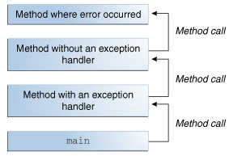
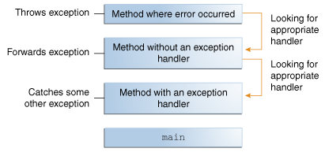

> 本文章以jdk8为基础进行编写，如果想查看后续的版本可以前往jdk版本目录下查看。
>
> 翻译自：https://docs.oracle.com/javase/tutorial/essential/exceptions/index.html

Java编程语言使用异常来处理错误和其他异常事件。本课程介绍何时以及如何使用异常。

## 什么是异常？

术语*exception*是短语“exceptionevent”的缩写

------

**Definition:** *异常*是在程序执行过程中发生的事件，它会中断程序的正常指令流。

------

当方法中发生错误时，该方法会创建一个对象并将其移交给运行时系统。该对象称为“异常对象”，包含有关错误的信息，包括错误发生时程序的类型和状态。创建异常对象并将其传递给运行时系统称为“抛出异常”。

方法抛出异常后，运行时系统会尝试找到处理它的方法。处理异常的一组可能的“something”是为获取发生错误的方法而调用的方法的有序列表。方法列表称为*调用堆栈*（参见下图）。




调用堆栈。

运行时系统在调用堆栈中搜索包含可处理异常的代码块的方法。这段代码称为*异常处理程序*。搜索从发生错误的方法开始，并按照调用方法的相反顺序继续执行调用堆栈。找到适当的处理程序后，运行时系统将异常传递给处理程序。如果抛出的异常对象的类型与处理程序可以处理的类型匹配，则认为异常处理程序是合适的。

所选的异常处理程序被称为“捕获异常”。如果运行时系统穷尽地搜索调用堆栈上的所有方法，而没有找到适当的异常处理程序，如下图所示，则运行时系统（因此，程序）终止。




正在调用堆栈中搜索异常处理程序。

与传统的错误管理技术相比，使用异常来管理错误具有一些优势。您可以在[例外情况的优点](https://docs.oracle.com/javase/tutorial/essential/exceptions/advantages.html)中了解更多信息第节。

## 捕捉或指定要求

有效的Java编程语言代码必须符合*捕获或指定要求*。这意味着可能引发某些异常的代码必须由以下任一项括起来：

- 捕获异常的“try”语句。“try”必须为异常提供处理程序，如[Catching and Handling Exceptions](https://docs.oracle.com/javase/tutorial/essential/exceptions/handling.html)中所述.
- 指定可以引发异常的方法。该方法必须提供列出异常的“throws”子句，如[指定方法引发的异常](https://docs.oracle.com/javase/tutorial/essential/exceptions/declaring.html)中所述.

无法满足Catch或Specify要求的代码将不会编译。

并非所有例外都符合“捕获或指定要求”。为了理解原因，我们需要研究三种基本的例外情况，其中只有一种例外情况符合要求。

### 三种例外

第一种异常是*checked异常*。这些都是编写良好的应用程序应该预见并从中恢复的例外情况。例如，假设应用程序提示用户输入文件名，然后通过将名称传递给“java.io.FileReader”的构造函数来打开文件。通常，用户提供现有可读文件的名称，因此“FileReader”对象的构造成功，应用程序的执行正常进行。但有时用户提供一个不存在的文件名，构造函数抛出“java.io.FileNotFoundException”。编写良好的程序将捕获此异常并通知用户错误，可能会提示用户更正文件名。

选中的异常*受捕获或指定要求的约束。除“错误”、“运行时异常”及其子类指示的异常外，所有异常都是检查异常。

第二种异常是*error*。这些是应用程序外部的异常情况，应用程序通常无法预测或从中恢复。例如，假设应用程序成功打开文件进行输入，但由于硬件或系统故障而无法读取文件。读取失败将引发“java.io.IOError”。应用程序可能会选择捕获此异常，以便通知用户问题，但程序打印堆栈跟踪并退出也可能有意义。

*错误*不受捕获或指定要求的约束。错误是由“错误”及其子类指示的异常。

第三种异常是*运行时异常*。这些是应用程序内部的异常情况，应用程序通常无法预测或从中恢复。这些通常表示编程错误，例如逻辑错误或API使用不当。例如，考虑前面描述的将文件名传递给“FileReader”构造函数的应用程序。如果逻辑错误导致向构造函数传递“null”，则构造函数将引发“NullPointerException”。应用程序可以捕获此异常，但消除导致异常发生的错误可能更有意义。

运行时*异常*不受捕获或指定要求的约束。运行时异常是由“RuntimeException”及其子类指示的异常。

错误和运行时异常统称为“未检查异常”。

### 绕过捕获或指定

一些程序员认为Catch或Specify Requirement是异常机制中的一个严重缺陷，并通过使用未检查的异常代替已检查的异常来绕过它。一般来说，不建议这样做。部分[未选中的例外-争议](https://docs.oracle.com/javase/tutorial/essential/exceptions/runtime.html)讨论何时使用未检查的异常。

## 捕获和处理异常

本节介绍如何使用三个异常处理程序组件（“try”、“catch”和“finally”块）来编写异常处理程序。然后，解释了JavaSE7中引入的“try-”with resources语句。“try-”with resources语句特别适用于使用“Closeable”资源的情况，例如流。

本节的最后一部分将通过一个示例，分析各种场景中发生的情况。

下面的示例定义并实现了一个名为“ListOfNumbers”的类。构造时，“ListOfNumbers”创建一个“ArrayList”，其中包含10个“Integer”元素，这些元素的顺序值为0到9。“ListOfNumber”类还定义了一个名为“writeList”的方法，该方法将数字列表写入名为“OutFile.txt”的文本文件中。此示例使用`java中定义的输出类。io`，包括在[基本I/O](https://docs.oracle.com/javase/tutorial/essential/io/index.html)中.

```java
// Note: This class will not compile yet.
import java.io.*;
import java.util.List;
import java.util.ArrayList;

public class ListOfNumbers {

    private List<Integer> list;
    private static final int SIZE = 10;

    public ListOfNumbers () {
        list = new ArrayList<Integer>(SIZE);
        for (int i = 0; i < SIZE; i++) {
            list.add(new Integer(i));
        }
    }

    public void writeList() {
	// The FileWriter constructor throws IOException, which must be caught.
        PrintWriter out = new PrintWriter(new FileWriter("OutFile.txt"));

        for (int i = 0; i < SIZE; i++) {
            // The get(int) method throws IndexOutOfBoundsException, which must be caught.
            out.println("Value at: " + i + " = " + list.get(i));
        }
        out.close();
    }
}
```

粗体的第一行是对构造函数的调用。构造函数初始化文件上的输出流。如果无法打开文件，构造函数将抛出“IOException”。第二个粗体行是对“ArrayList”类的“get”方法的调用，如果其参数值太小（小于0）或太大（大于“ArrayList”当前包含的元素数），则会抛出“IndexOutOfBoundsException”。

如果尝试编译[`ListOfNumbers`](https://docs.oracle.com/javase/tutorial/essential/exceptions/examples/ListOfNumbers.java)类，编译器将打印一条关于“FileWriter”构造函数引发的异常的错误消息。但是，它不会显示有关“get”引发的异常的错误消息。原因是构造函数抛出的异常“IOException”是一个已检查的异常，而“get”方法引发的异常“IndexOutOfBoundsException”是未检查的异常。

现在，您已经熟悉了“ListOfNumbers”类以及可以在其中抛出异常的位置，现在就可以编写异常处理程序来捕获和处理这些异常了。

### The try Block

构造异常处理程序的第一步是将可能引发异常的代码封装在“try”块中。通常，“try”块如下所示：

```java
try {
    code
}
catch and finally blocks . . .
```

示例中标记为“*code*”的段包含一个或多个可能引发异常的合法代码行。（“catch”和“finally”块将在接下来的两个小节中解释。）

要从“ListOfNumbers”类构造“writeList”方法的异常处理程序，请在“try”块中包含“writeList“方法的异常抛出语句。有不止一种方法可以做到这一点。您可以将可能引发异常的每一行代码放在自己的“try”块中，并为每一行提供单独的异常处理程序。或者，您可以将所有“writeList”代码放在一个“try”块中，并将多个处理程序与之关联。下面的列表对整个方法使用一个“try”块，因为所讨论的代码很短。

```java
private List<Integer> list;
private static final int SIZE = 10;

public void writeList() {
    PrintWriter out = null;
    try {
        System.out.println("Entered try statement");
        FileWriter f = new FileWriter("OutFile.txt");
        out = new PrintWriter(f);
        for (int i = 0; i < SIZE; i++) {
            out.println("Value at: " + i + " = " + list.get(i));
        }
    }
    catch and finally blocks  . . .
}
```

如果“try”块中发生异常，则该异常将由与其关联的异常处理程序处理。要将异常处理程序与“try”块关联，必须在其后面放置“catch”块；下一节，[捕捉块](https://docs.oracle.com/javase/tutorial/essential/exceptions/catch.html)，向您展示了如何操作。

### The catch Blocks

通过在“try”块之后直接提供一个或多个“catch”块，可以将异常处理程序与“try”块相关联。“try”块的结尾和第一个“catch”块的开头之间不能有代码。

```java
try {

} catch (ExceptionType name) {

} catch (ExceptionType name) {

}
```

每个“catch”块都是一个异常处理程序，用于处理其参数所指示的异常类型。参数类型“*ExceptionType*”声明处理程序可以处理的异常类型，并且必须是从“Throwable”类继承的类的名称。处理程序可以使用“*name*”引用异常。

“catch”块包含在调用异常处理程序时执行的代码。当异常处理程序是调用堆栈中第一个“*ExceptionType*”与抛出的异常类型匹配的异常处理程序时，运行时系统调用异常处理程序。如果抛出的对象可以合法地分配给异常处理程序的参数，则系统认为它是匹配的。

以下是“writeList”方法的两个异常处理程序：

```java
try {

} catch (IndexOutOfBoundsException e) {
    System.err.println("IndexOutOfBoundsException: " + e.getMessage());
} catch (IOException e) {
    System.err.println("Caught IOException: " + e.getMessage());
}
```

异常处理程序可以做的不仅仅是打印错误消息或停止程序。他们可以执行错误恢复，提示用户做出决定，或使用链式异常将错误传播到更高级别的处理程序，如[chained exceptions](https://docs.oracle.com/javase/tutorial/essential/exceptions/chained.html)中所述第节。

#### 用一个异常处理程序捕获多种类型的异常

在JavaSE7及更高版本中，单个“catch”块可以处理多种类型的异常。此功能可以减少代码重复，并减少捕捉过大异常的诱惑。

在“catch”子句中，指定块可以处理的异常类型，并用竖条（“|”）分隔每个异常类型：

```java
catch (IOException|SQLException ex) {
    logger.log(ex);
    throw ex;
}
```

**Note**: 如果“catch”块处理多个异常类型，则“catch”参数隐式为“final”。在此示例中，“catch”参数“ex”是“final”，因此不能在“catch”块中为其赋值。

### The finally Block

当“try”块退出时，“finally”块*始终*执行。这确保即使发生意外异常，也执行“finally”块。但“finally”不仅仅对异常处理有用，它允许程序员避免清理代码被“return”、“continue”或“break”意外绕过。将清理代码放在“finally”块中始终是一种很好的做法，即使预计不会出现异常。

------

**注意：**如果在执行“try”或“catch”代码时JVM退出，则“finally”块可能不会执行。

------

您在此使用的“writeList”方法的“try”块将打开一个“PrintWriter”。程序应在退出“writeList”方法之前关闭该流。这带来了一个有点复杂的问题，因为“writeList”的“try”块可以通过三种方式之一退出。

1. “new FileWriter”语句失败并引发“IOException”。
2. `list.get(i)`语句失败并抛出`IndexOutOfBoundsException`。
3. 一切都成功，“try”块正常退出。

运行时系统总是在“finally”块中执行语句，而不管“try”块中发生了什么。所以这是进行清理的最佳场所。

“writeList”方法的以下“finally”块将清除，然后关闭“PrintWriter”和“FileWriter”。

```java
finally {
    if (out != null) { 
        System.out.println("Closing PrintWriter");
        out.close(); 
    } else { 
        System.out.println("PrintWriter not open");
    } 
    if (f != null) {
	    System.out.println("Closing FileWriter");
	    f.close();
	}	
} 
```

------

**重要的:** 关闭文件或以其他方式恢复资源时，请使用“try-”with resources语句，而不是“finally”块。以下示例使用“try”-with-resources语句清理并关闭“writeList”方法的“PrintWriter”和“FileWriter”：

```java
public void writeList() throws IOException {
    try (FileWriter f = new FileWriter("OutFile.txt");
         PrintWriter out = new PrintWriter(f)) {
        for (int i = 0; i < SIZE; i++) {
            out.println("Value at: " + i + " = " + list.get(i));
        }
    }
}
```

“try”-with-resources语句在不再需要时自动释放系统资源。 See [The try-with-resources Statement](https://docs.oracle.com/javase/tutorial/essential/exceptions/tryResourceClose.html).

------

### The try-with-resources Statement

“try”-with-resources语句是声明一个或多个资源的“try”语句。*资源*是程序完成后必须关闭的对象。“try”-with-resources语句确保每个资源都在语句末尾关闭。 实现`java.lang.AutoCloseable`的任何对象，包括实现`java.io.AutoCloseable`，可用作资源。

以下示例从文件中读取第一行。它使用“FileReader”和“BufferedReader”的实例从文件中读取数据。`FileReader`和`BufferedReader`是程序完成后必须关闭的资源：

```java
	static String readFirstLineFromFile(String path) throws IOException {
	    try (FileReader fr = new FileReader(path);
	         BufferedReader br = new BufferedReader(fr)) {
	        return br.readLine();
	    }
	}	
```

在此示例中，“try”-with-resources语句中声明的资源是“FileReader”和“BufferedReader”。这些资源的声明语句出现在“try”关键字后面的括号内。Java SE 7和更高版本中的类“FileReader”和“BufferedReader”实现了接口“Java.lang.AutoCloseable”。由于“FileReader”和“BufferedReader”实例是在“try”with resource语句中声明的，因此无论“try语句是正常完成还是突然完成（由于方法“BufferedReader.readLine”引发了“IOException”），它们都将被关闭。

在JavaSE7之前，您可以使用“finally”块来确保关闭资源，而不管“try”语句是正常完成还是突然完成。以下示例使用“finally”块而不是“try”-with-resources语句：

```java
static String readFirstLineFromFileWithFinallyBlock(String path) throws IOException {
   
    FileReader fr = new FileReader(path);
    BufferedReader br = new BufferedReader(fr);
    try {
        return br.readLine();
    } finally {
        br.close();
        fr.close();
    }
}
```

但是，此示例可能存在资源泄漏。程序在使用完资源后，除了依靠垃圾收集器（GC）回收资源的内存之外，还需要做更多的工作。程序还必须将资源释放回操作系统，通常通过调用资源的“close”方法。但是，如果程序在GC回收资源之前未能做到这一点，那么释放资源所需的信息就会丢失。运行系统仍认为正在使用的资源已经泄漏。

在此示例中，如果“readLine”方法引发异常，则语句“br”。“finally”块中的close（）”引发异常，则“FileReader”已泄漏。因此，使用“try”-with-resources语句而不是“finally”块来关闭程序的资源。

如果方法“readLine”和“close”都抛出异常，则方法“readFirstLineFromFileWithFinallyBlock”抛出从“finally”块抛出的异常；抑制从“try”块抛出的异常。相反，在示例“readFirstLineFromFile”中，如果同时从“try”块和“try-with resources”语句抛出异常，则方法“readFirst LineFromFile”将抛出从“try”块抛出的异常；从“try”-with-resources块抛出的异常被抑制。在Java SE 7及更高版本中，您可以检索抑制的异常；请参见[抑制的异常](https://docs.oracle.com/javase/tutorial/essential/exceptions/tryResourceClose.html#suppressed-例外)一节以获取更多信息。

以下示例检索zip文件“zipFileName”中打包的文件的名称，并创建包含这些文件名称的文本文件：

```java
public static void writeToFileZipFileContents(String zipFileName,
                                           String outputFileName)
                                           throws java.io.IOException {

    java.nio.charset.Charset charset =
         java.nio.charset.StandardCharsets.US_ASCII;
    java.nio.file.Path outputFilePath =
         java.nio.file.Paths.get(outputFileName);

    // Open zip file and create output file with 
    // try-with-resources statement

    try (
        java.util.zip.ZipFile zf =
             new java.util.zip.ZipFile(zipFileName);
        java.io.BufferedWriter writer = 
            java.nio.file.Files.newBufferedWriter(outputFilePath, charset)
    ) {
        // Enumerate each entry
        for (java.util.Enumeration entries =
                                zf.entries(); entries.hasMoreElements();) {
            // Get the entry name and write it to the output file
            String newLine = System.getProperty("line.separator");
            String zipEntryName =
                 ((java.util.zip.ZipEntry)entries.nextElement()).getName() +
                 newLine;
            writer.write(zipEntryName, 0, zipEntryName.length());
        }
    }
}
```

在此示例中，“try”-with-resources语句包含两个用分号分隔的声明：“ZipFile”和“BufferedWriter”。当直接跟随它的代码块终止时，无论是正常终止还是由于异常终止，“BufferedWriter”和“ZipFile”对象的“close”方法都会按此顺序自动调用。请注意，资源的“close”方法的调用顺序与其创建顺序相反。

以下示例使用“try”-with-resources语句自动关闭“java.sql”。语句`object:

```java
public static void viewTable(Connection con) throws SQLException {

    String query = "select COF_NAME, SUP_ID, PRICE, SALES, TOTAL from COFFEES";

    try (Statement stmt = con.createStatement()) {
        ResultSet rs = stmt.executeQuery(query);

        while (rs.next()) {
            String coffeeName = rs.getString("COF_NAME");
            int supplierID = rs.getInt("SUP_ID");
            float price = rs.getFloat("PRICE");
            int sales = rs.getInt("SALES");
            int total = rs.getInt("TOTAL");

            System.out.println(coffeeName + ", " + supplierID + ", " + 
                               price + ", " + sales + ", " + total);
        }
    } catch (SQLException e) {
        JDBCTutorialUtilities.printSQLException(e);
    }
}
```

资源`java.sql。本例中使用的语句是JDBC4.1和更高版本API的一部分。

**注意**：“try”-with-resources语句可以有“catch”和“finally”块，就像普通的“try”语句一样。在“try”-with-resources语句中，任何“catch”或“finally”块都在声明的资源关闭后运行。

#### 抑制的异常

可以从与“try”-with-resources语句关联的代码块中抛出异常。在示例“writeToFileZipFileContents”中，当试图关闭“ZipFile”和“BufferedWriter”对象时，可以从“try”块引发一个异常，而“try-with resources”语句最多可以引发两个异常。如果从“try”块中抛出异常，并且从“try-with-resources”语句中抛出一个或多个异常，那么将抑制从“try/with-resources”语句中引发的异常，并且该块引发的异常是由“writeToFileZipFileContents”方法引发的异常。您可以通过调用“Throwable”来检索这些被抑制的异常。“try”块引发的异常中的getSuppressed”方法。

#### 实现AutoCloseable或Closeable接口的类

参见[`AutoCloseable`](https://docs.oracle.com/javase/8/docs/api/java/lang/AutoCloseable.html)的Javadoc和[`Closeable`](https://docs.oracle.com/javase/8/docs/api/java/io/Closeable.html)实现这些接口的类列表的接口。“可关闭”接口扩展了“自动关闭”接口。“Closeable”接口的“close”方法抛出类型为“IOException”的异常，而“AutoCloseable”界面的“close”方法抛出“Exception”类型的异常。因此，“AutoCloseable”接口的子类可以覆盖“close”方法的这种行为，以引发特殊异常，例如“IOException”，或者根本没有异常。

### 把一切放在一起

前几节描述了如何为ListOfNumbers类中的writeList方法构造try、catch和finally代码块。现在，让我们浏览代码并调查可能发生的情况。

当所有组件放在一起时，writeList方法如下所示。

```java
public void writeList() {
    PrintWriter out = null;

    try {
        System.out.println("Entering" + " try statement");

        out = new PrintWriter(new FileWriter("OutFile.txt"));
        for (int i = 0; i < SIZE; i++) {
            out.println("Value at: " + i + " = " + list.get(i));
        }
    } catch (IndexOutOfBoundsException e) {
        System.err.println("Caught IndexOutOfBoundsException: "
                           +  e.getMessage());
                                 
    } catch (IOException e) {
        System.err.println("Caught IOException: " +  e.getMessage());
                                 
    } finally {
        if (out != null) {
            System.out.println("Closing PrintWriter");
            out.close();
        } 
        else {
            System.out.println("PrintWriter not open");
        }
    }
}
```

如前所述，该方法的try块有三种不同的退出可能性；这里有两个。

1. “try”语句中的代码失败并引发异常。这可能是“new FileWriter”语句导致的“IOException”，也可能是“for”循环中索引值错误导致的“IndexOutOfBoundsException”。
2. 一切都成功，“try”语句正常退出。

让我们看看在这两种退出可能性期间，“writeList”方法中发生了什么。

#### 设想 1: 发生异常

创建“FileWriter”的语句可能因多种原因而失败。例如，如果程序无法创建或写入指定的文件，则“FileWriter”的构造函数将抛出“IOException”。

当“FileWriter”抛出“IOException”时，运行时系统立即停止执行“try”块；正在执行的方法调用未完成。然后，运行时系统开始在方法调用堆栈的顶部搜索适当的异常处理程序。在本例中，当发生“IOException”时，“FileWriter”构造函数位于调用堆栈的顶部。但是，“FileWriter”构造函数没有适当的异常处理程序，因此运行时系统会检查方法调用堆栈中的下一个方法“writeList”方法。“writeList”方法有两个异常处理程序：一个用于“IOException”，另一个为“IndexOutOfBoundsException”。

运行时系统按照“try”语句之后出现的顺序检查“writeList”的处理程序。第一个异常处理程序的参数是“IndexOutOfBoundsException”。这与引发的异常类型不匹配，因此运行时系统检查下一个异常处理程序-“IOException”。这与引发的异常类型相匹配，因此运行时系统结束对适当异常处理程序的搜索。现在运行时已经找到了合适的处理程序，“catch”块中的代码将被执行。

异常处理程序执行后，运行时系统将控制传递给“finally”块。“finally”块中的代码将执行，而不管上面捕获到什么异常。在这种情况下，“FileWriter”从未打开，不需要关闭。在“finally”块完成执行后，程序继续执行“finally”块后的第一条语句。

这是抛出“IOException”时出现的“ListOfNumbers”程序的完整输出。

```
Entering try statement
Caught IOException: OutFile.txt
PrintWriter not open 
```

以下列表中的粗体代码显示了在此场景中执行的语句：

```java
public void writeList() {
   PrintWriter out = null;

    try {
        System.out.println("Entering try statement");
        out = new PrintWriter(new FileWriter("OutFile.txt"));
        for (int i = 0; i < SIZE; i++)
            out.println("Value at: " + i + " = " + list.get(i));
                               
    } catch (IndexOutOfBoundsException e) {
        System.err.println("Caught IndexOutOfBoundsException: "
                           + e.getMessage());
                                 
    } catch (IOException e) {
        System.err.println("Caught IOException: " + e.getMessage());
    } finally {
        if (out != null) {
            System.out.println("Closing PrintWriter");
            out.close();
        } 
        else {
            System.out.println("PrintWriter not open");
        }
    }
}
```

#### 设想 2: try块正常退出

在这种情况下，“try”块范围内的所有语句都成功执行，没有抛出异常。执行从“try”块的末尾落下，运行时系统将控制权传递给“finally”块。由于一切都成功，当控件到达“finally”块时，“PrintWriter”将打开，该块将关闭“PrintWriter”。同样，在“finally”块完成执行之后，程序继续执行“finally”块之后的第一条语句。

这是“ListOfNumbers”程序在未引发异常时的输出。

```
Entering try statement
Closing PrintWriter
```

下面示例中的粗体代码显示了在此场景中执行的语句。

```java
public void writeList() {
    PrintWriter out = null;
    try {
        System.out.println("Entering try statement");
        out = new PrintWriter(new FileWriter("OutFile.txt"));
        for (int i = 0; i < SIZE; i++)
            out.println("Value at: " + i + " = " + list.get(i));
                  
    } catch (IndexOutOfBoundsException e) {
        System.err.println("Caught IndexOutOfBoundsException: "
                           + e.getMessage());

    } catch (IOException e) {
        System.err.println("Caught IOException: " + e.getMessage());
                                 
    } finally {
        if (out != null) {
            System.out.println("Closing PrintWriter");
            out.close();
        } 
        else {
            System.out.println("PrintWriter not open");
        }
    }
}
```

## 指定方法引发的异常

上一节介绍了如何为“ListOfNumbers”类中的“writeList”方法编写异常处理程序。有时，代码捕捉可能在其中发生的异常是合适的。然而，在其他情况下，最好让调用堆栈更上层的方法处理异常。例如，如果您将“ListOfNumbers”类作为一个类包的一部分提供，那么您可能无法预测包中所有用户的需求。在这种情况下，最好不要捕捉到异常，并允许调用堆栈更上层的方法来处理它。

如果“writeList”方法没有捕获可能在其中发生的已检查异常，则“writeList”方法必须指定它可以引发这些异常。让我们修改原始的“writeList”方法，以指定它可以抛出的异常，而不是捕获它们。为了提醒您，这里是无法编译的“writeList”方法的原始版本。

```java
public void writeList() {
    PrintWriter out = new PrintWriter(new FileWriter("OutFile.txt"));
    for (int i = 0; i < SIZE; i++) {
        out.println("Value at: " + i + " = " + list.get(i));
    }
    out.close();
}
```

若要指定“writeList”可以引发两个异常，请在“writeList”方法的方法声明中添加“throws”子句。“throws”子句包含“throws”关键字，后跟该方法引发的所有异常的逗号分隔列表。该子句位于方法名称和参数列表之后，位于定义方法范围的大括号之前；这是一个例子。

```java
public void writeList() throws IOException, IndexOutOfBoundsException {
```

请记住，“IndexOutOfBoundsException”是未选中的异常；在“throws”子句中包含它不是强制性的。你可以写以下内容。

```java
public void writeList() throws IOException {
```

## 如何抛出异常

在捕获异常之前，某些代码必须在某处抛出异常。任何代码都可能引发异常：您的代码、来自其他人编写的包（如Java平台附带的包或Java运行时环境）的代码。无论抛出异常的是什么，它总是与“throw”语句一起抛出。

正如您可能注意到的，Java平台提供了许多异常类。所有类都是[`Throwable`](https://docs.oracle.com/javase/8/docs/api/java/lang/Throwable.html)的后代类，所有这些都允许程序区分在程序执行期间可能发生的各种类型的异常。

您还可以创建自己的异常类来表示您编写的类中可能出现的问题。事实上，如果您是包开发人员，您可能需要创建自己的一组异常类，以允许用户区分包中可能发生的错误和Java平台或其他包中发生的错误。

您还可以创建*链式*异常。有关详细信息，请参阅[Chained Exceptions](https://docs.oracle.com/javase/tutorial/essential/exceptions/chained.html)第节。

### 投掷声明

所有方法都使用“throw”语句引发异常。“throw”语句需要一个参数：一个可丢弃的对象。可抛出对象是“可抛出”类的任何子类的实例。下面是一个“throw”语句的示例。

```
throw someThrowableObject;
```

让我们看看上下文中的“throw”语句。以下“pop”方法取自实现公共堆栈对象的类。该方法从堆栈中移除顶部元素并返回对象。

```java
public Object pop() {
    Object obj;

    if (size == 0) {
        throw new EmptyStackException();
    }

    obj = objectAt(size - 1);
    setObjectAt(size - 1, null);
    size--;
    return obj;
}
```

“pop”方法检查堆栈中是否有任何元素。如果堆栈为空（其大小等于“0”），“pop”将实例化一个新的“EmptyStackException”对象（“java.util”的成员）并将其抛出。[创建异常类](https://docs.oracle.com/javase/tutorial/essential/exceptions/creating.html)本章的一节介绍如何创建自己的异常类。现在，您需要记住的是，只能抛出从“java.lang.Throwable”类继承的对象。

请注意，“pop”方法的声明不包含“throws”子句`EmptyStackException`不是已检查的异常，因此不需要“pop”来声明可能发生此异常。

### Throwable 类及其子类

从“Throwable”类继承的对象包括直接后代（从“Throuble”类直接继承的对象）和间接后代（从‘Throwable’类的子代或子代继承的对象。下图说明了“Throwable”类及其最重要的子类的类层次结构。如您所见，“Throwable”有两个直接后代：[`Error`](https://docs.oracle.com/javase/8/docs/api/java/lang/Error.html)和[`Exception`](https://docs.oracle.com/javase/8/docs/api/java/lang/Exception.html).


The Throwable class.

### Error Class

当Java虚拟机中发生动态链接故障或其他硬故障时，虚拟机将抛出“Error”。简单程序通常不会捕获或抛出“Error”。

### Exception Class

大多数程序抛出和捕获从“Exception”类派生的对象。“异常”表示出现了问题，但不是严重的系统问题。您编写的大多数程序都会抛出和捕获“异常”，而不是“错误”。

Java平台定义了“Exception”类的许多后代。这些子体指示可能发生的各种类型的异常。例如，“IllegalAccessException”表示找不到特定的方法，而“NegativeArray SizeException”表示程序试图创建大小为负的数组。

一个`Exception`子类`RuntimeException`是为指示错误使用API的异常保留的。运行时异常的一个示例是“NullPointerException”，当方法试图通过“null”引用访问对象的成员时，会发生这种异常。部分[未选中的例外-争议](https://docs.oracle.com/javase/tutorial/essential/exceptions/runtime.html)讨论了为什么大多数应用程序不应该抛出运行时异常或子类“RuntimeException”。

### 链式异常

应用程序通常通过抛出另一个异常来响应异常。实际上，第一个异常*导致*第二个异常。了解一个异常何时导致另一个异常非常有用*Chained Exceptions*可帮助程序员执行此操作。

以下是“Throwable”中支持链式异常的方法和构造函数。

```java
Throwable getCause()
Throwable initCause(Throwable)
Throwable(String, Throwable)
Throwable(Throwable)
```

“initCause”的“Throwable”参数和“Throwable”构造函数是导致当前异常的异常`getCause `返回导致当前异常的异常，`initCause `设置当前异常的原因。

以下示例显示如何使用链式异常。

```java
try {

} catch (IOException e) {
    throw new SampleException("Other IOException", e);
}
```

在本例中，当捕获到“IOException”时，将创建一个新的“SampleException”异常，并附加原始原因，然后将异常链抛出到下一个更高级别的异常处理程序。

#### 访问堆栈跟踪信息

现在让我们假设高级异常处理程序希望以自己的格式转储堆栈跟踪。

------

**释义:** *堆栈跟踪*提供有关当前线程执行历史的信息，并列出在异常发生时调用的类和方法的名称。堆栈跟踪是一个有用的调试工具，当抛出异常时，通常可以利用它。

------

下面的代码显示了如何对异常对象调用“getStackTrace”方法。

```java
catch (Exception cause) {
    StackTraceElement elements[] = cause.getStackTrace();
    for (int i = 0, n = elements.length; i < n; i++) {       
        System.err.println(elements[i].getFileName()
            + ":" + elements[i].getLineNumber() 
            + ">> "
            + elements[i].getMethodName() + "()");
    }
}
```


#### Logging API

下一个代码段记录“catch”块中发生异常的位置。但是，不要手动解析堆栈跟踪并将输出发送到`System.err()`，它使用[`java.util.logging`](https://docs.oracle.com/javase/8/docs/api/java/util/logging/package-summary.html)中的日志记录工具将输出发送到文件包装。

```java
try {
    Handler handler = new FileHandler("OutFile.log");
    Logger.getLogger("").addHandler(handler);
    
} catch (IOException e) {
    Logger logger = Logger.getLogger("package.name"); 
    StackTraceElement elements[] = e.getStackTrace();
    for (int i = 0, n = elements.length; i < n; i++) {
        logger.log(Level.WARNING, elements[i].getMethodName());
    }
}
```

### Creating Exception Classes

在选择要抛出的异常类型时，您可以使用其他人编写的异常类（Java平台提供了许多可以使用的异常类），也可以编写自己的异常类。如果您对以下任何一个问题回答“是”，您应该编写自己的异常类；否则，你可能会用别人的。

- 您是否需要Java平台中没有表示的异常类型？
- 如果用户能够将您的异常与其他供应商编写的类引发的异常区分开来，这对他们有帮助吗？
- 您的代码是否引发多个相关异常？
- 如果您使用其他人的异常，用户是否可以访问这些异常？一个类似的问题是，您的软件包是否应该是独立和独立的？

#### An Example

假设您正在编写一个链表类。该类支持以下方法：

- **`objectAt(int n)`** — 返回列表中第n个位置的对象。如果参数小于0或大于列表中当前对象的数量，则引发异常。
- **`firstObject()`** — 返回列表中的第一个对象。如果列表中不包含对象，则引发异常。
- **`indexOf(Object o)`** — 在列表中搜索指定的“对象”并返回其在列表中的位置。如果传入方法的对象不在列表中，则引发异常。

链表类可以抛出多个异常，如果能够用一个异常处理程序捕获链表抛出的所有异常，将非常方便。此外，如果您计划在一个包中分发链接列表，所有相关的代码都应该打包在一起。因此，链接列表应该提供自己的一组异常类。

下图说明了链接列表引发的异常的一个可能的类层次结构。


异常类层次结构示例。

#### 选择超级类

任何“Exception”子类都可以用作“LinkedListException”的父类。然而，快速阅读这些子类会发现它们是不合适的，因为它们要么过于专业化，要么与“LinkedListException”完全无关。因此，“LinkedListException”的父类应为“Exception”。

您编写的大多数小程序和应用程序都会抛出“异常”对象`错误通常用于系统中严重的硬错误，例如阻止JVM运行的错误。

------

**Note:** For readable code, it's good practice to append the string `Exception` to the names of all classes that inherit (directly or indirectly) from the `Exception` class.

------
