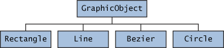

> 本文章以jdk8为基础进行编写，如果想查看后续的版本可以前往jdk版本目录下查看。
>
> 翻译自：https://docs.oracle.com/javase/tutorial/java/IandI/index.html

## 接口

在软件工程中，有很多情况下，不同的程序员群体必须同意一份“合同”，说明他们的软件如何交互。每个组都应该能够在不知道其他组的代码是如何编写的情况下编写自己的代码。一般来说，*接口*就是这样的合同。

例如，想象一个未来社会，计算机控制的机器人汽车在无人驾驶的情况下通过城市街道运送乘客。汽车制造商编写的软件（当然是Java）可以操作汽车停止、启动、加速、左转等等。另一个工业集团，电子导航仪器制造商，制造计算机系统，接收GPS（全球定位系统）位置数据和交通状况的无线传输，并使用这些信息驾驶汽车。

汽车制造商必须发布一个行业标准界面，详细说明可以调用哪些方法来使汽车移动（任何汽车，任何制造商的）。然后，指南制造商可以编写软件，调用界面中描述的方法来命令汽车。两个工业集团都不需要知道另一个集团的软件是如何实现的。事实上，每个小组都认为自己的软件是高度专有的，并保留随时修改它的权利，只要它继续遵守发布的界面。

### Java中的接口

在Java编程语言中，*接口*是一种引用类型，类似于类，它只能包含*常量、方法签名、默认方法、静态方法和嵌套类型。方法体仅存在于默认方法和静态方法。接口不能实例化，它们只能由类*实现*或由其他接口*扩展。本课稍后将讨论扩展。

定义接口类似于创建新类：

```java
public interface OperateCar {

   // 常量声明（如果有）

   // 方法签名
   
   // An enum with values RIGHT, LEFT
   int turn(Direction direction,
            double radius,
            double startSpeed,
            double endSpeed);
   int changeLanes(Direction direction,
                   double startSpeed,
                   double endSpeed);
   int signalTurn(Direction direction,
                  boolean signalOn);
   int getRadarFront(double distanceToCar,
                     double speedOfCar);
   int getRadarRear(double distanceToCar,
                    double speedOfCar);
         ......
   // more method signatures
}
```

请注意，方法签名没有大括号，并以分号结尾。

要使用接口，您需要编写一个实现接口的类。当可实例化类实现接口时，它为接口中声明的每个方法提供方法体。例如

```java
public class OperateBMW760i implements OperateCar {

    // the OperateCar method signatures, with implementation --
    // for example:
    public int signalTurn(Direction direction, boolean signalOn) {
       // code to turn BMW's LEFT turn indicator lights on
       // code to turn BMW's LEFT turn indicator lights off
       // code to turn BMW's RIGHT turn indicator lights on
       // code to turn BMW's RIGHT turn indicator lights off
    }

    // other members, as needed -- for example, helper classes not 
    // visible to clients of the interface
}
```

在上面的机器人汽车示例中，将由汽车制造商来实现接口。当然，雪佛兰的实施方式将与丰田的实施方式大不相同，但两家制造商都将遵循相同的界面。作为该接口的客户，导航制造商将构建使用汽车位置GPS数据、数字街道地图和交通数据驾驶汽车的系统。这样，制导系统将调用接口方法：转弯、变道、刹车、加速等。

### 接口作为API

机器人汽车示例显示了用作行业标准的接口*应用程序编程接口（API）*。API在商业软件产品中也很常见。通常，一家公司销售的软件包包含另一家公司希望在自己的软件产品中使用的复杂方法。一个例子是向制作最终用户图形程序的公司出售的一套数字图像处理方法。这家图像处理公司编写类来实现一个接口，并将其公开给客户。然后，图形公司使用接口中定义的签名和返回类型调用图像处理方法。虽然图像处理公司的API公开（向其客户），但其API的实现被严格保密。事实上，只要它继续实现其客户所依赖的原始接口，它可能会在稍后修改实现。

### 定义接口

接口声明由修饰符、关键字“interface”、接口名称、以逗号分隔的父接口列表（如果有）和接口主体组成。例如：

```java
public interface GroupedInterface extends Interface1, Interface2, Interface3 {

    // 常量声明
    
    // base of natural logarithms
    double E = 2.718282;
 
    // method signatures
    void doSomething (int i, double x);
    int doSomethingElse(String s);
}
```

“public”访问说明符表示接口可以由任何包中的任何类使用。如果未指定接口是公共的，则只有在与接口相同的包中定义的类才能访问接口。

一个接口可以扩展其他接口，就像一个类子类或扩展另一个类一样。然而，虽然一个类只能扩展另一个类，但是一个接口可以扩展任意数量的接口。接口声明包括一个以逗号分隔的列表，其中列出了它所扩展的所有接口。

#### 接口主体

接口主体可以包含[抽象方法](https://docs.oracle.com/javase/tutorial/java/IandI/abstract.html)，[默认方法](https://docs.oracle.com/javase/tutorial/java/IandI/defaultmethods.html)，和[静态方法](https://docs.oracle.com/javase/tutorial/java/IandI/defaultmethods.html#static). 接口中的抽象方法后面是分号，但没有大括号（抽象方法不包含实现）。默认方法使用“Default”修饰符定义，静态方法使用“static”关键字定义。接口中的所有抽象、默认和静态方法都是隐式的“public”，因此可以省略“public”修饰符。

此外，接口可以包含常量声明。接口中定义的所有常量值都隐式为“public”、“static”和“final”。同样，可以省略这些修改器。

### 实现接口

要声明实现接口的类，请在类声明中包含“implements”子句。您的类可以实现多个接口，因此“implements”关键字后面是该类实现的接口的逗号分隔列表。按照惯例，如果“extends”子句后面有“implements”子句，则“implement”子句在后面。

#### 示例界面，可关联

考虑一个定义如何比较对象大小的接口。

```java
public interface Relatable {
        
    // this (object calling isLargerThan)
    // and other must be instances of 
    // the same class returns 1, 0, -1 
    // if this is greater than, 
    // equal to, or less than other
    public int isLargerThan(Relatable other);
}
```

如果您希望能够比较类似对象的大小，无论它们是什么，实例化它们的类都应该实现“Relatable”。

如果有某种方法可以比较从类实例化的对象的相对“大小”，则任何类都可以实现“Relatable”。对于字符串，它可以是字符数；对于书籍，可以是页数；对学生来说，可能是体重；等等对于平面几何对象，面积将是一个很好的选择（请参见下面的“RectanglePlus”类），而体积将适用于三维几何对象。所有此类类都可以实现“isLargerThan（）”方法。

如果您知道一个类实现了“Relatable”，那么您就可以比较从该类实例化的对象的大小。

#### 实现相关接口

这是[Creating Objects](https://docs.oracle.com/javase/tutorial/java/javaOO/objectcreation.html)中显示的“Rectangle”类部分，重写为实现“Relatable”。

```java
public class RectanglePlus 
    implements Relatable {
    public int width = 0;
    public int height = 0;
    public Point origin;

    // four constructors
    public RectanglePlus() {
        origin = new Point(0, 0);
    }
    public RectanglePlus(Point p) {
        origin = p;
    }
    public RectanglePlus(int w, int h) {
        origin = new Point(0, 0);
        width = w;
        height = h;
    }
    public RectanglePlus(Point p, int w, int h) {
        origin = p;
        width = w;
        height = h;
    }

    // a method for moving the rectangle
    public void move(int x, int y) {
        origin.x = x;
        origin.y = y;
    }

    // a method for computing
    // the area of the rectangle
    public int getArea() {
        return width * height;
    }
    
    // a method required to implement
    // the Relatable interface
    public int isLargerThan(Relatable other) {
        RectanglePlus otherRect 
            = (RectanglePlus)other;
        if (this.getArea() < otherRect.getArea())
            return -1;
        else if (this.getArea() > otherRect.getArea())
            return 1;
        else
            return 0;               
    }
}
```

由于“RectanglePlus”实现了“Relatable”，因此可以比较任意两个“Rectangle Plus”对象的大小。

------

**Note:** 在“Relatable”接口中定义的“isLargerThan”方法接受类型为“Relatable”的对象。在上一个示例中以粗体显示的代码行将“other”强制转换为“RectanglePlus”实例。类型转换告诉编译器对象的真正含义。直接在“other”实例（“other.getArea()”）上调用“getArea”将无法编译，因为编译器不知道“other”实际上是“RectanglePlus”的实例。

----

### 使用接口作为类型

定义新接口时，即定义了新的引用数据类型。您可以在任何可以使用任何其他数据类型名称的地方使用接口名称。如果定义的引用变量的类型是接口，则分配给它的任何对象*必须*是实现接口的类的实例。

例如，对于从实现“Relatable”的类实例化的*任何*对象，这里有一个查找一对对象中最大对象的方法：

```java
public Object findLargest(Object object1, Object object2) {
   Relatable obj1 = (Relatable)object1;
   Relatable obj2 = (Relatable)object2;
   if ((obj1).isLargerThan(obj2) > 0)
      return object1;
   else 
      return object2;
}
```

通过将“object1”转换为“Relatable”类型，它可以调用“isLargerThan”方法。

如果要在各种各样的类中实现“Relatable”，那么可以将从这些类中的*任意*实例化的对象与“findLargest（）”方法进行比较，前提是这两个对象都属于同一类。同样，它们都可以与以下方法进行比较：

```java
public Object findSmallest(Object object1, Object object2) {
   Relatable obj1 = (Relatable)object1;
   Relatable obj2 = (Relatable)object2;
   if ((obj1).isLargerThan(obj2) < 0)
      return object1;
   else 
      return object2;
}

public boolean isEqual(Object object1, Object object2) {
   Relatable obj1 = (Relatable)object1;
   Relatable obj2 = (Relatable)object2;
   if ( (obj1).isLargerThan(obj2) == 0)
      return true;
   else 
      return false;
}
```

这些方法适用于任何“相关”对象，无论其类继承是什么。当它们实现“相关”时，它们既可以是自己的类（或超类）类型，也可以是“相关”类型。这为它们提供了多重继承的一些优点，它们可以同时从超类和接口获得行为。

### 不断发展的接口

考虑您开发的一个名为 `DoIt`:

```java
public interface DoIt {
   void doSomething(int i, double x);
   int doSomethingElse(String s);
}
```

假设稍后要向“DoIt”添加第三个方法，这样接口现在就变成：

```java
public interface DoIt {

   void doSomething(int i, double x);
   int doSomethingElse(String s);
   boolean didItWork(int i, double x, String s);
   
}
```

如果进行此更改，则实现旧“DoIt”接口的所有类都将中断，因为它们不再实现旧接口。依赖这个接口的程序员会大声抗议。

尝试预测接口的所有用途，并从一开始就完全指定它。如果要向接口添加其他方法，可以有几个选项。您可以创建一个扩展“DoIt”的“DoItPlus”接口：

```java
public interface DoItPlus extends DoIt {

   boolean didItWork(int i, double x, String s);
   
}
```

现在，代码的用户可以选择继续使用旧界面或升级到新界面。

或者，您可以将新方法定义为[默认方法](https://docs.oracle.com/javase/tutorial/java/IandI/defaultmethods.html). 以下示例定义了名为“didItWork”的默认方法：

```java
public interface DoIt {

   void doSomething(int i, double x);
   int doSomethingElse(String s);
   default boolean didItWork(int i, double x, String s) {
       // Method body 
   }
   
}
```

注意，必须为默认方法提供实现。您还可以定义新的[静态方法](https://docs.oracle.com/javase/tutorial/java/IandI/defaultmethods.html#static)到现有接口。拥有实现用新的默认或静态方法增强的接口的类的用户不必修改或重新编译它们以适应其他方法。

### 默认方法

[接口](https://docs.oracle.com/javase/tutorial/java/IandI/createinterface.html)部分描述了一个涉及计算机控制汽车制造商的示例，这些制造商发布了行业标准接口，这些接口描述了可以调用哪些方法来操作他们的汽车。如果那些计算机控制的汽车制造商为他们的汽车增加了新的功能，比如飞行，会怎么样？这些制造商需要指定新的方法，以使其他公司（如电子制导仪器制造商）能够使其软件适应飞行汽车。这些汽车制造商将在哪里宣布这些与飞行相关的新方法？如果他们将它们添加到原始接口中，那么实现了这些接口的程序员将不得不重写其实现。如果他们将它们添加为静态方法，那么程序员会将它们视为实用方法，而不是必要的核心方法。

默认方法使您能够向库的接口添加新功能，并确保与为这些接口的旧版本编写的代码的二进制兼容性。

考虑以下接口[`TimeClient`](https://docs.oracle.com/javase/tutorial/java/IandI/examples/TimeClient.java)，如[问题和练习答案：界面](https://docs.oracle.com/javase/tutorial/java/IandI/QandE/interfaces-answers.html)中所述:

```java
import java.time.*; 
 
public interface TimeClient {
    void setTime(int hour, int minute, int second);
    void setDate(int day, int month, int year);
    void setDateAndTime(int day, int month, int year,
                               int hour, int minute, int second);
    LocalDateTime getLocalDateTime();
}
```

以下类[`SimpleTimeClient`](https://docs.oracle.com/javase/tutorial/java/IandI/examples/defaultmethods/SimpleTimeClient.java)，实现“TimeClient”：

```java
package defaultmethods;

import java.time.*;
import java.lang.*;
import java.util.*;

public class SimpleTimeClient implements TimeClient {
    
    private LocalDateTime dateAndTime;
    
    public SimpleTimeClient() {
        dateAndTime = LocalDateTime.now();
    }
    
    public void setTime(int hour, int minute, int second) {
        LocalDate currentDate = LocalDate.from(dateAndTime);
        LocalTime timeToSet = LocalTime.of(hour, minute, second);
        dateAndTime = LocalDateTime.of(currentDate, timeToSet);
    }
    
    public void setDate(int day, int month, int year) {
        LocalDate dateToSet = LocalDate.of(day, month, year);
        LocalTime currentTime = LocalTime.from(dateAndTime);
        dateAndTime = LocalDateTime.of(dateToSet, currentTime);
    }
    
    public void setDateAndTime(int day, int month, int year,
                               int hour, int minute, int second) {
        LocalDate dateToSet = LocalDate.of(day, month, year);
        LocalTime timeToSet = LocalTime.of(hour, minute, second); 
        dateAndTime = LocalDateTime.of(dateToSet, timeToSet);
    }
    
    public LocalDateTime getLocalDateTime() {
        return dateAndTime;
    }
    
    public String toString() {
        return dateAndTime.toString();
    }
    
    public static void main(String... args) {
        TimeClient myTimeClient = new SimpleTimeClient();
        System.out.println(myTimeClient.toString());
    }
}
```

假设您希望向“TimeClient”接口添加新功能，例如通过[`ZonedDateTime`](https://docs.oracle.com/javase/8/docs/api/java/time/ZonedDateTime.html)指定时区的功能对象（类似于[`LocalDateTime`](https://docs.oracle.com/javase/8/docs/api/java/time/LocalDateTime.html)对象，除了它存储时区信息）：

```java
public interface TimeClient {
    void setTime(int hour, int minute, int second);
    void setDate(int day, int month, int year);
    void setDateAndTime(int day, int month, int year,
        int hour, int minute, int second);
    LocalDateTime getLocalDateTime();                           
    ZonedDateTime getZonedDateTime(String zoneString);
}
```

对“TimeClient”接口进行修改后，还必须修改类“SimpleTimeClient”并实现方法“getZonedDateTime”。但是，您可以定义一个*默认实现*，而不是将“getZonedDateTime”保留为“abstract”（如前一个示例所示）。（记住[抽象方法](https://docs.oracle.com/javase/tutorial/java/IandI/abstract.html)是没有实现的声明方法。）

```java
package defaultmethods;
 
import java.time.*;

public interface TimeClient {
    void setTime(int hour, int minute, int second);
    void setDate(int day, int month, int year);
    void setDateAndTime(int day, int month, int year,
                               int hour, int minute, int second);
    LocalDateTime getLocalDateTime();
    
    static ZoneId getZoneId (String zoneString) {
        try {
            return ZoneId.of(zoneString);
        } catch (DateTimeException e) {
            System.err.println("Invalid time zone: " + zoneString +
                "; using default time zone instead.");
            return ZoneId.systemDefault();
        }
    }
        
    default ZonedDateTime getZonedDateTime(String zoneString) {
        return ZonedDateTime.of(getLocalDateTime(), getZoneId(zoneString));
    }
}
```

您可以指定接口中的方法定义是默认方法，方法签名开头带有“default”关键字。接口中的所有方法声明（包括默认方法）都隐式为“public”，因此可以省略“public”修饰符。

使用此接口，您不必修改类“SimpleTimeClient”，并且该类（以及实现接口“TimeClient”的任何类）将具有已定义的方法“getZonedDateTime”。以下示例[`TestSimpleTimeClient`](https://docs.oracle.com/javase/tutorial/java/IandI/examples/defaultmethods/TestSimpleTimeClient.java)，从“SimpleTimeClient”实例调用方法“getZonedDateTime”：

```java
package defaultmethods;
 
import java.time.*;
import java.lang.*;
import java.util.*;

public class TestSimpleTimeClient {
    public static void main(String... args) {
        TimeClient myTimeClient = new SimpleTimeClient();
        System.out.println("Current time: " + myTimeClient.toString());
        System.out.println("Time in California: " +
            myTimeClient.getZonedDateTime("Blah blah").toString());
    }
}
```

### 扩展包含默认方法的接口

扩展包含默认方法的接口时，可以执行以下操作：

- 根本不用提默认方法，它允许扩展接口继承默认方法。
- 重新声明默认方法，使其成为“抽象”。
- 重新定义默认方法，该方法将覆盖该方法。

假设您按如下方式扩展接口“TimeClient”：

```java
public interface AnotherTimeClient extends TimeClient { }
```

实现接口“AnotherTimeClient”的任何类都将具有默认方法“TimeClient.getZonedDateTime”指定的实现。

假设您按如下方式扩展接口“TimeClient”：

```java
public interface AbstractZoneTimeClient extends TimeClient {
    public ZonedDateTime getZonedDateTime(String zoneString);
}
```

实现接口“AbstractZoneTimeClient”的任何类都必须实现方法“getZonedDateTime”；与接口中的所有其他非默认（和非静态）方法一样，该方法是一个“抽象”方法。

假设您按如下方式扩展接口“TimeClient”：

```java
public interface HandleInvalidTimeZoneClient extends TimeClient {
    default public ZonedDateTime getZonedDateTime(String zoneString) {
        try {
            return ZonedDateTime.of(getLocalDateTime(),ZoneId.of(zoneString)); 
        } catch (DateTimeException e) {
            System.err.println("Invalid zone ID: " + zoneString +
                "; using the default time zone instead.");
            return ZonedDateTime.of(getLocalDateTime(),ZoneId.systemDefault());
        }
    }
}
```

实现接口“HandleInvalidTimeZoneClient”的任何类都将使用此接口指定的“getZonedDateTime”实现，而不是接口“TimeClient”指定的实现。

#### 静态方法

除了默认方法，您还可以定义[静态方法](https://docs.oracle.com/javase/tutorial/java/javaOO/classvars.html)在接口中。（静态方法是一种与定义它的类关联的方法，而不是与任何对象关联的方法。该类的每个实例都共享其静态方法。）这使您更容易在库中组织助手方法；您可以在同一个接口中而不是在单独的类中保持特定于接口的静态方法。以下示例定义了一个静态方法，该方法检索[`ZoneId`](https://docs.oracle.com/javase/8/docs/api/java/time/ZoneId.html)与时区标识符相对应的对象；如果没有对应于给定标识符的“ZoneId”对象，则使用系统默认时区。（因此，您可以简化方法`getZonedDateTime`）：

```java
public interface TimeClient {
    // ...
    static public ZoneId getZoneId (String zoneString) {
        try {
            return ZoneId.of(zoneString);
        } catch (DateTimeException e) {
            System.err.println("Invalid time zone: " + zoneString +
                "; using default time zone instead.");
            return ZoneId.systemDefault();
        }
    }

    default public ZonedDateTime getZonedDateTime(String zoneString) {
        return ZonedDateTime.of(getLocalDateTime(), getZoneId(zoneString));
    }    
}
```

与类中的静态方法一样，您指定接口中的方法定义是静态方法，方法签名开头带有“static”关键字。接口中的所有方法声明（包括静态方法）都隐式为“public”，因此可以省略“public”修饰符。

#### 将默认方法集成到现有库中

默认方法使您能够向现有接口添加新功能，并确保与为这些接口的旧版本编写的代码的二进制兼容性。特别是，默认方法允许您向现有接口添加接受lambda表达式作为参数的方法。本节演示[`Comparator`](https://docs.oracle.com/javase/8/docs/api/java/util/Comparator.html)接口已通过默认和静态方法进行了增强。

考虑[问题和练习：课程](https://docs.oracle.com/javase/tutorial/java/javaOO/QandE/creating-questions.html)中所述的“卡片”和“套牌”课程. 此示例重写[`Card`](https://docs.oracle.com/javase/tutorial/java/IandI/examples/defaultmethods/Card.java)和[`Deck`](https://docs.oracle.com/javase/tutorial/java/IandI/examples/defaultmethods/Deck.java)类作为接口。“Card”接口包含两种“enum”类型（“Suit”和“Rank”）和两种抽象方法（“getSuit”与“getRank””）：

```java
package defaultmethods;

public interface Card extends Comparable<Card> {
    
    public enum Suit { 
        DIAMONDS (1, "Diamonds"), 
        CLUBS    (2, "Clubs"   ), 
        HEARTS   (3, "Hearts"  ), 
        SPADES   (4, "Spades"  );
        
        private final int value;
        private final String text;
        Suit(int value, String text) {
            this.value = value;
            this.text = text;
        }
        public int value() {return value;}
        public String text() {return text;}
    }
    
    public enum Rank { 
        DEUCE  (2 , "Two"  ),
        THREE  (3 , "Three"), 
        FOUR   (4 , "Four" ), 
        FIVE   (5 , "Five" ), 
        SIX    (6 , "Six"  ), 
        SEVEN  (7 , "Seven"),
        EIGHT  (8 , "Eight"), 
        NINE   (9 , "Nine" ), 
        TEN    (10, "Ten"  ), 
        JACK   (11, "Jack" ),
        QUEEN  (12, "Queen"), 
        KING   (13, "King" ),
        ACE    (14, "Ace"  );
        private final int value;
        private final String text;
        Rank(int value, String text) {
            this.value = value;
            this.text = text;
        }
        public int value() {return value;}
        public String text() {return text;}
    }
    
    public Card.Suit getSuit();
    public Card.Rank getRank();
}
```

“卡片组”界面包含操纵卡片组中卡片的各种方法：

```java
package defaultmethods; 
 
import java.util.*;
import java.util.stream.*;
import java.lang.*;
 
public interface Deck {
    
    List<Card> getCards();
    Deck deckFactory();
    int size();
    void addCard(Card card);
    void addCards(List<Card> cards);
    void addDeck(Deck deck);
    void shuffle();
    void sort();
    void sort(Comparator<Card> c);
    String deckToString();

    Map<Integer, Deck> deal(int players, int numberOfCards)
        throws IllegalArgumentException;

}
```

类[`PlayingCard`](https://docs.oracle.com/javase/tutorial/java/IandI/examples/defaultmethods/PlayingCard.java)实现接口“Card”和类[`StandardDeck`](https://docs.oracle.com/javase/tutorial/java/IandI/examples/defaultmethods/StandardDeck.java)实现接口“Deck”。

类“StandardDeck”实现抽象方法“Deck”。排序如下：

```java
public class StandardDeck implements Deck {
    
    private List<Card> entireDeck;
    
    // ...
    
    public void sort() {
        Collections.sort(entireDeck);
    }
    
    // ...
}
```

方法`Collections.sort`对元素类型实现接口[`Comparable`](https://docs.oracle.com/javase/8/docs/api/java/lang/Comparable.html)的`List`实例进行排序. 成员“entireDeck”是“List”的一个实例，其元素类型为“Card”，扩展了“Comparable”。类“PlayingCard”实现了[`Comparable.compareTo`](https://docs.oracle.com/javase/8/docs/api/java/lang/Comparable.html#compareTo-T-)方法如下：

```java
public int hashCode() {
    return ((suit.value()-1)*13)+rank.value();
}

public int compareTo(Card o) {
    return this.hashCode() - o.hashCode();
}
```

方法“compareTo”导致方法`StandardDeck.sort()`先按花色排序，然后按等级排序。

如果你想先按等级排序，然后按套装排序，该怎么办？您需要实现[`Comparator`](https://docs.oracle.com/javase/8/docs/api/java/util/Comparator.html)接口指定新的排序条件，并使用方法[`排序（List List，Comparator c）`](https://docs.oracle.com/javase/8/docs/api/java/util/Collections.html#sort-java.util.List-java.util。Comparator-)（包含“Comparator”参数的“sort”方法的版本）。您可以在类“StandardDeck”中定义以下方法：

```java
public void sort(Comparator<Card> c) {
    Collections.sort(entireDeck, c);
}  
```

使用此方法，可以指定方法`Collections的方式。sort`对`Card`类的实例进行排序。实现这一点的一种方法是实现“Comparator”接口，以指定您希望卡片如何排序。示例[`SortByRankTheSubit `](https://docs.oracle.com/javase/tutorial/java/IandI/examples/defaultmethods/SortByRankThenSuit.java)这样做：

```java
package defaultmethods;

import java.util.*;
import java.util.stream.*;
import java.lang.*;

public class SortByRankThenSuit implements Comparator<Card> {
    public int compare(Card firstCard, Card secondCard) {
        int compVal =
            firstCard.getRank().value() - secondCard.getRank().value();
        if (compVal != 0)
            return compVal;
        else
            return firstCard.getSuit().value() - secondCard.getSuit().value(); 
    }
}
```

下面的调用首先按等级排序扑克牌，然后按花色排序：

```java
StandardDeck myDeck = new StandardDeck();
myDeck.shuffle();
myDeck.sort(new SortByRankThenSuit());
```

然而，这种方法过于冗长；如果只指定排序条件并避免创建多个排序实现，那会更好。假设您是编写“Comparator”接口的开发人员。您可以向“Comparator”接口添加哪些默认或静态方法，以使其他开发人员能够更容易地指定排序标准？

首先，假设您希望按等级对扑克牌进行排序，而不考虑花色。您可以调用`StandardDeck.sort`方法如下：

```java
StandardDeck myDeck = new StandardDeck();
myDeck.shuffle();
myDeck.sort(
    (firstCard, secondCard) ->
        firstCard.getRank().value() - secondCard.getRank().value()
); 
```

因为接口“Comparator”是[功能接口](https://docs.oracle.com/javase/tutorial/java/javaOO/lambdaexpressions.html#approach6)，可以使用lambda表达式作为“sort”方法的参数。在此示例中，lambda表达式比较两个整数值。

如果您的开发人员可以通过调用方法“Card”来创建“Comparator”实例，则会更简单。getRank`仅限。特别是，如果您的开发人员可以创建一个“Comparator”实例来比较可以从“getValue”或“hashCode”等方法返回数值的任何对象，这将非常有用。“Comparator”接口已通过静态方法[“comparating”](https://docs.oracle.com/javase/8/docs/api/java/util/Comparator.html#comparing-java.util.function.Functionjava.util.Comprator-)增强了此功能：

```java
myDeck.sort(Comparator.comparing((card) -> card.getRank()));  
```

在此示例中，可以使用[方法引用](https://docs.oracle.com/javase/tutorial/java/javaOO/methodreferences.html)而是：

```java
myDeck.sort(Comparator.comparing(Card::getRank));  
```

此调用更好地演示了如何指定不同的排序标准，避免创建多个排序实现。

“Comparator”接口已通过静态方法“comparising”的其他版本（如[`comparisingDouble`](https://docs.oracle.com/javase/8/docs/api/java/util/Comparator.html#comparingDouble-java.util.function.ToDoubleFunction-java.util。Comparator-)）进行了增强和[`comparingLong`](https://docs.oracle.com/javase/8/docs/api/java/util/Comparator.html#comparingLong-java.util.function。ToLongFunction-)，使您能够创建比较其他数据类型的“Comparator”实例。

假设您的开发人员希望创建一个“Comparator”实例，该实例可以将对象与多个条件进行比较。例如，你会如何先按等级，然后按花色对扑克牌进行排序？与之前一样，您可以使用lambda表达式来指定这些排序条件：

```java
StandardDeck myDeck = new StandardDeck();
myDeck.shuffle();
myDeck.sort(
    (firstCard, secondCard) -> {
        int compare =
            firstCard.getRank().value() - secondCard.getRank().value();
        if (compare != 0)
            return compare;
        else
            return firstCard.getSuit().value() - secondCard.getSuit().value();
    }      
); 
```

如果您的开发人员可以从一系列“Comparator”实例中构建一个“Comparator”实例，则会更简单。“Comparator”接口已通过默认方法[`thenCompanying`](https://docs.oracle.com/javase/8/docs/api/java/util/Comparator.html#thenComparing-java.util.Comprator-)增强了此功能：

```java
myDeck.sort(
    Comparator
        .comparing(Card::getRank)
        .thenComparing(Comparator.comparing(Card::getSuit)));
```

“Comparator”接口已通过其他版本的默认方法“thenCompanying”（如[`thenComparingDouble`](https://docs.oracle.com/javase/8/docs/api/java/util/Comparator.html#thenComparingDouble-java.util.function。ToDoubleFunction-)）进行了增强和[`thenComparingLong`](https://docs.oracle.com/javase/8/docs/api/java/util/Comparator.html#thenComparingLong-java.util.function。ToLongFunction-)，使您能够构建比较其他数据类型的“Comparator”实例。

假设您的开发人员希望创建一个“Comparator”实例，使他们能够以相反的顺序对对象集合进行排序。例如，您将如何按照排名降序对扑克牌进行排序，从A到2（而不是从2到A）？如前所述，您可以指定另一个lambda表达式。然而，如果您的开发人员可以通过调用一个方法来反转现有的“Comparator”，则会更简单。“Comparator”接口已通过默认方法[“reversed”]增强了此功能(https://docs.oracle.com/javase/8/docs/api/java/util/Comparator.html#reversed--):

```java
myDeck.sort(
    Comparator.comparing(Card::getRank)
        .reversed()
        .thenComparing(Comparator.comparing(Card::getSuit)));
```

此示例演示了如何使用默认方法、静态方法、lambda表达式和方法引用增强了“Comparator”接口，以创建更具表达力的库方法，程序员可以通过查看它们的调用方式快速推断其功能。使用这些构造来增强库中的接口。

### 接口概述

接口声明可以包含方法签名，默认方法、静态方法和常量定义。唯一具有实现的方法是默认方法和静态方法。

实现接口的类必须实现接口中声明的所有方法。

可以在任何可以使用类型的地方使用接口名称。

## 继承

在前面的课程中，您已经多次看到*继承*。在Java语言中，类可以从其他类*派生*，从而从这些类*继承*字段和方法。

------

**定义：**从另一个类派生的类称为*子类*（也称为*派生类*、*扩展类*或*子类）。派生子类的类被称为*超类*（也是*基类*或*父类）。

除了没有超类的“Object”之外，每个类都有并且只有一个直接超类（单一继承）。在没有任何其他显式超类的情况下，每个类都是“Object”的子类。

类可以从从类派生的类派生，以此类推，最终从最顶层的类“Object”派生。这样的类被称为继承链中所有类的“后代”，可以追溯到“Object”。

------

继承的思想简单但强大：当您想要创建一个新类，并且已经有一个类包含了您想要的一些代码时，您可以从现有类派生出新类。在这样做时，您可以重用现有类的字段和方法，而无需编写（和调试！）他们自己。

子类从其超类继承所有*成员*（字段、方法和嵌套类）。构造函数不是成员，因此它们不会被子类继承，但超类的构造函数可以从子类调用。

### Java平台类层次结构

[`对象`](https://docs.oracle.com/javase/8/docs/api/java/lang/Object.html)类，在`java。lang包，定义并实现所有类（包括您编写的类）通用的行为。在Java平台中，许多类直接从“Object”派生，其他类从这些类中的一些派生，依此类推，形成了类的层次结构。


Java平台中的所有类都是对象的后代

在层次结构的顶部，“Object”是所有类中最通用的。层次结构底部附近的类提供了更专门的行为。

### 继承的一个例子

以下是“类和对象”课程中介绍的“自行车”类的可能实现示例代码：

```java
public class Bicycle {
        
    // the Bicycle class has three fields
    public int cadence;
    public int gear;
    public int speed;
        
    // the Bicycle class has one constructor
    public Bicycle(int startCadence, int startSpeed, int startGear) {
        gear = startGear;
        cadence = startCadence;
        speed = startSpeed;
    }
        
    // the Bicycle class has four methods
    public void setCadence(int newValue) {
        cadence = newValue;
    }
        
    public void setGear(int newValue) {
        gear = newValue;
    }
        
    public void applyBrake(int decrement) {
        speed -= decrement;
    }
        
    public void speedUp(int increment) {
        speed += increment;
    }
        
}
```

作为“Bicycle”子类的“MountainBike”类的类声明可能如下所示：

```java
public class MountainBike extends Bicycle {
        
    // the MountainBike subclass adds one field
    public int seatHeight;

    // the MountainBike subclass has one constructor
    public MountainBike(int startHeight,
                        int startCadence,
                        int startSpeed,
                        int startGear) {
        super(startCadence, startSpeed, startGear);
        seatHeight = startHeight;
    }   
        
    // the MountainBike subclass adds one method
    public void setHeight(int newValue) {
        seatHeight = newValue;
    }   
}
```

`MountainBike`继承了“Bicycle”的所有字段和方法，并添加了字段“seatHeight”和设置它的方法。除了构造函数，就好像您完全从头开始编写了一个新的“MountainBike”类，包含四个字段和五个方法。然而，你不必做所有的工作。如果“Bicycle”类中的方法很复杂并且需要大量时间进行调试，那么这将特别有价值。

### 在子类中可以做什么

子类继承其父类的所有*public*和*protected*成员，无论子类在哪个包中。如果子类与其父类在同一个包中，它也继承父类的*packageprivate*成员。您可以按原样使用继承的成员、替换它们、隐藏它们或使用新成员补充它们：

- 继承的字段可以直接使用，就像任何其他字段一样。
- 您可以在子类中声明与超类中的字段同名的字段，从而*隐藏*它（不推荐）。
- 您可以在子类中声明不在超类中的新字段。
- 继承的方法可以直接使用。
- 您可以在子类中编写一个新的*instance*方法，该方法与超类中的方法具有相同的签名，从而覆盖它。
- 您可以在子类中编写一个新的*static*方法，该方法与超类中的方法具有相同的签名，从而将其隐藏。
- 您可以在子类中声明不在超类中的新方法。
- 您可以隐式地或通过使用关键字“super”来编写调用超类构造函数的子类构造函数。

本课程的以下部分将对这些主题进行扩展。

### 超级类中的私人成员

子类不继承其父类的“private”成员。但是，如果超类具有用于访问其私有字段的公共或受保护的方法，则子类也可以使用这些方法。

嵌套类可以访问其封闭类的所有私有成员，包括字段和方法。因此，子类继承的公共或受保护的嵌套类可以间接访问父类的所有私有成员。

### 铸造对象

我们已经看到一个对象是从中实例化的类的数据类型。例如，如果我们写

```java
public MountainBike myBike = new MountainBike();
```

则“myBike”是“MountainBike”类型。

`MountainBike`是Bicycle和Object的后代。因此，“MountainBike”是一个“Bicycle”，也是一个“Object”，它可以在调用“Bicycles”或“Object”对象的任何地方使用。

相反的说法并不一定正确：“自行车”可能是“山地自行车”，但不一定。类似地，“对象”*可以是“自行车”或“山地自行车”，但不一定。

*Casting*显示了在继承和实现允许的对象中使用一种类型的对象代替另一种类型。例如，如果我们写

```java
Object obj = new MountainBike();
```

则“obj”既是“Object”又是“MountainBike”（直到“obj’被分配给另一个不是“MountainBike”的对象）。这称为“隐式转换”。

另一方面，如果我们写

```java
MountainBike myBike = obj;
```

我们将得到一个编译时错误，因为编译器不知道“obj”是“MountainBike”。然而，我们可以*告诉*编译器，我们承诺通过*显式转换将“MountainBike”分配给“obj”：*

```java
MountainBike myBike = (MountainBike)obj;
```

此强制转换将插入一个运行时检查，检查“obj”是否被分配了“MountainBike”，以便编译器可以安全地假设“obj”是“MountainBike”。如果“obj”在运行时不是“MountainBike”，则将引发异常。

------

**Note:** 您可以使用“instanceof”运算符对特定对象的类型进行逻辑测试。这可以避免由于不正确的强制转换而导致的运行时错误。例如：

```java
if (obj instanceof MountainBike) {
    MountainBike myBike = (MountainBike)obj;
}
```

在这里，“instanceof”运算符验证“obj”是否引用了“MountainBike”，以便我们可以在知道不会引发运行时异常的情况下进行强制转换。

------

### 状态、实现和类型的多重继承

类和接口之间的一个重要区别是类可以有字段，而接口不能。此外，您可以实例化一个类来创建一个对象，这是使用接口无法做到的。如[什么是对象？](https://docs.oracle.com/javase/tutorial/java/concepts/object.html)一节所述，对象将其状态存储在类中定义的字段中。Java编程语言不允许扩展多个类的一个原因是为了避免“状态的多重继承”问题，即从多个类继承字段的能力。例如，假设您能够定义一个扩展多个类的新类。当通过实例化该类创建对象时，该对象将继承该类所有超类的字段。如果来自不同超类的方法或构造函数实例化同一个字段呢？哪个方法或构造函数优先？因为接口不包含字段，所以您不必担心状态的多重继承导致的问题。

*实现的多重继承*是从多个类继承方法定义的能力。这种类型的多重继承会出现问题，例如名称冲突和歧义。当支持这种类型多重继承的编程语言的编译器遇到包含同名方法的超类时，它们有时无法确定要访问或调用哪个成员或方法。此外，程序员可以通过向超类添加新方法而无意中引入名称冲突。[默认方法](https://docs.oracle.com/javase/tutorial/java/IandI/defaultmethods.html)介绍一种形式的多重继承实现。一个类可以实现多个接口，这些接口可以包含同名的默认方法。Java编译器提供了一些规则来确定特定类使用的默认方法。

Java编程语言支持*类型的多重继承，这是一个类实现多个接口的能力。一个对象可以有多种类型：它自己的类的类型和该类实现的所有接口的类型。这意味着，如果变量被声明为接口的类型，那么它的值可以引用从实现接口的任何类实例化的任何对象。这在[使用接口作为类型](https://docs.oracle.com/javase/tutorial/java/IandI/interfaceAsType.html)一节中进行了讨论.

与实现的多重继承一样，类可以继承在其扩展的接口中定义的方法（作为默认或静态）的不同实现。在这种情况下，编译器或用户必须决定使用哪一个。

### 覆盖和隐藏方法

#### 实例方法

子类中的实例方法具有与超类中实例方法相同的签名（名称，加上其参数的编号和类型）和返回类型*覆盖*超类的方法。

子类重写方法的能力允许类从行为“足够接近”的超类继承，然后根据需要修改行为。重写方法具有与其重写的方法相同的名称、参数的数量和类型以及返回类型。重写方法还可以返回重写方法返回的类型的子类型。此子类型称为*协变返回类型*。

重写方法时，可能需要使用“@Override”注释，该注释指示编译器要重写超类中的方法。如果由于某种原因，编译器检测到某个超类中不存在该方法，那么它将生成错误。有关“@Override”的详细信息，请参见[`Annotations`](https://docs.oracle.com/javase/tutorial/java/annotations/index.html).

#### 静态方法

如果子类定义的静态方法与超类中的静态方法具有相同的签名，那么子类中的方法将隐藏超类中。

隐藏静态方法和重写实例方法之间的区别具有重要意义：

- 被调用的重写实例方法的版本是子类中的版本。
- 被调用的隐藏静态方法的版本取决于它是从超类还是子类调用的。

考虑一个包含两个类的示例。第一个是“Animal”，它包含一个实例方法和一个静态方法：

```java
public class Animal {
    public static void testClassMethod() {
        System.out.println("The static method in Animal");
    }
    public void testInstanceMethod() {
        System.out.println("The instance method in Animal");
    }
}
```

第二类是“Animal”的子类，称为“Cat”：

```java
public class Cat extends Animal {
    public static void testClassMethod() {
        System.out.println("The static method in Cat");
    }
    public void testInstanceMethod() {
        System.out.println("The instance method in Cat");
    }

    public static void main(String[] args) {
        Cat myCat = new Cat();
        Animal myAnimal = myCat;
        Animal.testClassMethod();
        myAnimal.testInstanceMethod();
    }
}
```

“Cat”类重写“Animal”中的实例方法，并隐藏“Animal”中的静态方法。此类中的“main”方法创建一个“Cat”实例，并在类上调用“testClassMethod（）”，在实例上调用“testInstanceMethod()）”。

该程序的输出如下：

```java
The static method in Animal
The instance method in Cat
```

正如所承诺的，被调用的隐藏静态方法的版本是超类中的版本，而被调用的重写实例方法的版本则是子类中的。

#### 接口方法

[默认方法](https://docs.oracle.com/javase/tutorial/java/IandI/defaultmethods.html)和[抽象方法](https://docs.oracle.com/javase/tutorial/java/IandI/abstract.html)在接口中继承类似实例方法。然而，当类或接口的超类型提供具有相同签名的多个默认方法时，Java编译器会遵循继承规则来解决名称冲突。这些规则由以下两个原则驱动：

- 实例方法优于接口默认方法。

	考虑以下类和接口：

	```java
	public class Horse {
	    public String identifyMyself() {
	        return "I am a horse.";
	    }
	}
	```

	```java
	public interface Flyer {
	    default public String identifyMyself() {
	        return "I am able to fly.";
	    }
	}
	```

	```java
	public interface Mythical {
	    default public String identifyMyself() {
	        return "I am a mythical creature.";
	    }
	}
	```

	```java
	public class Pegasus extends Horse implements Flyer, Mythical {
	    public static void main(String... args) {
	        Pegasus myApp = new Pegasus();
	        System.out.println(myApp.identifyMyself());
	    }
	}
	```

	方法`Pegasus.identifyMyself`返回字符串`I am a horse`

- 已被其他候选对象覆盖的方法将被忽略。当超类型共享一个共同祖先时，可能会出现这种情况。

	考虑以下接口和类：

	```java
	public interface Animal {
	    default public String identifyMyself() {
	        return "I am an animal.";
	    }
	}
	```

	```java
	public interface EggLayer extends Animal {
	    default public String identifyMyself() {
	        return "I am able to lay eggs.";
	    }
	}
	```

	```java
	public interface FireBreather extends Animal { }
	```

	```java
	public class Dragon implements EggLayer, FireBreather {
	    public static void main (String... args) {
	        Dragon myApp = new Dragon();
	        System.out.println(myApp.identifyMyself());
	    }
	}
	```

	方法`Dragon.identifyMyself`返回字符串`I am able to lay eggs.`

如果两个或多个独立定义的默认方法冲突，或者默认方法与抽象方法冲突，则Java编译器会产生编译器错误。必须显式重写父类型方法。

以现在可以飞行的计算机控制汽车为例。您有两个接口（“OperaCar”和“FlyCar”），为同一方法（“startEngine”）提供默认实现：

```java
public interface OperateCar {
    // ...
    default public int startEngine(EncryptedKey key) {
        // Implementation
    }
}
public interface FlyCar {
    // ...
    default public int startEngine(EncryptedKey key) {
        // Implementation
    }
}
```

同时实现“OperateCar”和“FlyCar”的类必须重写方法“startEngine”。您可以使用“super”关键字调用任何默认实现。

```java
public class FlyingCar implements OperateCar, FlyCar {
    // ...
    public int startEngine(EncryptedKey key) {
        FlyCar.super.startEngine(key);
        OperateCar.super.startEngine(key);
    }
}
```

“super”前面的名称（在本例中为“FlyCar”或“OperaCar”）必须引用定义或继承所调用方法默认值的直接超级接口。这种形式的方法调用不限于区分包含具有相同签名的默认方法的多个已实现接口。您可以使用“super”关键字在类和接口中调用默认方法。

从类继承的实例方法可以重写抽象接口方法。考虑以下接口和类：

```java
public interface Mammal {
    String identifyMyself();
}
public class Horse {
    public String identifyMyself() {
        return "I am a horse.";
    }
}
public class Mustang extends Horse implements Mammal {
    public static void main(String... args) {
        Mustang myApp = new Mustang();
        System.out.println(myApp.identifyMyself());
    }
}
```

方法`Mustang。identifyMyself`返回字符串“I am a horse.”类“Mustang”继承了类“Horse”中的方法“identifyMyself”，该方法重写了接口“Mammal”中同名的抽象方法。

**Note**: 接口中的静态方法永远不会被继承。

#### 修改器

重写方法的访问说明符可以允许比重写方法更多但不能更少的访问。例如，超类中的受保护实例方法可以在子类中公开，但不能私有。

如果试图将超类中的实例方法更改为子类中的静态方法，则会出现编译时错误，反之亦然。

#### 总结

下表总结了定义与超类中的方法具有相同签名的方法时发生的情况。

|              | 超级类实例方法 | 超类静态方法   |
| ------------ | -------------- | -------------- |
| 子类实例方法 | 覆盖           | 生成编译时错误 |
| 父类静态方法 | 生成编译时错误 | Hides          |

------

**Note:** 在子类中，可以重载从超类继承的方法。此类重载方法既不隐藏也不覆盖超类实例方法，它们是子类特有的新方法。

------

### 多态性

字典中对“多态性”的定义是指生物学中的一个原则，即一个生物体或物种可以有许多不同的形式或阶段。这一原则也适用于面向对象编程和Java语言等语言。类的子类可以定义自己独特的行为，但也可以共享父类的一些相同功能。

对“Bicycle”类稍作修改即可证明多态性。例如，可以将“printDescription”方法添加到显示实例中当前存储的所有数据的类中。

```java
public void printDescription(){
    System.out.println("\nBike is " + "in gear " + this.gear
        + " with a cadence of " + this.cadence +
        " and travelling at a speed of " + this.speed + ". ");
}
```

要演示Java语言中的多态特性，请使用“MountainBike”和“RoadBike”类扩展“Bicycle”类。对于“MountainBike”，添加一个“suspension”字段，该字段是一个“String”值，指示自行车是否具有前减震器“front”。或者，自行车有一个前后减震器，“双减震器”。

以下是更新的类：

```java
public class MountainBike extends Bicycle {
    private String suspension;

    public MountainBike(
               int startCadence,
               int startSpeed,
               int startGear,
               String suspensionType){
        super(startCadence,
              startSpeed,
              startGear);
        this.setSuspension(suspensionType);
    }

    public String getSuspension(){
      return this.suspension;
    }

    public void setSuspension(String suspensionType) {
        this.suspension = suspensionType;
    }

    public void printDescription() {
        super.printDescription();
        System.out.println("The " + "MountainBike has a" +
            getSuspension() + " suspension.");
    }
} 
```

注意重写的“printDescription”方法。除了之前提供的信息之外，输出中还包括关于悬架的附加数据。

接下来，创建“RoadBike”类。因为公路或赛车的轮胎很薄，所以添加一个属性来跟踪轮胎宽度。这是“RoadBike”课程：

```java
public class RoadBike extends Bicycle{
    // In millimeters (mm)
    private int tireWidth;

    public RoadBike(int startCadence,
                    int startSpeed,
                    int startGear,
                    int newTireWidth){
        super(startCadence,
              startSpeed,
              startGear);
        this.setTireWidth(newTireWidth);
    }

    public int getTireWidth(){
      return this.tireWidth;
    }

    public void setTireWidth(int newTireWidth){
        this.tireWidth = newTireWidth;
    }

    public void printDescription(){
        super.printDescription();
        System.out.println("The RoadBike" + " has " + getTireWidth() +
            " MM tires.");
    }
}
```

请再次注意，“printDescription”方法已被重写。此时，将显示有关轮胎宽度的信息。

概括来说，有三个类别：“自行车”、“山地自行车”和“公路自行车”。这两个子类重写“printDescription”方法并打印唯一信息。

这是一个创建三个“Bicycle”变量的测试程序。每个变量分配给三个自行车类中的一个。然后打印每个变量。

```java
public class TestBikes {
  public static void main(String[] args){
    Bicycle bike01, bike02, bike03;

    bike01 = new Bicycle(20, 10, 1);
    bike02 = new MountainBike(20, 10, 5, "Dual");
    bike03 = new RoadBike(40, 20, 8, 23);

    bike01.printDescription();
    bike02.printDescription();
    bike03.printDescription();
  }
}
```

以下是测试程序的输出：

```java
Bike is in gear 1 with a cadence of 20 and travelling at a speed of 10. 

Bike is in gear 5 with a cadence of 20 and travelling at a speed of 10. 
The MountainBike has a Dual suspension.

Bike is in gear 8 with a cadence of 40 and travelling at a speed of 20. 
The RoadBike has 23 MM tires.
```

Java虚拟机（JVM）为每个变量中引用的对象调用适当的方法。它不会调用由变量类型定义的方法。这种行为被称为“虚拟方法调用”，它展示了Java语言中重要的多态特性的一个方面。

### 隐藏字段

在类中，与超类中的字段同名的字段隐藏超类的字段，即使它们的类型不同。在子类中，超类中的字段不能通过其简单名称引用。相反，必须通过“super”访问该字段，这将在下一节中介绍。一般来说，我们不建议隐藏字段，因为这会使代码难以阅读。

### 使用关键字super

#### 访问超级类成员

如果您的方法覆盖了其超类的方法之一，则可以通过使用关键字“super”来调用覆盖的方法。您也可以使用“super”来引用隐藏字段（尽管不鼓励隐藏字段）。考虑此类“超级类”：

```java
public class Superclass {

    public void printMethod() {
        System.out.println("Printed in Superclass.");
    }
}
```

下面是一个子类，名为“subclass”，它重写了“printMethod()”：

```java
public class Subclass extends Superclass {

    // overrides printMethod in Superclass
    public void printMethod() {
        super.printMethod();
        System.out.println("Printed in Subclass");
    }
    public static void main(String[] args) {
        Subclass s = new Subclass();
        s.printMethod();    
    }
}
```

在“子类”中，简单名称“printMethod()”引用在“子类别”中声明的名称，该名称覆盖在“超级类”中的名称。因此，要引用从“Superclass”继承的“printMethod()”，“Subclass”必须使用限定名，使用“super”，如图所示。编译和执行“子类”将打印以下内容：

```
Printed in Superclass.
Printed in Subclass
```

#### 子类构造函数

下面的示例说明了如何使用“super”关键字来调用超类的构造函数。从[`Bicycle`](https://docs.oracle.com/javase/tutorial/java/IandI/subclasses.html)中回忆例如，“MountainBike”是“Bicycle”的子类。这里是“MountainBike”（子类）构造函数，它调用超类构造函数，然后添加自己的初始化代码：

```java
public MountainBike(int startHeight, 
                    int startCadence,
                    int startSpeed,
                    int startGear) {
    super(startCadence, startSpeed, startGear);
    seatHeight = startHeight;
}   
```

超类构造函数的调用必须是子类构造函数中的第一行。

调用超类构造函数的语法为

```
super();  
```

or:

```
super(parameter list);
```

使用“super()”，将调用超类无参数构造函数。使用“super(parameter list)”，将调用具有匹配参数列表的超类构造函数。

------

**Note:** 如果构造函数没有显式调用超类构造函数，Java编译器会自动插入对超类的无参数构造函数的调用。如果超级类没有无参数构造函数，则会出现编译时错误`对象“*”没有这样的构造函数，因此如果“Object”是唯一的超类，则没有问题。

------

如果子类构造函数显式或隐式地调用其超类的构造函数，您可能会认为将有一个完整的构造函数链被调用，一直返回到“Object”的构造函数。事实上，情况就是这样。它被称为*构造函数链接*，当有很长的类下降线时，您需要注意它。

### Object 作为超类

[`对象`](https://docs.oracle.com/javase/8/docs/api/java/lang/Object.html)类，在`java.lang`包位于类层次结构树的顶部。每个类都是“Object”类的直接或间接后代。您使用或编写的每个类都继承“Object”的实例方法。您不需要使用任何这些方法，但是，如果您选择这样做，您可能需要使用特定于您的类的代码来覆盖它们。本节讨论的从“Object”继承的方法包括：

- `protected Object clone() throws CloneNotSupportedException`
	   创建并返回此对象的副本。
- `public boolean equals(Object obj)`
	   指示其他对象是否“等于”此对象。
- `protected void finalize() throws Throwable`
	   垃圾回收时由对象上的垃圾回收器调用
	   集合确定不再有对该对象的引用
- `public final Class getClass()`
	   返回对象的运行时类。
- `public int hashCode()`
	   返回对象的哈希代码值。
- `public String toString()`
	   返回对象的字符串表示形式。

“Object”的“notify”、“notifyAll”和“wait”方法都在同步程序中独立运行的线程的活动中发挥作用，这将在后面的课程中讨论，这里不再赘述。有五种方法：

- `public final void notify()`
- `public final void notifyAll()`
- `public final void wait()`
- `public final void wait(long timeout)`
- `public final void wait(long timeout, int nanos)`

------

**Note:** 许多这些方法都有一些微妙的方面，特别是“克隆”方法。

------

#### The clone() Method

如果类或其超类之一实现了“可克隆”接口，则可以使用“clone()”方法从现有对象创建副本。要创建克隆，请执行以下操作：

```
aCloneableObject.clone();
```

`对象的此方法的实现检查调用了“clone()”的对象是否实现了“Cloneable”接口。如果对象没有，该方法将抛出“CloneNotSupportedException”异常。异常处理将在后面的课程中介绍。目前，您需要知道“clone（）”必须声明为

```
protected Object clone() throws CloneNotSupportedException
```

or:

```
public Object clone() throws CloneNotSupportedException
```

如果要编写一个“clone()”方法来覆盖“Object”中的方法。

如果调用了“clone()”的对象确实实现了“Cloneable”接口，则“object”实现的“clone()”方法将创建一个与原始对象具有相同类的对象，并初始化新对象的成员变量，使其具有与原始对象的对应成员变量相同的值。

使类可克隆的最简单方法是将“implements cloneable”添加到类的声明中。则对象可以调用“clone()”方法。

对于某些类，“Object”的“clone()”方法的默认行为正常工作。但是，如果对象包含对外部对象的引用，例如“ObjExternal”，则可能需要重写“clone()”以获得正确的行为。否则，一个对象对“ObjExternal”所做的更改也将在其克隆中可见。这意味着原始对象及其克隆不是独立的。要使它们解耦，必须重写“clone()”，以便它克隆对象*和*“ObjExternal”。然后，原始对象引用“ObjExternal”，克隆引用“Obj External”的克隆，因此对象及其克隆是真正独立的。

#### The equals() Method

“equals（）”方法比较两个对象是否相等，如果相等则返回“true”。“Object”类中提供的“equals（）”方法使用标识运算符（“==”）来确定两个对象是否相等。对于原始数据类型，这将给出正确的结果。然而，对于对象，则不会。“Object”提供的“equals（）”方法测试对象*引用*是否相等，也就是说，如果比较的对象是完全相同的对象。

要测试两个对象在*等效*（包含相同信息）意义上是否相等，必须重写“equals（）”方法。下面是重写“equals（）”的“Book”类的示例：

```java
public class Book {
    String ISBN;
    
    public String getISBN() { 
        return ISBN;
    }
    
    public boolean equals(Object obj) {
        if (obj instanceof Book)
            return ISBN.equals((Book)obj.getISBN()); 
        else
            return false;
    }
}
```

考虑一下测试“Book”类的两个实例是否相等的代码：

```java
// Swing Tutorial, 2nd edition
Book firstBook  = new Book("0201914670");
Book secondBook = new Book("0201914670");
if (firstBook.equals(secondBook)) {
    System.out.println("objects are equal");
} else {
    System.out.println("objects are not equal");
}
```

该程序显示“对象相等”，即使“firstBook”和“secondBook”引用了两个不同的对象。它们被认为是相等的，因为所比较的对象包含相同的ISBN编号。

如果标识运算符不适合您的类，则应始终重写“equals（）”方法。

------

**Note:** 如果重写“equals（）”，则也必须重写“hashCode（）”。

------

#### The finalize() Method

“Object”类提供回调方法“finalize（）”，当对象变为垃圾时，可以*调用该方法`对象“finalize（）”的实现不做任何事情，您可以重写“finaliz（）”来进行清理，例如释放资源。

“finalize（）”方法*可以由系统自动调用，但何时调用，甚至是否调用，都是不确定的。因此，不要依赖此方法为您进行清理。例如，如果在执行I/O之后不关闭代码中的文件描述符，并且希望“finalize（）”为您关闭它们，则可能会用完文件描述符。相反，使用“try”-with-resources语句自动关闭应用程序的资源。参见[资源尝试声明](https://docs.oracle.com/javase/tutorial/essential/exceptions/tryResourceClose.html)和[定案和弱参考、软参考和虚参考](https://docs.oracle.com/javase/8/docs/technotes/guides/vm/gctuning/considerations.html#sthref63)在*Java平台标准版HotSpot虚拟机垃圾收集调整指南*中。

#### The getClass() Method

您不能覆盖 `getClass`.

“getClass（）”方法返回一个“Class”对象，该对象具有可用于获取类信息的方法，例如其名称（“getSimpleName（）”）、其超类（“getSuperclass（）”，以及其实现的接口（“getInterface（）”。例如，以下方法获取并显示对象的类名：

```java
void printClassName(Object obj) {
    System.out.println("The object's" + " class is " +
        obj.getClass().getSimpleName());
}
```

[`Class`](https://docs.oracle.com/javase/8/docs/api/java/lang/Class.html)类，在`java。lang包有大量方法（超过50个）。例如，您可以测试该类是注释（`isAnnotation（）`）、接口（`isInterface（）`或枚举（`isEnum（））。您可以看到对象的字段是什么（`getFields（）`）或其方法是什么（` getMethods（）'），等等。

#### The hashCode() Method

“hashCode（）”返回的值是对象的哈希代码，它是由哈希算法生成的整数值。

根据定义，如果两个对象相等，则其哈希代码*也必须相等。如果重写“equals（）”方法，则会更改两个对象相等的方式，并且“Object”对“hashCode（）”的实现不再有效。因此，如果重写“equals（）”方法，也必须重写“hashCode（）”。

#### The toString() Method

您应该始终考虑在类中重写“toString（）”方法。

“Object”的“toString（）”方法返回对象的“String”表示，这对于调试非常有用。对象的“String”表示完全依赖于对象，这就是为什么需要在类中重写“toString（）”。

可以将“toString（）”与“System.out”一起使用。println（）`显示对象的文本表示，例如“Book”的实例：

```
System.out.println(firstBook.toString());
```

对于正确重写的“toString（）”方法，它将打印一些有用的内容，例如：

```
ISBN: 0201914670; The Swing Tutorial; A Guide to Constructing GUIs, 2nd Edition
```

### 编写 Final Classes and Methods

您可以声明类的一些或所有方法*final*。在方法声明中使用“final”关键字表示方法不能被子类重写。“Object”类这样做——它的许多方法都是“final”。

如果方法的实现不应更改，并且对对象的一致状态至关重要，那么您可能希望将其设置为final。例如，您可能希望将“ChessAlgorithm”类中的“getFirstPlayer”方法设置为final：

```java
class ChessAlgorithm {
    enum ChessPlayer { WHITE, BLACK }
    ...
    final ChessPlayer getFirstPlayer() {
        return ChessPlayer.WHITE;
    }
    ...
}
```

从构造函数调用的方法通常应声明为final。如果构造函数调用非final方法，子类可能会重新定义该方法，并产生令人惊讶或不希望的结果。

注意，您也可以声明整个类final。声明为final的类不能被子类化。例如，当创建像“String”类这样的不可变类时，这特别有用。

### Abstract Methods and Classes

*抽象类*是一个声明为“abstract”的类，它可能包含也可能不包含抽象方法。抽象类不能实例化，但可以子类化。

*抽象方法*是在没有实现的情况下声明的方法（没有大括号，后跟分号），如下所示：

```java
abstract void moveTo(double deltaX, double deltaY);
```

如果类包含抽象方法，则类本身*必须*声明为“abstract”，如：

```java
public abstract class GraphicObject {
   // declare fields
   // declare nonabstract methods
   abstract void draw();
}
```

当抽象类被子类化时，子类通常为其父类中的所有抽象方法提供实现。但是，如果没有，那么子类也必须声明为“abstract”。

------

**Note:** *接口*中的方法（请参见[接口](https://docs.oracle.com/javase/tutorial/java/IandI/createinterface.html)section）是隐式抽象的，因此“abstract”修饰符不与接口方法一起使用。（可以使用，但没有必要。）

------

#### 抽象类与接口的比较

抽象类类似于接口。您不能实例化它们，它们可能包含带有或不带有实现的混合声明方法。然而，使用抽象类，您可以声明非静态和最终的字段，并定义公共、受保护和私有的具体方法。使用接口，所有字段都自动为公共、静态和final，并且您声明或定义的所有方法（作为默认方法）都是公共的。此外，无论是否抽象，您只能扩展一个类，而可以实现任意数量的接口。

抽象类或接口应该使用哪一个？

- 如果以下任何语句适用于您的情况，请考虑使用抽象类：
	- 您希望在几个密切相关的类之间共享代码。
	- 您希望扩展抽象类的类具有许多公共方法或字段，或者需要公共以外的访问修饰符（如protected和private）。
	- 您要声明非静态或非final字段。这使您能够定义可以访问和修改其所属对象状态的方法。
- 如果以下任何语句适用于您的情况，请考虑使用接口：
	- 您希望不相关的类实现您的接口。例如，接口[`Comparable`](https://docs.oracle.com/javase/8/docs/api/java/lang/Comparable.html)和[`可克隆`](https://docs.oracle.com/javase/8/docs/api/java/lang/Cloneable.html)由许多不相关的类实现。
	- 您希望指定特定数据类型的行为，但不关心谁实现了它的行为。
	- 您希望利用类型的多重继承。

JDK中抽象类的一个示例是[`AbstractMap`](https://docs.oracle.com/javase/8/docs/api/java/util/AbstractMap.html)，是集合框架的一部分。它的子类（包括“HashMap”、“TreeMap”和“ConcurrentHashMap”）共享“AbstractMap”定义的许多方法（包括“get”、“put”、“isEmpty”、“containsKey”和“containsValue”）。

JDK中实现多个接口的类的示例是[`HashMap`](https://docs.oracle.com/javase/8/docs/api/java/util/HashMap.html)，实现了接口“Serializable”、“Cloneable”和“Map<K，V>”。通过阅读此接口列表，您可以推断出“HashMap”的实例（无论是开发人员还是实现该类的公司）可以被克隆、可序列化（这意味着它可以被转换为字节流；请参阅[serializable Objects]一节(https://docs.oracle.com/javase/tutorial/jndi/objects/serial.html))，并具有地图的功能。此外，“Map<K，V>”接口已通过许多默认方法（如“merge”和“forEach”）进行了增强，实现了该接口的旧类不必定义这些方法。

注意，许多软件库同时使用抽象类和接口；“HashMap”类实现了几个接口，还扩展了抽象类“AbstractMap”。

#### 抽象类示例

在面向对象的绘图应用程序中，可以绘制圆、矩形、直线、贝塞尔曲线和许多其他图形对象。这些对象都具有某些共同的状态（例如：位置、方向、线条颜色、填充颜色）和行为（例如：moveTo、旋转、调整大小、绘制）。所有图形对象的某些状态和行为都相同（例如：位置、填充颜色和moveTo）。其他需要不同的实现（例如，调整大小或绘制）。所有“GraphicObject”必须能够自己绘制或调整大小；他们只是在做这件事的方式上有所不同。对于抽象超类来说，这是一个完美的情况。您可以利用这些相似性，并声明要从同一抽象父对象（例如，“GraphicObject”）继承的所有图形对象，如下图所示。




类矩形、直线、贝塞尔和圆继承自GraphicObject

首先，声明一个抽象类“GraphicObject”，以提供所有子类（如当前位置和“moveTo”方法）完全共享的成员变量和方法`GraphicObject还为需要由所有子类实现但必须以不同方式实现的方法（如“draw”或“resize”）声明抽象方法。“GraphicObject”类可以如下所示：

```java
abstract class GraphicObject {
    int x, y;
    ...
    void moveTo(int newX, int newY) {
        ...
    }
    abstract void draw();
    abstract void resize();
}
```

“GraphicObject”的每个非抽象子类（如“Circle”和“Rectangle”）必须提供“draw”和“resize”方法的实现：

```java
class Circle extends GraphicObject {
    void draw() {
        ...
    }
    void resize() {
        ...
    }
}
class Rectangle extends GraphicObject {
    void draw() {
        ...
    }
    void resize() {
        ...
    }
}
```

#### 抽象类实现接口时

在[`Interfaces`](https://docs.oracle.com/javase/tutorial/java/IandI/createinterface.html)部分，注意到实现接口的类必须实现接口的所有方法。然而，如果类被声明为“抽象”，则可以定义一个不实现所有接口方法的类。例如

```java
abstract class X implements Y {
  // implements all but one method of Y
}

class XX extends X {
  // implements the remaining method in Y
}
```

在这种情况下，类“X”必须是“抽象”的，因为它没有完全实现“Y”，但类“XX”实际上实现了“Y”。

#### Class Members

抽象类可以具有“静态”字段和“静态”方法。您可以将这些静态成员与类引用（例如，“AbstractClass.staticMethod()”）一起使用，就像与任何其他类一样。

### 继承总结

除了“Object”类，一个类只有一个直接超类。类从其所有超类（无论是直接还是间接）继承字段和方法。子类可以覆盖其继承的方法，也可以隐藏其继承的字段或方法。（请注意，隐藏字段通常是不好的编程实践。）

[覆盖和隐藏方法](https://docs.oracle.com/javase/tutorial/java/IandI/override.html)中的表部分显示了使用与超类中的方法相同的签名声明方法的效果。

“Object”类是类层次结构的顶部。所有类都是该类的后代，并从该类继承方法。从`Object`继承的有用方法包括`toString（）`、`equals（）`，`clone（）`和`getClass（）`。

通过在类的声明中使用“final”关键字，可以防止类被子类化。类似地，通过将方法声明为final方法，可以防止方法被子类重写。

抽象类只能被子类化；它不能被实例化。抽象类可以包含声明但未实现的抽象方法方法。然后，子类提供抽象方法的实现。