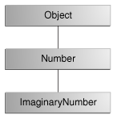

> 本文章以jdk8为基础进行编写，如果想查看后续的版本可以前往jdk版本目录下查看。
>
> 翻译自：https://docs.oracle.com/javase/tutorial/java/javaOO/index.html

## 类(Classes)

在题为“面向对象编程概念”的课程中，面向对象概念的介绍以自行车类为例，赛车、山地自行车和串联自行车为子类。下面是Bicycle类的可能实现的示例代码，为您提供类声明的概述。本课程的后续部分将逐步支持和解释类声明。目前，不要关心细节。

```java
public class Bicycle {
        
    // the Bicycle class has
    // three fields
    public int cadence;
    public int gear;
    public int speed;
        
    // the Bicycle class has
    // one constructor
    public Bicycle(int startCadence, int startSpeed, int startGear) {
        gear = startGear;
        cadence = startCadence;
        speed = startSpeed;
    }
        
    // the Bicycle class has
    // four methods
    public void setCadence(int newValue) {
        cadence = newValue;
    }
        
    public void setGear(int newValue) {
        gear = newValue;
    }
        
    public void applyBrake(int decrement) {
        speed -= decrement;
    }
        
    public void speedUp(int increment) {
        speed += increment;
    }
        
}
```

作为Bicycle子类的MountainBike类的类声明可能如下所示：

```java
public class MountainBike extends Bicycle {
        
    // the MountainBike subclass has
    // one field
    public int seatHeight;

    // the MountainBike subclass has
    // one constructor
    public MountainBike(int startHeight, int startCadence,
                        int startSpeed, int startGear) {
        super(startCadence, startSpeed, startGear);
        seatHeight = startHeight;
    }   
        
    // the MountainBike subclass has
    // one method
    public void setHeight(int newValue) {
        seatHeight = newValue;
    }   

}
```

MountainBike继承了Bicycle的所有字段和方法，并添加了字段seatHeight和设置方法（山地自行车具有可根据地形需要上下移动的座椅）。

### 声明类

您已经看到了以以下方式定义的类：

```java
class MyClass {
    // field, constructor, and 
    // method declarations
}
```

这是一个类声明。类主体（大括号之间的区域）包含了为从类创建的对象的生命周期提供的所有代码：用于初始化新对象的构造函数、用于提供类及其对象状态的字段声明，以及用于实现类及其对象行为的方法。

前面的类声明是最小的。它只包含类声明中需要的那些组件。您可以在类声明的开头提供有关类的更多信息，例如其超类的名称、是否实现任何接口等。例如

```java
class MyClass extends MySuperClass implements YourInterface {
    // field, constructor, and
    // method declarations
}
```

意味着MyClass是MySuperClass的子类，它实现了YourInterface接口。

您还可以在一开始就添加public或private等修饰符，这样您可以看到类声明的开头行会变得非常复杂。公共和私有修饰符决定了哪些其他类可以访问MyClass，将在本课稍后讨论。关于接口和继承的课程将解释如何以及为什么在类声明中使用扩展和实现关键字。目前你不需要担心这些额外的并发症。

一般来说，类声明可以包括以下组件：

1. 修改器，如public、private和稍后将遇到的许多其他修改器。（但是，请注意，private修饰符只能应用于Nested Classes。）
2. 类名，按照惯例，首字母大写。
3. 类的父类（超类）的名称（如果有的话），前面加上关键字extends。一个类只能扩展（子类）一个父类。
4. 由类实现的接口的逗号分隔列表（如果有），前面是关键字implements。一个类可以实现多个接口。
5. 类主体由大括号｛｝包围。

### 声明成员变量

有几种变量：

- 类中的成员变量称为字段。
- 方法或代码块中的变量称为局部变量。
- 方法声明中的变量称为参数。

Bicycle类使用以下代码行定义其字段：

```java
public int cadence;
public int gear;
public int speed;
```

字段声明由三个组件组成，顺序如下：

1. 零个或多个修饰符，如public或private。
2. 字段的类型。
3. 字段的名称。

Bicycle的字段名为“节奏”、“档位”和“速度”，并且都是整数（int）数据类型。public关键字将这些字段标识为公共成员，可由任何可以访问类的对象访问。

#### 访问修改函数

使用的第一个（最左边）修饰符可以控制哪些其他类可以访问成员字段。目前，只考虑公共和私人。稍后将讨论其他访问修饰符。

- public修饰符字段可从所有类访问。
- private修饰符字段只能在其自己的类中访问。

本着封装的精神，将字段私有化是很常见的。这意味着只能从Bicycle类直接访问它们。然而，我们仍然需要获得这些价值观。这可以通过添加为我们获取字段值的公共方法间接实现：

```java
public class Bicycle {
        
    private int cadence;
    private int gear;
    private int speed;
        
    public Bicycle(int startCadence, int startSpeed, int startGear) {
        gear = startGear;
        cadence = startCadence;
        speed = startSpeed;
    }
        
    public int getCadence() {
        return cadence;
    }
        
    public void setCadence(int newValue) {
        cadence = newValue;
    }
        
    public int getGear() {
        return gear;
    }
        
    public void setGear(int newValue) {
        gear = newValue;
    }
        
    public int getSpeed() {
        return speed;
    }
        
    public void applyBrake(int decrement) {
        speed -= decrement;
    }
        
    public void speedUp(int increment) {
        speed += increment;
    }
}
```

#### 类型

所有变量都必须有一个类型。您可以使用基本类型，如int、float、boolean等，也可以使用引用类型，如字符串、数组或对象。

#### 变量名称

所有变量，无论是字段、局部变量还是参数，都遵循语言基础课“[Variables—Naming](https://docs.oracle.com/javase/tutorial/java/nutsandbolts/variables.html#naming).”中介绍的相同命名规则和约定。

在本课中，请注意相同的命名规则和约定用于方法和类名，除了

- 类名的第一个字母应该大写
- 方法名中的第一个（或唯一一个）单词应该是动词。

### 定义方法

下面是一个典型方法声明的示例：

```java
public double calculateAnswer(double wingSpan, int numberOfEngines,
                              double length, double grossTons) {
    //do the calculation here
}
```

方法声明中唯一必需的元素是方法的返回类型、名称、一对括号（）和大括号之间的主体｛｝。

更一般地说，方法声明有六个组件，顺序如下：

1. 修改器，如public、private和其他您稍后将了解的修改器。
2. 返回类型是方法返回值的数据类型，如果方法不返回值，则返回void。
3. 方法名字段名规则也适用于方法名，但约定有点不同。
4. 括号中的参数列表—以逗号分隔的输入参数列表，前面是它们的数据类型，用括号（）括起来。如果没有参数，则必须使用空括号。
5. 稍后将讨论的例外列表。
6. 方法体（包含在方法代码的大括号中，包括局部变量的声明）位于此处。

修饰符、返回类型和参数将在本课后面讨论。例外情况将在后面的课程中讨论。

> 定义：方法声明的两个组件包括方法签名、方法名称和参数类型。

上述方法的签名为：

```java
calculateAnswer(double, int, double, double)
```

#### 命名方法

尽管方法名可以是任何合法标识符，但代码约定限制了方法名。按照惯例，方法名应该是一个小写的动词，或者是一个以小写的动词开头，然后是形容词、名词等的多单词名。在多单词名中，第二个和后面的每个单词的第一个字母都应该大写。以下是一些示例：

```
run
runFast
getBackground
getFinalData
compareTo
setX
isEmpty
```

通常，方法在其类中具有唯一的名称。但是，由于方法重载，方法可能与其他方法同名。

#### 重载方法

Java编程语言支持重载方法，Java可以区分具有不同方法签名的方法。这意味着，如果一个类中的方法有不同的参数列表，那么它们可以具有相同的名称（在“接口和继承”一课中将讨论一些限制条件）。

假设您有一个类可以使用书法绘制各种类型的数据（字符串、整数等），该类包含绘制每个数据类型的方法。为每个方法使用一个新名称是很麻烦的，例如drawString、drawInteger、drawFloat等。在Java编程语言中，您可以为所有绘制方法使用相同的名称，但可以为每个方法传递不同的参数列表。因此，数据绘制类可能会声明四个名为draw的方法，每个方法都有一个不同的参数列表。

```java
public class DataArtist {
    ...
    public void draw(String s) {
        ...
    }
    public void draw(int i) {
        ...
    }
    public void draw(double f) {
        ...
    }
    public void draw(int i, double f) {
        ...
    }
}
```

重载方法通过传递给方法的参数的数量和类型进行区分。在代码示例中，draw（Strings）和draw（inti）是截然不同的方法，因为它们需要不同的参数类型。

不能声明多个具有相同名称、相同数量和类型的参数的方法，因为编译器无法区分它们。

编译器在区分方法时不考虑返回类型，因此您不能声明具有相同签名的两个方法，即使它们具有不同的返回类型。

==注意：重载方法应该谨慎使用，因为它们会使代码的可读性大大降低。==

#### 为类提供构造函数

类包含调用以从类蓝图创建对象的构造函数。构造函数声明看起来像方法声明，只是它们使用类的名称并且没有返回类型。例如，Bicycle有一个构造函数：

```java
public Bicycle(int startCadence, int startSpeed, int startGear) {
    gear = startGear;
    cadence = startCadence;
    speed = startSpeed;
}
```

要创建名为myBike的新Bicycle对象，new操作符将调用构造函数：

```java
Bicycle myBike = new Bicycle(30, 0, 8);
```

newBicycle（30,0,8）在内存中为对象创建空间并初始化其字段。

尽管Bicycle只有一个构造函数，但它也可以有其他构造函数，包括无参数构造函数： 

```java
public Bicycle() {
    gear = 1;
    cadence = 10;
    speed = 0;
}
```

`Bicycle yourBike = new Bicycle();` 调用无参数构造函数创建名为yourBike的新Bicycle对象。

两个构造函数都可以在Bicycle中声明，因为它们有不同的参数列表。与方法一样，Java平台根据列表中参数的数量及其类型来区分构造函数。不能为同一类编写两个参数数量和类型相同的构造函数，因为平台无法将它们区分开来。这样做会导致编译时错误。

您不必为类提供任何构造函数，但在这样做时必须小心。编译器自动为任何没有构造函数的类提供无参数的默认构造函数。此默认构造函数将调用超类的无参数构造函数。在这种情况下，如果超类没有无参数构造函数，编译器会发出抱怨，因此您必须验证它有无参数构造函数。如果您的类没有显式超类，那么它有一个隐式超类Object，该类没有参数构造函数。

您可以自己使用超类构造函数。本课开始时的山地自行车课就是这样做的。这将在稍后的接口和继承课程中讨论。

可以在构造函数声明中使用访问修饰符来控制哪些其他类可以调用构造函数。

==注意：如果另一个类不能调用MyClass构造函数，则不能直接创建MyClass对象。==

### 向方法或构造函数传递信息

方法或构造函数的声明声明了该方法或构造函数参数的数量和类型。例如，以下是一种根据贷款金额、利率、贷款期限（期限数）和贷款未来价值计算住房贷款月付款的方法：

```java
public double computePayment(
                  double loanAmt,
                  double rate,
                  double futureValue,
                  int numPeriods) {
    double interest = rate / 100.0;
    double partial1 = Math.pow((1 + interest), 
                    - numPeriods);
    double denominator = (1 - partial1) / interest;
    double answer = (-loanAmt / denominator)
                    - ((futureValue * partial1) / denominator);
    return answer;
}
```

该方法有四个参数：贷款金额、利率、未来价值和期数。前三个是双精度浮点数，第四个是整数。参数在方法体中使用，在运行时将接受传入的参数值。

==注意：参数是指方法声明中的变量列表。参数是调用方法时传入的实际值。调用方法时，使用的参数必须在类型和顺序上与声明的参数匹配。==

#### 参数类型

您可以将任何数据类型用于方法或构造函数的参数。这包括基本数据类型，如double、float和integer，如您在computePayment方法中看到的，以及引用数据类型，例如对象和数组。

下面是一个接受数组作为参数的方法的示例。在本例中，该方法创建一个新的多边形对象，并从Point对象数组初始化它（假设Point是表示x，y坐标的类）：

```java
public Polygon polygonFrom(Point[] corners) {
    // method body goes here
}
```

注意：如果要将方法传递给方法，请使用[lambda expression](https://docs.oracle.com/javase/tutorial/java/javaOO/lambdaexpressions.html) 或 [method reference](https://docs.oracle.com/javase/tutorial/java/javaOO/methodreferences.html).

#### 任意数量的参数

可以使用名为varargs的构造将任意数量的值传递给方法。当您不知道将向方法传递多少特定类型的参数时，可以使用varargs。这是手动创建数组的快捷方式（以前的方法可以使用varargs而不是数组）。

要使用varargs，在最后一个参数的类型后面加一个省略号（三个点，…），然后加一个空格和参数名称。然后可以使用任意数量的该参数调用该方法，包括无。

```java
public Polygon polygonFrom(Point... corners) {
    int numberOfSides = corners.length;
    double squareOfSide1, lengthOfSide1;
    squareOfSide1 = (corners[1].x - corners[0].x)
                     * (corners[1].x - corners[0].x) 
                     + (corners[1].y - corners[0].y)
                     * (corners[1].y - corners[0].y);
    lengthOfSide1 = Math.sqrt(squareOfSide1);

    // more method body code follows that creates and returns a 
    // polygon connecting the Points
}
```

您可以看到，在该方法中，角被视为数组。可以使用数组或参数序列调用该方法。无论哪种情况，方法体中的代码都会将参数视为数组。

您通常会看到带有打印方法的varargs；例如，这个printf方法：

```java
public PrintStream printf(String format, Object... args)
```

允许您打印任意数量的对象。可以这样称呼：

```java
System.out.printf("%s: %d, %s%n", name, idnum, address);
```

或者像这样

```java
System.out.printf("%s: %d, %s, %s, %s%n", name, idnum, address, phone, email);
```

或者具有不同数量的参数。

#### 参数名称

当您向方法或构造函数声明参数时，您需要为该参数提供一个名称。此名称在方法体中用于引用传入的参数。

参数的名称在其范围内必须唯一。它不能与同一方法或构造函数的另一个参数的名称相同，也不能是方法或构造函数中的局部变量的名称。

参数可以与类的某个字段同名。如果是这种情况，则该参数被称为阴影字段。阴影字段会使代码难以阅读，通常仅在设置特定字段的构造函数和方法中使用。例如，考虑以下Circle类及其setOrigin方法：

```java
public class Circle {
    private int x, y, radius;
    public void setOrigin(int x, int y) {
        ...
    }
}
```

Circle类有三个字段：x、y和radius。setOrigin方法有两个参数，每个参数的名称与其中一个字段的名称相同。每个方法参数都会隐藏共享其名称的字段。因此，在方法体中使用简单名称x或y是指参数，而不是字段。要访问该字段，必须使用限定名称。这将在本课后面的“使用此关键字”一节中讨论.

#### 传递原语数据类型参数

原始参数（如int或double）通过值传递到方法中。这意味着对参数值的任何更改都只存在于方法的范围内。当方法返回时，参数将消失，对它们的任何更改都将丢失。下面是一个示例：

```java
public class PassPrimitiveByValue {

    public static void main(String[] args) {
           
        int x = 3;
           
        // invoke passMethod() with 
        // x as argument
        passMethod(x);
           
        // print x to see if its 
        // value has changed
        System.out.println("After invoking passMethod, x = " + x);
           
    }
        
    // change parameter in passMethod()
    public static void passMethod(int p) {
        p = 10;
    }
}
```

运行此程序时，输出为：

```java
After invoking passMethod, x = 3
```

#### 传递引用数据类型参数

引用数据类型参数（如对象）也按值传递到方法中。这意味着当方法返回时，传入的引用仍然引用与以前相同的对象。但是，如果对象的字段具有适当的访问级别，则可以在方法中更改这些字段的值。

例如，考虑任意类中移动Circle对象的方法：

```java
public void moveCircle(Circle circle, int deltaX, int deltaY) {
    // code to move origin of circle to x+deltaX, y+deltaY
    circle.setX(circle.getX() + deltaX);
    circle.setY(circle.getY() + deltaY);
        
    // code to assign a new reference to circle
    circle = new Circle(0, 0);
}
```

使用以下参数调用方法：

```java
moveCircle(myCircle, 23, 56)
```

在方法中，圆最初是指myCircle。该方法将圆引用的对象（即myCircle）的x和y坐标分别更改23和56。当方法返回时，这些更改将持续存在。然后，圆被分配给一个新的circle对象（x=y=0）的引用。但是，这种重新分配没有永久性，因为引用是按值传递的，不能更改。在该方法中，圆指向的对象已更改，但当该方法返回时，myCircle仍然引用与调用该方法之前相同的circle对象。

## 对象(Objects)

典型的Java程序创建许多对象，正如您所知，这些对象通过调用方法进行交互。通过这些对象交互，程序可以执行各种任务，例如实现GUI、运行动画或通过网络发送和接收信息。一旦对象完成了为其创建的工作，其资源将被回收供其他对象使用。

这是一个名为CreateObjectDemo的小程序，它创建三个对象：一个Point对象和两个Rectangle对象。编译此程序需要所有三个源文件。

```java
public class CreateObjectDemo {

    public static void main(String[] args) {
		
        // Declare and create a point object and two rectangle objects.
        Point originOne = new Point(23, 94);
        Rectangle rectOne = new Rectangle(originOne, 100, 200);
        Rectangle rectTwo = new Rectangle(50, 100);
		
        // display rectOne's width, height, and area
        System.out.println("Width of rectOne: " + rectOne.width);
        System.out.println("Height of rectOne: " + rectOne.height);
        System.out.println("Area of rectOne: " + rectOne.getArea());
		
        // set rectTwo's position
        rectTwo.origin = originOne;
		
        // display rectTwo's position
        System.out.println("X Position of rectTwo: " + rectTwo.origin.x);
        System.out.println("Y Position of rectTwo: " + rectTwo.origin.y);
		
        // move rectTwo and display its new position
        rectTwo.move(40, 72);
        System.out.println("X Position of rectTwo: " + rectTwo.origin.x);
        System.out.println("Y Position of rectTwo: " + rectTwo.origin.y);
    }
}
```

该程序创建、操作和显示有关各种对象的信息。以下是输出：

```
Width of rectOne: 100
Height of rectOne: 200
Area of rectOne: 20000
X Position of rectTwo: 23
Y Position of rectTwo: 94
X Position of rectTwo: 40
Y Position of rectTwo: 72
```

以下三个部分使用上面的示例来描述程序中对象的生命周期。从中，您将学习如何编写在自己的程序中创建和使用对象的代码。您还将了解当对象的生命结束时，系统如何在对象之后进行清理。

### 创建对象

如您所知，类提供对象的蓝图；从类创建对象。从 [`CreateObjectDemo`](https://docs.oracle.com/javase/tutorial/java/javaOO/examples/CreateObjectDemo.java)程序中提取的以下语句中的每一个都会创建一个对象并将其指定给一个变量：

```java
Point originOne = new Point(23, 94);
Rectangle rectOne = new Rectangle(originOne, 100, 200);
Rectangle rectTwo = new Rectangle(50, 100);
```

第一行创建Point类的对象，第二行和第三行分别创建Rectangle类的对象。

这些语句中的每一个都有三个部分（下面将详细讨论）：

1. 声明：粗体代码集是将变量名与对象类型关联的所有变量声明。
2. 实例化：new关键字是创建对象的Java运算符。
3. 初始化：新运算符后面是对构造函数的调用，构造函数初始化新对象。

#### 声明变量以引用对象

之前，您了解到要声明变量，您可以编写：

```java
type name;
```

这会通知编译器，您将使用名称引用类型为type的数据。对于基元变量，此声明还为变量保留了适当的内存量。

您也可以在自己的行中声明引用变量。例如：

```java
Point originOne;
```

如果像这样声明originOne，那么在实际创建并分配对象之前，它的值将无法确定。简单地声明引用变量不会创建对象。为此，您需要使用新运算符，如下一节所述。在代码中使用对象之前，必须将其分配给originOne。否则，您将得到一个编译器错误。

此状态下的变量当前未引用任何对象，可以如下所示（变量名originOne加上指向任何对象的引用）：


#### 实例化类

新操作符通过为新对象分配内存并返回对该内存的引用来实例化类。新运算符还调用对象构造函数。

==注意：短语“实例化一个类”的意思与“创建一个对象”的意思相同。当您创建对象时，您正在创建一个类的“实例”，因此“实例”一个类。==

新运算符需要一个后缀参数：对构造函数的调用。构造函数的名称提供了要实例化的类的名称。

新运算符返回对其创建的对象的引用。此引用通常分配给适当类型的变量，如：

```java
Point originOne = new Point(23, 94);
```

新运算符返回的引用不必指定给变量。它也可以直接在表达式中使用。例如：

```java
int height = new Rectangle().height;
```

这一声明将在下一节讨论。

#### 初始化对象

以下是Point类的代码：

```java
public class Point {
    public int x = 0;
    public int y = 0;
    //constructor
    public Point(int a, int b) {
        x = a;
        y = b;
    }
}
```

此类包含单个构造函数。您可以识别构造函数，因为它的声明使用与类相同的名称，并且没有返回类型。Point类中的构造函数接受两个整数参数，如代码所声明的（int a，int b）。以下语句提供23和94作为这些参数的值：

```java
Point originOne = new Point(23, 94);
```

执行此语句的结果如下图所示：


下面是Rectangle类的代码，它包含四个构造函数：

```java
public class Rectangle {
    public int width = 0;
    public int height = 0;
    public Point origin;

    // four constructors
    public Rectangle() {
        origin = new Point(0, 0);
    }
    public Rectangle(Point p) {
        origin = p;
    }
    public Rectangle(int w, int h) {
        origin = new Point(0, 0);
        width = w;
        height = h;
    }
    public Rectangle(Point p, int w, int h) {
        origin = p;
        width = w;
        height = h;
    }

    // a method for moving the rectangle
    public void move(int x, int y) {
        origin.x = x;
        origin.y = y;
    }

    // a method for computing the area of the rectangle
    public int getArea() {
        return width * height;
    }
}
```

每个构造函数都允许您使用基本类型和引用类型为矩形的原点、宽度和高度提供初始值。如果一个类有多个构造函数，它们必须有不同的签名。Java编译器根据参数的数量和类型区分构造函数。当Java编译器遇到以下代码时，它知道调用Rectangle类中的构造函数，该构造函数需要Point参数后跟两个整数参数：

```java
Rectangle rectOne = new Rectangle(originOne, 100, 200);
```

这将调用Rectangle的构造函数之一，该构造函数将origin初始化为originOne。此外，构造函数将宽度设置为100，高度设置为200。现在有两个对同一Point对象的引用，一个对象可以有多个对它的引用，如下图所示：


下面一行代码调用Rectangle构造函数，该构造函数需要两个整数参数，它们提供宽度和高度的初始值。如果检查构造函数中的代码，您会看到它创建了一个新的Point对象，其x和y值被初始化为0：

```java
Rectangle rectTwo = new Rectangle(50, 100);
```

以下语句中使用的矩形构造函数不带任何参数，因此称为无参数构造函数：

```java
Rectangle rect = new Rectangle();
```

所有类都至少有一个构造函数。如果类没有显式声明任何，Java编译器会自动提供一个无参数构造函数，称为默认构造函数。此默认构造函数调用类父级的无参数构造函数，如果类没有其他父级，则调用Object构造函数。如果父级没有构造函数（Object有构造函数），编译器将拒绝该程序。

### 使用对象

一旦您创建了一个对象，您可能希望将其用于某些用途。您可能需要使用其中一个字段的值、更改其中一个域或调用其中一个方法来执行操作。

#### 引用对象的字段

对象字段通过其名称进行访问。您必须使用明确的名称。

您可以在自己的类中为字段使用一个简单的名称。例如，我们可以在Rectangle类中添加一条语句来打印宽度和高度：

```java
System.out.println("Width and height are: " + width + ", " + height);
```

在这种情况下，宽度和高度是简单的名称。

对象类之外的代码必须使用对象引用或表达式，后跟点（.）运算符，后跟简单字段名，如： 

```java
objectReference.fieldName
```

例如，CreateObjectDemo类中的代码位于Rectangle类的代码之外。因此，要引用名为rectOne的矩形对象中的原点、宽度和高度字段，CreateObjectDemo类必须使用名称rectOne。原点，rectOne。width和rectOne。高度。程序使用以下两个名称来显示rectOne的宽度和高度：

```java
System.out.println("Width of rectOne: "  + rectOne.width);
System.out.println("Height of rectOne: " + rectOne.height);
```

试图使用CreateObjectDemo类中代码中的简单名称width和height是没有意义的-这些字段只存在于对象中-并导致编译器错误。

稍后，该程序使用类似的代码来显示关于rectTwo的信息。相同类型的对象具有自己的相同实例字段副本。因此，每个矩形对象都有名为原点、宽度和高度的字段。通过对象引用访问实例字段时，将引用该特定对象的字段。CreateObjectDemo程序中的两个对象rectOne和rectTwo具有不同的原点、宽度和高度字段。

要访问字段，可以使用对对象的命名引用，如前面的示例所示，也可以使用任何返回对象引用的表达式。回想一下，新操作符返回对对象的引用。因此，您可以使用new返回的值来访问新对象的字段：

```java
int height = new Rectangle().height;
```

此语句创建一个新的矩形对象，并立即获得其高度。本质上，该语句计算矩形的默认高度。请注意，在执行此语句之后，程序不再具有对所创建矩形的引用，因为程序从未将该引用存储在任何位置。对象未被引用，其资源可由Java虚拟机自由回收。

#### 调用对象的方法

还可以使用对象引用来调用对象的方法。您可以将方法的简单名称附加到对象引用，中间有一个点运算符（.）。此外，还可以在括号内提供该方法的任何参数。如果方法不需要任何参数，请使用空括号。

```java
objectReference.methodName(argumentList);
```

or:

```java
objectReference.methodName();
```

Rectangle类有两个方法：getArea（）计算矩形的面积，move（）更改矩形的原点。下面是调用这两个方法的CreateObjectDemo代码：

```java
System.out.println("Area of rectOne: " + rectOne.getArea());
...
rectTwo.move(40, 72);
```

第一条语句调用rectOne的getArea（）方法并显示结果。第二行移动rectTwo，因为move（）方法为对象的原点指定了新值。x和原点y。

与实例字段一样，objectReference必须是对对象的引用。可以使用变量名，但也可以使用返回对象引用的任何表达式。new运算符返回一个对象引用，因此您可以使用从new返回的值来调用新对象的方法：

```java
new Rectangle(100, 50).getArea()
```

表达式new Rectangle（100，50）返回一个引用矩形对象的对象引用。如图所示，您可以使用点表示法调用新矩形的getArea（）方法来计算新矩形的面积。

一些方法，如getArea（），返回一个值。对于返回值的方法，可以在表达式中使用方法调用。您可以将返回值分配给变量，使用它来进行决策，或控制循环。此代码将getArea（）返回的值分配给变量areaOfRectangle：

```java
int areaOfRectangle = new Rectangle(100, 50).getArea();
```

请记住，对特定对象调用方法与向该对象发送消息相同。在这种情况下，调用getArea（）的对象是构造函数返回的矩形。

#### 垃圾收集器

一些面向对象的语言要求您跟踪创建的所有对象，并在不再需要它们时显式销毁它们。显式地管理内存是乏味且容易出错的。Java平台允许您创建任意多的对象（当然，受限于您的系统所能处理的对象），并且您不必担心破坏它们。当Java运行时环境确定不再使用对象时，将删除这些对象。这个过程称为垃圾收集。

当不再有对该对象的引用时，该对象可以进行垃圾收集。当变量超出范围时，通常会删除变量中的引用。或者，可以通过将变量设置为特殊值null来显式删除对象引用。请记住，一个程序可以对同一对象有多个引用；在对象符合垃圾收集条件之前，必须删除对该对象的所有引用。

Java运行时环境有一个垃圾收集器，它定期释放不再被引用的对象所使用的内存。垃圾收集器在确定时间合适时自动执行其任务。

## 类的更多操作

### 从方法返回值

方法返回调用它的代码

- 完成方法中的所有语句，
- 到达返回语句，
- 或抛出异常（稍后介绍），

以先发生者为准。

在方法声明中声明方法的返回类型。在方法体中，使用return语句返回值。

任何声明为void的方法都不会返回值。它不需要包含return语句，但可以这样做。在这种情况下，可以使用return语句从控制流块中分支出来并退出该方法，其用法如下：

```java
return;
```

如果您试图从声明为void的方法返回值，将得到编译器错误。

任何未声明为void的方法都必须包含具有相应返回值的return语句，如下所示： 

```java
return returnValue;
```

返回值的数据类型必须与方法声明的返回类型匹配；不能从声明为返回布尔值的方法返回整数值。

Rectangle Rectangel类中的getArea()方法返回一个整数： 

```java
// a method for computing the area of the rectangle
public int getArea() {
  return width * height;
}
```

此方法返回表达式width*height计算的整数。

getArea方法返回一个基元类型。方法也可以返回引用类型。例如，在一个操纵Bicycle对象的程序中，我们可能有这样一个方法：

```java
public Bicycle seeWhosFastest(Bicycle myBike, Bicycle yourBike,
                              Environment env) {
    Bicycle fastest;
    // code to calculate which bike is 
    // faster, given each bike's gear 
    // and cadence and given the 
    // environment (terrain and wind)
    return fastest;
}
```

#### 返回类或接口

如果这一部分让您感到困惑，请跳过它，在完成接口和继承的课程后返回。
当方法使用类名作为其返回类型时，如whosFastest所做的那样，返回对象类型的类必须是返回类型的子类或确切的类。假设您有一个类层次结构，其中ImaginaryNumber是java.lang.Number的子类，而后者又是Object的子类。如下图所示。



现在假设您有一个声明为返回Number的方法：

```java
public Number returnANumber() {
    ...
}
```

returnANumber方法可以返回ImaginaryNumber，但不能返回Object。ImaginaryNumber是Number，因为它是Number的子类。然而，Object不一定是Number，它可以是String或其他类型。

您可以重写一个方法并将其定义为返回原始方法的子类，如下所示：

```java
public ImaginaryNumber returnANumber() {
    ...
}
```

这种称为协变返回类型的技术意味着允许返回类型与子类的方向相同。

==注意：您也可以使用接口名称作为返回类型。在这种情况下，返回的对象必须实现指定的接口。==

### 使用this关键字

在实例方法或构造函数中，这是对当前对象的引用，即调用其方法或构造函数的对象。通过使用该方法，可以从实例方法或构造函数中引用当前对象的任何成员。

#### 使用this字段

使用this关键字的最常见原因是因为字段被方法或构造函数参数遮蔽。

例如，Point类是这样编写的 

```java
public class Point {
    public int x = 0;
    public int y = 0;
        
    //constructor
    public Point(int a, int b) {
        x = a;
        y = b;
    }
}
```

但它可能是这样写的：

```java
public class Point {
    public int x = 0;
    public int y = 0;
        
    //constructor
    public Point(int x, int y) {
        this.x = x;
        this.y = y;
    }
}
```

构造函数的每个参数都会隐藏对象的一个字段——在构造函数x中是构造函数第一个参数的本地副本。要引用点字段x，构造函数必须使用this.x。

#### 将this与构造函数一起使用

在构造函数中，还可以使用this关键字调用同一类中的另一个构造函数。这样做称为显式构造函数调用。这是另一个Rectangle类，其实现与Objects部分中的不同。

```java
public class Rectangle {
    private int x, y;
    private int width, height;
        
    public Rectangle() {
        this(0, 0, 1, 1);
    }
    public Rectangle(int width, int height) {
        this(0, 0, width, height);
    }
    public Rectangle(int x, int y, int width, int height) {
        this.x = x;
        this.y = y;
        this.width = width;
        this.height = height;
    }
    ...
}
```

此类包含一组构造函数。每个构造函数初始化矩形的一些或所有成员变量。构造函数为参数未提供初始值的任何成员变量提供默认值。例如，无参数构造函数在坐标0,0处创建一个1x1矩形。双参数构造函数调用四参数构造函数，传递宽度和高度，但始终使用0,0坐标。如前所述，编译器根据参数的数量和类型确定调用哪个构造函数。

如果存在，对另一个构造函数的调用必须是构造函数中的第一行。

#### 控制对类成员的访问

访问级别修饰符确定其他类是否可以使用特定字段或调用特定方法。访问控制有两个级别：

- 在顶层public或package private（没有显式修饰符）。
- 在成员级public、private、protected或package private（无显式修饰符）。

类可以用修饰符public声明，在这种情况下，所有类都可以看到该类。如果一个类没有修饰符（默认值，也称为packageprivate），则它只能在其自己的包中可见（包是相关类的命名组，您将在后面的课程中了解它们）。

在成员级别，您也可以使用public修饰符或no修饰符，就像顶级类一样，并具有相同的含义。对于成员，还有两个额外的访问修饰符：private和protected。私有修饰符指定成员只能在其自己的类中访问。protected修饰符指定成员只能在其自己的包中访问（与包private一样），此外，还可以由另一个包中其类的子类访问。

下表显示了每个修饰符允许的成员访问权限。

| Modifier    | Class | Package | Subclass | World |
| ----------- | ----- | ------- | -------- | ----- |
| `public`    | Y     | Y       | Y        | Y     |
| `protected` | Y     | Y       | Y        | N     |
| no modifier | Y     | Y       | N        | N     |
| `private`   | Y     | N       | N        | N     |

第一个数据列指示类本身是否有权访问由访问级别定义的成员。如您所见，类始终可以访问自己的成员。第二列指示与该类在同一包中的类（无论其父级如何）是否有权访问该成员。第三列指示在此包外部声明的类的子类是否可以访问该成员。第四列指示是否所有类都可以访问该成员。

访问级别以两种方式影响您。首先，当您使用来自其他源的类（如Java平台中的类）时，访问级别决定您自己的类可以使用这些类的哪些成员。第二，在编写类时，需要确定类中每个成员变量和每个方法应该具有的访问级别。

让我们看看一组类，看看访问级别如何影响可见性。下图显示了本示例中的四个类以及它们之间的关系。


下表显示了Alpha类的成员对于可以应用于它们的每个访问修饰符的可见位置。

| Modifier    | Alpha | Beta | Alphasub | Gamma |
| ----------- | ----- | ---- | -------- | ----- |
| `public`    | Y     | Y    | Y        | Y     |
| `protected` | Y     | Y    | Y        | N     |
| no modifier | Y     | Y    | N        | N     |
| `private`   | Y     | N    | N        | N     |

选择访问级别的提示：

如果其他程序员使用您的类，您希望确保不会发生误用错误。访问级别可以帮助您做到这一点。

- 使用对特定成员有意义的最严格的访问级别。除非你有充分的理由不这样做，否则使用隐私。
- 避免除常量外的公共字段。（本教程中的许多示例都使用公共字段。这可能有助于简明地说明某些要点，但不建议用于生产代码。）公共字段往往会将您链接到特定的实现，并限制您更改代码的灵活性。

### 了解类成员

在本节中，我们将讨论使用static关键字创建属于类而不是类实例的字段和方法。

#### 类变量

当从同一个类蓝图创建多个对象时，它们都有各自不同的实例变量副本。对于Bicycle类，实例变量是节奏、档位和速度。每个Bicycle对象都有自己的这些变量值，存储在不同的内存位置。

有时，您希望所有对象都有通用的变量。这是通过静态修饰符实现的。声明中包含静态修饰符的字段称为静态字段或类变量。它们与类关联，而不是与任何对象关联。类的每个实例共享一个类变量，该变量位于内存中的一个固定位置。任何对象都可以更改类变量的值，但也可以在不创建类实例的情况下操作类变量。

例如，假设您要创建多个Bicycle对象，并为每个对象指定一个序列号，第一个对象从1开始。此ID号对于每个对象都是唯一的，因此是一个实例变量。同时，您需要一个字段来跟踪已创建的Bicycle对象的数量，以便知道要为下一个对象指定什么ID。这样的字段与任何单个对象无关，而是与整个类有关。为此，您需要一个类变量numberOfBicycles，如下所示：

```java
public class Bicycle {
        
    private int cadence;
    private int gear;
    private int speed;
        
    // add an instance variable for the object ID
    private int id;
    
    // add a class variable for the
    // number of Bicycle objects instantiated
    private static int numberOfBicycles = 0;
        ...
}
```

类变量由类名本身引用，如

```java
Bicycle.numberOfBicycles
```

这表明它们是类变量。

==注意：您也可以使用像myBike这样的对象引用来引用静态字段。==

==numberOfBicycles，但这是不鼓励的，因为它不清楚它们是类变量。==

您可以使用Bicycle构造函数设置id实例变量并递增numberOfBicycles类变量：

```java
public class Bicycle {
        
    private int cadence;
    private int gear;
    private int speed;
    private int id;
    private static int numberOfBicycles = 0;
        
    public Bicycle(int startCadence, int startSpeed, int startGear){
        gear = startGear;
        cadence = startCadence;
        speed = startSpeed;

        // increment number of Bicycles
        // and assign ID number
        id = ++numberOfBicycles;
    }

    // new method to return the ID instance variable
    public int getID() {
        return id;
    }
        ...
}
```

#### 类方法

Java编程语言支持静态方法和静态变量。静态方法（在其声明中有静态修饰符）应使用类名调用，而无需创建类的实例，如

```java
ClassName.methodName(args)
```

==注意：还可以使用对象引用引用静态方法，如==

==instanceName.methodName(args)==

==但这是不鼓励的，因为它没有明确说明它们是类方法==

静态方法的一个常见用法是访问静态字段。例如，我们可以向Bicycle类添加一个静态方法来访问numberOfBicycles静态字段：

```java
public static int getNumberOfBicycles() {
    return numberOfBicycles;
}
```

并非所有实例和类变量及方法的组合都是允许的：

- 实例方法可以直接访问实例变量和实例方法。
- 实例方法可以直接访问类变量和类方法。
- 类方法可以直接访问类变量和类方法。
- 类方法不能直接访问实例变量或实例方法，它们必须使用对象引用。此外，类方法不能使用this关键字，因为没有可引用的实例。

#### 常量

静态修饰符与最终修饰符结合使用，也用于定义常量。最后一个修饰符表示该字段的值不能更改。

例如，下面的变量声明定义了一个名为PI的常数，其值是PI的近似值（圆的周长与其直径的比值）：

```java
static final double PI = 3.141592653589793;
```

无法重新分配以这种方式定义的常量，如果程序尝试这样做，则会出现编译时错误。按照惯例，常量值的名称用大写字母拼写。如果名称由多个单词组成，则这些单词用下划线（_）分隔。

==注意：如果基元类型或字符串被定义为常量，并且在编译时已知其值，编译器会用其值替换代码中的所有常量名称。这称为编译时常数。如果外部世界中常量的值发生变化（例如，如果立法规定pi实际上应该是3.975），则需要重新编译使用该常量的任何类以获得当前值。==

**自行车class**

在本节中进行了所有修改后，Bicycle类现在是：

```java
public class Bicycle {
        
    private int cadence;
    private int gear;
    private int speed;
        
    private int id;
    
    private static int numberOfBicycles = 0;

        
    public Bicycle(int startCadence,
                   int startSpeed,
                   int startGear) {
        gear = startGear;
        cadence = startCadence;
        speed = startSpeed;

        id = ++numberOfBicycles;
    }

    public int getID() {
        return id;
    }

    public static int getNumberOfBicycles() {
        return numberOfBicycles;
    }

    public int getCadence() {
        return cadence;
    }
        
    public void setCadence(int newValue) {
        cadence = newValue;
    }
        
    public int getGear(){
        return gear;
    }
        
    public void setGear(int newValue) {
        gear = newValue;
    }
        
    public int getSpeed() {
        return speed;
    }
        
    public void applyBrake(int decrement) {
        speed -= decrement;
    }
        
    public void speedUp(int increment) {
        speed += increment;
    }
}
```

### 初始化字段

正如您所看到的，您通常可以在字段声明中为其提供初始值：

```java
public class BedAndBreakfast {

    // initialize to 10
    public static int capacity = 10;

    // initialize to false
    private boolean full = false;
}
```

当初始化值可用并且可以将初始化放在一行上时，这很好。然而，这种形式的初始化由于其简单性而具有局限性。如果初始化需要一些逻辑（例如错误处理或用于填充复杂数组的for循环），简单的作业是不够的。实例变量可以在构造函数中初始化，其中可以使用错误处理或其他逻辑。为了为类变量提供相同的功能，Java编程语言包括静态初始化块。

==注意：没有必要在类定义的开头声明字段，尽管这是最常见的做法。只需要在使用它们之前声明和初始化它们。==

#### 静态初始化块

静态初始化块是一个普通的代码块，用大括号｛｝括起来，前面是static关键字。下面是一个示例：

```java
static {
    // whatever code is needed for initialization goes here
}
```

一个类可以有任意数量的静态初始化块，它们可以出现在类主体中的任何位置。运行时系统保证按照静态初始化块在源代码中出现的顺序调用它们。

有一种替代静态块的方法——您可以编写一个私有静态方法：

```java
class Whatever {
    public static varType myVar = initializeClassVariable();
        
    private static varType initializeClassVariable() {

        // initialization code goes here
    }
}
```

私有静态方法的优点是，如果需要重新初始化类变量，则可以稍后重用它们。

#### 初始化实例成员

通常，您会将代码放在构造函数中初始化实例变量。使用构造函数初始化实例变量有两种选择：初始化块和final方法。

实例变量的初始化器块看起来与静态初始化器块类似，但没有static关键字：

```java
{
    // 初始化所需的任何代码都在这里
}
```

Java编译器将初始化器块复制到每个构造函数中。因此，这种方法可以用于在多个构造函数之间共享代码块。

final方法不能在子类中重写。这在关于接口和继承的课程中进行了讨论。下面是使用final方法初始化实例变量的示例：

```java
class Whatever {
    private varType myVar = initializeInstanceVariable();
        
    protected final varType initializeInstanceVariable() {

        // initialization code goes here
    }
}
```

如果子类可能希望重用初始化方法，这一点尤其有用。该方法是final的，因为在实例初始化期间调用非final方法可能会导致问题。

### 创建和使用类和对象概述

类声明命名类，并将类体括在大括号之间。类名前面可以有修饰符。类主体包含类的字段、方法和构造函数。类使用字段来包含状态信息，并使用方法来实现行为。初始化类的新实例的构造函数使用类的名称，看起来像没有返回类型的方法。

您可以以相同的方式控制对类和成员的访问：在它们的声明中使用访问修饰符，如public。

通过在成员声明中使用static关键字来指定类变量或类方法。未声明为静态的成员隐式为实例成员。类变量由类的所有实例共享，可以通过类名和实例引用访问。类的实例获得每个实例变量的自己副本，必须通过实例引用访问该副本。

使用new运算符和构造函数从类创建对象。新运算符返回对已创建对象的引用。您可以将引用分配给变量或直接使用它。

实例变量和方法可由声明它们的类之外的代码访问，可以通过使用限定名来引用。实例变量的限定名如下所示：

```java
objectReference.variableName
```

方法的限定名如下所示：

```java
objectReference.methodName(argumentList)
```

or:

```java
objectReference.methodName()
```

垃圾收集器会自动清理未使用的对象。如果程序不再包含对对象的引用，则对象将不被使用。通过将保持引用的变量设置为null，可以显式删除引用。

## 内部类

Java编程语言允许您在另一个类中定义一个类。这样的类称为嵌套类，如下所示：

```java
class OuterClass {
    ...
    class NestedClass {
        ...
    }
}
```

==术语：嵌套类分为两类：非静态类和静态类。非静态嵌套类称为内部类。声明为静态的嵌套类称为静态嵌套类。==

```java
class OuterClass {
    ...
    class InnerClass {
        ...
    }
    static class StaticNestedClass {
        ...
    }
}
```

嵌套类是其封闭类的成员。非静态嵌套类（内部类）可以访问封闭类的其他成员，即使它们被声明为私有。静态嵌套类无权访问封闭类的其他成员。作为OuterClass的成员，嵌套类可以声明为private、public、protected或package private。（记住，外部类只能声明为public或package private。）

### 为什么使用嵌套类？

使用嵌套类的主要原因如下：

- **这是一种对仅在一个地方使用的类进行逻辑分组的方法：**如果一个类只对另一个类有用，那么将其嵌入该类并将两者保持在一起是合乎逻辑的。嵌套这样的“助手类”使它们的包更加精简。
- **它增加了封装：**考虑两个顶级类A和B，其中B需要访问A的成员，否则这些成员将被声明为私有。通过将类B隐藏在类A中，可以将A的成员声明为私有，B可以访问它们。此外，B本身可以对外界隐藏。
- **它可以产生更可读和可维护的代码：**将小类嵌套在顶级类中，使代码更接近使用它的地方。

### 内部类

与实例方法和变量一样，内部类与其封闭类的实例相关联，并可以直接访问该对象的方法和字段。此外，因为内部类与实例相关联，所以它本身不能定义任何静态成员。

作为内部类实例的对象存在于外部类的实例中。考虑以下类别：

```java
class OuterClass {
    ...
    class InnerClass {
        ...
    }
}
```

InnerClass实例只能存在于OuterClass实例中，并且可以直接访问其封闭实例的方法和字段。

要实例化内部类，必须首先实例化外部类。然后，使用以下语法在外部对象中创建内部对象：

```java
OuterClass outerObject = new OuterClass();
OuterClass.InnerClass innerObject = outerObject.new InnerClass();
```

有两种特殊的内部类：[local classes](https://docs.oracle.com/javase/tutorial/java/javaOO/localclasses.html) and [anonymous classes](https://docs.oracle.com/javase/tutorial/java/javaOO/anonymousclasses.html).

### 静态嵌套类

与类方法和变量一样，静态嵌套类与其外部类相关联。与静态类方法一样，静态嵌套类不能直接引用其封闭类中定义的实例变量或方法：它只能通过对象引用来使用它们。[内部类和嵌套静态类示例](https://docs.oracle.com/javase/tutorial/java/javaOO/nested.html#inner-class-and-nested-static-class-example)演示了这一点。

==注意：静态嵌套类与其外部类（和其他类）的实例成员进行交互，就像任何其他顶级类一样。实际上，静态嵌套类在行为上是一个顶级类，为了打包方便，它被嵌套在另一个顶级类别中。[内部类和嵌套静态类示例](https://docs.oracle.com/javase/tutorial/java/javaOO/nested.html#inner-class-and-nested-static-class-example)也演示了这一点。==

以与顶级类相同的方式实例化静态嵌套类：

```java
StaticNestedClass staticNestedObject = new StaticNestedClass();
```

### 内部类和嵌套静态类示例

以下示例OuterClass与TopLevelClass一起演示了OuterClass的哪些类成员可以访问内部类（InnerClass）、嵌套静态类（StaticNestedClass）和顶级类（TopLevelClass）：

#### OuterClass.java

```java
public class OuterClass {

    String outerField = "Outer field";
    static String staticOuterField = "Static outer field";

    class InnerClass {
        void accessMembers() {
            System.out.println(outerField);
            System.out.println(staticOuterField);
        }
    }

    static class StaticNestedClass {
        void accessMembers(OuterClass outer) {
            // Compiler error: Cannot make a static reference to the non-static
            //     field outerField
            // System.out.println(outerField);
            System.out.println(outer.outerField);
            System.out.println(staticOuterField);
        }
    }

    public static void main(String[] args) {
        System.out.println("Inner class:");
        System.out.println("------------");
        OuterClass outerObject = new OuterClass();
        OuterClass.InnerClass innerObject = outerObject.new InnerClass();
        innerObject.accessMembers();

        System.out.println("\nStatic nested class:");
        System.out.println("--------------------");
        StaticNestedClass staticNestedObject = new StaticNestedClass();        
        staticNestedObject.accessMembers(outerObject);
        
        System.out.println("\nTop-level class:");
        System.out.println("--------------------");
        TopLevelClass topLevelObject = new TopLevelClass();        
        topLevelObject.accessMembers(outerObject);                
    }
}
```

#### TopLevelClass.java

```java
public class TopLevelClass {

    void accessMembers(OuterClass outer) {     
        // Compiler error: Cannot make a static reference to the non-static
        //     field OuterClass.outerField
        // System.out.println(OuterClass.outerField);
        System.out.println(outer.outerField);
        System.out.println(OuterClass.staticOuterField);
    }  
}
```

此示例打印以下输出：

```java
Inner class:
------------
Outer field
Static outer field

Static nested class:
--------------------
Outer field
Static outer field

Top-level class:
--------------------
Outer field
Static outer field
```

请注意，静态嵌套类与其外部类的实例成员进行交互，就像任何其他顶级类一样。静态嵌套类StaticNestedClass无法直接访问outerField，因为它是封闭类OuterClass的实例变量。Java编译器在突出显示的语句处生成错误：

```java
static class StaticNestedClass {
    void accessMembers(OuterClass outer) {
       // Compiler error: Cannot make a static reference to the non-static
       //     field outerField
       System.out.println(outerField);
    }
}
```

要修复此错误，请通过对象引用访问outerField：

```java
System.out.println(outer.outerField);
```

同样，顶级类TopLevelClass也不能直接访问outerField。

### 阴影

如果特定作用域（如内部类或方法定义）中的类型声明（如成员变量或参数名称）与封闭作用域中的另一声明具有相同的名称，则该声明将隐藏封闭作用域的声明。不能仅通过其名称引用阴影声明。以下示例ShadowTest演示了这一点：

```java
public class ShadowTest {

    public int x = 0;

    class FirstLevel {

        public int x = 1;

        void methodInFirstLevel(int x) {
            System.out.println("x = " + x);
            System.out.println("this.x = " + this.x);
            System.out.println("ShadowTest.this.x = " + ShadowTest.this.x);
        }
    }

    public static void main(String... args) {
        ShadowTest st = new ShadowTest();
        ShadowTest.FirstLevel fl = st.new FirstLevel();
        fl.methodInFirstLevel(23);
    }
}
```

以下是本示例的输出：

```java
x = 23
this.x = 1
ShadowTest.this.x = 0
```

本例定义了三个名为x的变量：ShadowTest类的成员变量、内部类FirstLevel的成员变量和方法methodInFirstLevel中的参数。定义为方法methodInFirstLevel的参数的变量x隐藏了内部类FirstLevel中的变量。因此，当您在方法methodInFirstLevel中使用变量x时，它会引用方法参数。要引用内部类FirstLevel的成员变量，请使用关键字this表示封闭范围：

```java
System.out.println("this.x = " + this.x);
```

引用成员变量，这些成员变量通过其所属的类名将较大范围括起来。例如，以下语句从方法methodInFirstLevel访问ShadowTest类的成员变量：

```java
System.out.println("ShadowTest.this.x = " + ShadowTest.this.x);
```

### 序列化

强烈不建议[序列化](https://docs.oracle.com/javase/tutorial/jndi/objects/serial.html)内部类，包括本地类和匿名类。当Java编译器编译某些构造（如内部类）时，它会创建合成构造；这些是源代码中没有相应构造的类、方法、字段和其他构造。合成构造使Java编译器能够在不改变JVM的情况下实现新的Java语言特性。然而，合成构造在不同的Java编译器实现中可能有所不同，这意味着.class文件在不同的实现中也可能有所不同。因此，如果序列化内部类，然后使用不同的JRE实现反序列化，则可能会出现兼容性问题。有关编译内部类时生成的合成构造的更多信息，请参阅获取方法参数名称一节中的隐式和合成参数一节。

### 内部类示例

要查看正在使用的内部类，首先考虑一个数组。在下面的示例中，您创建一个数组，用整数值填充它，然后按升序只输出数组偶数索引的值。

 [`DataStructure.java`](https://docs.oracle.com/javase/tutorial/java/javaOO/examples/DataStructure.java) 以下示例包括：

- DataStructure外部类，它包括一个构造函数，用于创建DataStructure的实例，该实例包含一个填充有连续整数值（0、1、2、3等）的数组，以及一个打印具有偶数索引值的数组元素的方法。
- EvenIterator内部类，它实现了DataStructureTerator接口，该接口扩展了Iterator＜Integer＞接口。迭代器用于遍历数据结构，通常具有测试最后一个元素、检索当前元素并移动到下一个元素的方法。
- 实例化DataStructure对象（ds）的主方法，然后调用printEven方法来打印数组arrayOfInts中具有偶数索引值的元素。

```java
public class DataStructure {
    
    // Create an array
    private final static int SIZE = 15;
    private int[] arrayOfInts = new int[SIZE];
    
    public DataStructure() {
        // fill the array with ascending integer values
        for (int i = 0; i < SIZE; i++) {
            arrayOfInts[i] = i;
        }
    }
    
    public void printEven() {
        
        // Print out values of even indices of the array
        DataStructureIterator iterator = this.new EvenIterator();
        while (iterator.hasNext()) {
            System.out.print(iterator.next() + " ");
        }
        System.out.println();
    }
    
    interface DataStructureIterator extends java.util.Iterator<Integer> { } 

    // Inner class implements the DataStructureIterator interface,
    // which extends the Iterator<Integer> interface
    
    private class EvenIterator implements DataStructureIterator {
        
        // Start stepping through the array from the beginning
        private int nextIndex = 0;
        
        public boolean hasNext() {
            
            // Check if the current element is the last in the array
            return (nextIndex <= SIZE - 1);
        }        
        
        public Integer next() {
            
            // Record a value of an even index of the array
            Integer retValue = Integer.valueOf(arrayOfInts[nextIndex]);
            
            // Get the next even element
            nextIndex += 2;
            return retValue;
        }
    }
    
    public static void main(String s[]) {
        
        // Fill the array with integer values and print out only
        // values of even indices
        DataStructure ds = new DataStructure();
        ds.printEven();
    }
}
```

The output is:

```
0 2 4 6 8 10 12 14 
```

请注意，EvenIterator类直接引用DataStructure对象的arrayOfInts实例变量。

您可以使用内部类来实现助手类，例如本示例中所示的助手类。要处理用户界面事件，您必须知道如何使用内部类，因为事件处理机制大量使用它们。

#### 本地和匿名类

还有两种额外类型的内部类。可以在方法体中声明内部类。这些类称为本地类。您还可以在方法体中声明内部类，而不必命名该类。这些类称为匿名类。

#### 修改器

可以为内部类使用与为外部类的其他成员使用相同的修饰符。例如，可以使用访问说明符private、public和protected来限制对内部类的访问，就像使用它们来限制对其他类成员的访问一样。

### 本地类

#### 声明本地类

可以在任何块内定义本地类（有关详细信息，请参见表达式、语句和块）。例如，可以在方法体、For循环或if子句中定义本地类。

以下示例LocalClassExample验证两个电话号码。它在validatePhoneNumber方法中定义了本地类PhoneNumber:

```java
public class LocalClassExample {
  
    static String regularExpression = "[^0-9]";
  
    public static void validatePhoneNumber(
        String phoneNumber1, String phoneNumber2) {
      
        final int numberLength = 10;
        
        // Valid in JDK 8 and later:
       
        // int numberLength = 10;
       
        class PhoneNumber {
            
            String formattedPhoneNumber = null;

            PhoneNumber(String phoneNumber){
                // numberLength = 7;
                String currentNumber = phoneNumber.replaceAll(
                  regularExpression, "");
                if (currentNumber.length() == numberLength)
                    formattedPhoneNumber = currentNumber;
                else
                    formattedPhoneNumber = null;
            }

            public String getNumber() {
                return formattedPhoneNumber;
            }
            
            // Valid in JDK 8 and later:

//            public void printOriginalNumbers() {
//                System.out.println("Original numbers are " + phoneNumber1 +
//                    " and " + phoneNumber2);
//            }
        }

        PhoneNumber myNumber1 = new PhoneNumber(phoneNumber1);
        PhoneNumber myNumber2 = new PhoneNumber(phoneNumber2);
        
        // Valid in JDK 8 and later:

//        myNumber1.printOriginalNumbers();

        if (myNumber1.getNumber() == null) 
            System.out.println("First number is invalid");
        else
            System.out.println("First number is " + myNumber1.getNumber());
        if (myNumber2.getNumber() == null)
            System.out.println("Second number is invalid");
        else
            System.out.println("Second number is " + myNumber2.getNumber());

    }

    public static void main(String... args) {
        validatePhoneNumber("123-456-7890", "456-7890");
    }
}
```

该示例首先删除电话号码中除数字0到9以外的所有字符，以验证电话号码。然后，它检查电话号码是否正好包含十个数字（北美电话号码的长度）。此示例打印以下内容：

```
First number is 1234567890
Second number is invalid
```

#### 访问封闭类的成员

本地类可以访问其封闭类的成员。在上一个示例中，PhoneNumber构造函数访问成员LocalClassExample.regularExpression。

此外，局部类可以访问局部变量。然而，局部类只能访问声明为final的局部变量。当局部类访问封闭块的局部变量或参数时，它会捕获该变量或参数。例如，PhoneNumber构造函数可以访问本地变量numberLength，因为它被声明为final；numberLength是捕获的变量。

然而，从JavaSE8开始，本地类可以访问封闭块的最终或有效最终的本地变量和参数。一个变量或参数，其值在初始化后从未改变，实际上是最终的。例如，假设变量numberLength未声明为final，并且在PhoneNumber构造函数中添加突出显示的赋值语句以将有效电话号码的长度更改为7位：

```java
PhoneNumber(String phoneNumber) {
    numberLength = 7;
    String currentNumber = phoneNumber.replaceAll(
        regularExpression, "");
    if (currentNumber.length() == numberLength)
        formattedPhoneNumber = currentNumber;
    else
        formattedPhoneNumber = null;
}
```

由于此赋值语句，变量numberLength实际上不再是final。因此，Java编译器会生成类似于“从内部类引用的本地变量必须是最终的或有效的最终的”的错误消息，其中内部类PhoneNumber尝试访问numberLength变量：

```java
if (currentNumber.length() == numberLength)
```

从JavaSE8开始，如果在方法中声明本地类，它可以访问该方法的参数。例如，您可以在PhoneNumber本地类中定义以下方法：

```java
public void printOriginalNumbers() {
    System.out.println("Original numbers are " + phoneNumber1 +
        " and " + phoneNumber2);
}
```

printOriginalNumbers方法访问validatePhoneNumber方法的参数phoneNumber1和phoneNumber2。

#### 阴影和局部类

局部类中的类型声明（例如变量）在封闭范围内的影子声明中具有相同名称。See [Shadowing](https://docs.oracle.com/javase/tutorial/java/javaOO/nested.html#shadowing) for more information.

#### 局部类与内部类相似

本地类与内部类类似，因为它们不能定义或声明任何静态成员。静态方法中的本地类，例如在静态方法validatePhoneNumber中定义的类PhoneNumber，只能引用封闭类的静态成员。例如，如果您没有将成员变量regularExpression定义为static，那么Java编译器会生成类似于“非静态变量regular表达式不能从静态上下文引用”的错误

本地类是非静态的，因为它们可以访问封闭块的实例成员。因此，它们不能包含大多数类型的静态声明。

不能在块内声明接口；接口本质上是静态的。例如，以下代码摘录无法编译，因为接口HelloThere定义在方法greetInEnglish的主体中：

```java
public void greetInEnglish() {
  interface HelloThere {
    public void greet();
  }
  class EnglishHelloThere implements HelloThere {
    public void greet() {
      System.out.println("Hello " + name);
    }
  }
  HelloThere myGreeting = new EnglishHelloThere();
  myGreeting.greet();
}
```

不能在本地类中声明静态初始化器或成员接口。以下代码摘录无法编译，因为方法EnglishGoodbye。sayGoodbye被声明为静态。当编译器遇到此方法定义时，会生成类似于“仅在常量变量声明中允许修饰符'static'”的错误：

```java
public void sayGoodbyeInEnglish() {
        class EnglishGoodbye {
            public static void sayGoodbye() {
                System.out.println("Bye bye");
            }
        }
        EnglishGoodbye.sayGoodbye();
    }
```

局部类可以有静态成员，前提是它们是常量变量。（常量变量是基元类型或字符串类型的变量，声明为final并用编译时常量表达式初始化。编译时常量通常是可以在编译时计算的字符串或算术表达式。有关详细信息，请参阅了解类成员。)以下代码摘录编译，因为静态成员EnglishGoodbye。告别是一个常量变量：

```java
    public void sayGoodbyeInEnglish() {
        class EnglishGoodbye {
            public static final String farewell = "Bye bye";
            public void sayGoodbye() {
                System.out.println(farewell);
            }
        }
        EnglishGoodbye myEnglishGoodbye = new EnglishGoodbye();
        myEnglishGoodbye.sayGoodbye();
    }
```

### 匿名类

匿名类使您能够使代码更简洁。它们使您能够同时声明和实例化类。它们就像本地类，只是没有名称。如果只需要使用一次本地类，请使用它们。

#### 声明匿名类

虽然本地类是类声明，但匿名类是表达式，这意味着您可以在另一个表达式中定义类。以下示例HelloWorldAnonymousClasses在本地变量frenchGreeting和spanishGreeting的初始化语句中使用匿名类，但在变量englishGreeting初始化时使用本地类：

```java
public class HelloWorldAnonymousClasses {
  
    interface HelloWorld {
        public void greet();
        public void greetSomeone(String someone);
    }
  
    public void sayHello() {
        
        class EnglishGreeting implements HelloWorld {
            String name = "world";
            public void greet() {
                greetSomeone("world");
            }
            public void greetSomeone(String someone) {
                name = someone;
                System.out.println("Hello " + name);
            }
        }
      
        HelloWorld englishGreeting = new EnglishGreeting();
        
        HelloWorld frenchGreeting = new HelloWorld() {
            String name = "tout le monde";
            public void greet() {
                greetSomeone("tout le monde");
            }
            public void greetSomeone(String someone) {
                name = someone;
                System.out.println("Salut " + name);
            }
        };
        
        HelloWorld spanishGreeting = new HelloWorld() {
            String name = "mundo";
            public void greet() {
                greetSomeone("mundo");
            }
            public void greetSomeone(String someone) {
                name = someone;
                System.out.println("Hola, " + name);
            }
        };
        englishGreeting.greet();
        frenchGreeting.greetSomeone("Fred");
        spanishGreeting.greet();
    }

    public static void main(String... args) {
        HelloWorldAnonymousClasses myApp =
            new HelloWorldAnonymousClasses();
        myApp.sayHello();
    }            
}
```

#### 匿名类的语法

如前所述，匿名类是一个表达式。匿名类表达式的语法类似于构造函数的调用，只是代码块中包含一个类定义。

考虑frenchGreeting对象的实例化：

```java
 HelloWorld frenchGreeting = new HelloWorld() {
            String name = "tout le monde";
            public void greet() {
                greetSomeone("tout le monde");
            }
            public void greetSomeone(String someone) {
                name = someone;
                System.out.println("Salut " + name);
            }
        };
```

匿名类表达式由以下内容组成：

- new运算符
- 要实现的接口或要扩展的类的名称。在本例中，匿名类实现接口HelloWorld。
- 包含构造函数参数的括号，就像普通的类实例创建表达式一样。注意：当您实现一个接口时，没有构造函数，所以您使用一对空括号，如本例所示。
- 一个主体，它是一个类声明主体。更具体地说，在正文中，允许方法声明，但不允许语句。

因为匿名类定义是表达式，所以它必须是语句的一部分。在本例中，匿名类表达式是实例化frenchGreeting对象的语句的一部分。（这解释了为什么右大括号后面有分号。）

#### 访问Enclosing作用域的局部变量，以及声明和访问匿名类的成员

与本地类一样，匿名类可以捕获变量；它们对封闭作用域的局部变量具有相同的访问权限：

- 匿名类可以访问其封闭类的成员。

- 匿名类不能访问其封闭范围中未声明为final或有效final的局部变量。

- 与嵌套类一样，匿名类中的类型（例如变量）声明隐藏了封闭范围中具有相同名称的任何其他声明。有关详细信息，请参见阴影。

	匿名类对其成员也有与本地类相同的限制：

- 不能在匿名类中声明静态初始化器或成员接口。

- 匿名类可以有静态成员，前提是它们是常量变量。

	请注意，您可以在匿名类中声明以下内容：

- Fields 

- Extra方法（即使它们没有实现任何父类型的方法）

- Instance initializers

-  Local classes

但是，您不能在匿名类内声明构造函数。

#### 匿名类示例

匿名类通常用于图形用户界面（GUI）应用程序中。

考虑JavaFX示例HelloWorld。java（来自《JavaFX入门》中的Hello World，JavaFX Style一节）。此示例创建一个包含Say“Hello World”按钮的框架。将突出显示匿名类表达式：

```java
import javafx.event.ActionEvent;
import javafx.event.EventHandler;
import javafx.scene.Scene;
import javafx.scene.control.Button;
import javafx.scene.layout.StackPane;
import javafx.stage.Stage;
 
public class HelloWorld extends Application {
    public static void main(String[] args) {
        launch(args);
    }
    
    @Override
    public void start(Stage primaryStage) {
        primaryStage.setTitle("Hello World!");
        Button btn = new Button();
        btn.setText("Say 'Hello World'");
        btn.setOnAction(new EventHandler<ActionEvent>() {
 
            @Override
            public void handle(ActionEvent event) {
                System.out.println("Hello World!");
            }
        });
        
        StackPane root = new StackPane();
        root.getChildren().add(btn);
        primaryStage.setScene(new Scene(root, 300, 250));
        primaryStage.show();
    }
}
```

在此示例中，方法调用btn。setOnAction指定当您选择**Say“Hello World”**按钮时会发生什么。此方法需要EventHandler＜ActionEvent＞类型的对象。EventHandler＜ActionEvent＞接口仅包含一个方法handle。该示例使用了一个匿名类表达式，而不是用新类实现此方法。请注意，此表达式是传递给btn的参数。setOnAction方法。

因为EventHandler＜ActionEvent＞接口只包含一个方法，所以可以使用lambda表达式而不是匿名类表达式。有关详细信息，请参见 [Lambda Expressions](https://docs.oracle.com/javase/tutorial/java/javaOO/lambdaexpressions.html)一节。

匿名类是实现包含两个或多个方法的接口的理想选择。以下JavaFX示例来自UI控件的自定义部分。突出显示的代码创建一个仅接受数值的文本字段。它通过重写从TextInputControl类继承的replaceText和replaceSelection方法，用匿名类重新定义TextField类的默认实现。

```java
import javafx.application.Application;
import javafx.event.ActionEvent;
import javafx.event.EventHandler;
import javafx.geometry.Insets;
import javafx.scene.Group;
import javafx.scene.Scene;
import javafx.scene.control.*;
import javafx.scene.layout.GridPane;
import javafx.scene.layout.HBox;
import javafx.stage.Stage;

public class CustomTextFieldSample extends Application {
    
    final static Label label = new Label();
 
    @Override
    public void start(Stage stage) {
        Group root = new Group();
        Scene scene = new Scene(root, 300, 150);
        stage.setScene(scene);
        stage.setTitle("Text Field Sample");
 
        GridPane grid = new GridPane();
        grid.setPadding(new Insets(10, 10, 10, 10));
        grid.setVgap(5);
        grid.setHgap(5);
 
        scene.setRoot(grid);
        final Label dollar = new Label("$");
        GridPane.setConstraints(dollar, 0, 0);
        grid.getChildren().add(dollar);
        
        final TextField sum = new TextField() {
            @Override
            public void replaceText(int start, int end, String text) {
                if (!text.matches("[a-z, A-Z]")) {
                    super.replaceText(start, end, text);                     
                }
                label.setText("Enter a numeric value");
            }
 
            @Override
            public void replaceSelection(String text) {
                if (!text.matches("[a-z, A-Z]")) {
                    super.replaceSelection(text);
                }
            }
        };
 
        sum.setPromptText("Enter the total");
        sum.setPrefColumnCount(10);
        GridPane.setConstraints(sum, 1, 0);
        grid.getChildren().add(sum);
        
        Button submit = new Button("Submit");
        GridPane.setConstraints(submit, 2, 0);
        grid.getChildren().add(submit);
        
        submit.setOnAction(new EventHandler<ActionEvent>() {
            @Override
            public void handle(ActionEvent e) {
                label.setText(null);
            }
        });
        
        GridPane.setConstraints(label, 0, 1);
        GridPane.setColumnSpan(label, 3);
        grid.getChildren().add(label);
        
        scene.setRoot(grid);
        stage.show();
    }
 
    public static void main(String[] args) {
        launch(args);
    }
}
```

#### Lambda表达式

匿名类的一个问题是，如果匿名类的实现非常简单，例如一个接口只包含一个方法，那么匿名类的语法可能会显得笨拙和不清楚。在这些情况下，您通常试图将功能作为参数传递给另一个方法，例如当有人单击按钮时应该采取什么操作。Lambda表达式使您能够做到这一点，将功能视为方法参数，或将代码视为数据。

上一节“匿名类”向您展示了如何实现基类而不为其命名。虽然这通常比命名类更简洁，但对于只有一个方法的类，即使是匿名类也显得有点过分和麻烦。Lambda表达式允许您更紧凑地表达单个方法类的实例。

##### Lambda表达式的理想用例

假设您正在创建一个社交网络应用程序。您希望创建一个功能，使管理员能够对满足特定条件的社交网络应用程序成员执行任何类型的操作，例如发送消息。下表详细描述了该用例：

| Field                   | Description                                                  |
| ----------------------- | ------------------------------------------------------------ |
| Name                    | 对所选成员执行操作                                           |
| Primary Actor           | 管理员                                                       |
| Preconditions           | 管理员已登录系统。                                           |
| Postconditions          | 仅对符合指定条件的成员执行操作。                             |
| Main Success Scenario   | 管理员指定要对其执行特定操作的成员的标准。管理员指定要对这些选定成员执行的操作。管理员选择**提交**按钮。系统将查找符合指定条件的所有成员。系统对所有匹配的成员执行指定的操作。 |
| Extensions              | 1a中。管理员可以选择在指定要执行的操作或选择**提交**按钮之前预览符合指定条件的成员。 |
| Frequency of Occurrence | 白天很多次。                                                 |

假设此社交网络应用程序的成员由以下Person类表示：

```java
public class Person {

    public enum Sex {
        MALE, FEMALE
    }

    String name;
    LocalDate birthday;
    Sex gender;
    String emailAddress;

    public int getAge() {
        // ...
    }

    public void printPerson() {
        // ...
    }
}
```

假设社交网络应用程序的成员存储在`List<Person>`实例中。

本节从这个用例的简单方法开始。它使用本地和匿名类改进了这种方法，然后使用lambda表达式以高效简洁的方法结束。在示例RosterTest中查找本节中描述的代码摘录。

##### 方法1：创建搜索符合一个特征的成员的方法

一种简单的方法是创建几种方法；每个方法都搜索与一个特征（如性别或年龄）匹配的成员。以下方法打印早于指定年龄的成员：

```java
public static void printPersonsOlderThan(List<Person> roster, int age) {
    for (Person p : roster) {
        if (p.getAge() >= age) {
            p.printPerson();
        }
    }
}
```

注意： [`List`](https://docs.oracle.com/javase/8/docs/api/java/util/List.html)是一个有序的 [`Collection`](https://docs.oracle.com/javase/8/docs/api/java/util/Collection.html) 。集合是将多个元素分组为单个单元的对象。集合用于存储、检索、操作和传递聚合数据。有关集合的详细信息，请参阅 [Collections](https://docs.oracle.com/javase/tutorial/collections/index.html) 跟踪。

这种方法可能会使您的应用程序变得脆弱，这是因为引入了更新（例如更新的数据类型）而导致应用程序无法工作的可能性。假设您升级应用程序并更改Person类的结构，使其包含不同的成员变量；也许该类使用不同的数据类型或算法记录和测量年龄。为了适应这种变化，您必须重写大量API。此外，这种方法具有不必要的限制性；例如，如果你想打印小于某个年龄的会员，该怎么办？

##### 方法2：创建更通用的搜索方法

以下方法比printPersonsHolderThan更通用；它打印指定年龄范围内的成员：

```java
public static void printPersonsWithinAgeRange(
    List<Person> roster, int low, int high) {
    for (Person p : roster) {
        if (low <= p.getAge() && p.getAge() < high) {
            p.printPerson();
        }
    }
}
```

如果您想打印特定性别的成员，或指定性别和年龄范围的组合，该怎么办？如果您决定更改Person类并添加其他属性，如关系状态或地理位置，该怎么办？尽管此方法比printPersonsOldThan更通用，但尝试为每个可能的搜索查询创建单独的方法仍然会导致代码脆弱。相反，您可以将指定要在不同类中搜索的条件的代码分开。

##### 方法3：在本地类中指定搜索条件代码

以下方法打印符合您指定的搜索条件的成员：

```java
public static void printPersons(
    List<Person> roster, CheckPerson tester) {
    for (Person p : roster) {
        if (tester.test(p)) {
            p.printPerson();
        }
    }
}
```

此方法通过调用tester.test方法检查List参数列表中包含的每个Person实例是否满足CheckPerson参数测试程序中指定的搜索条件。如果方法测试仪。测试返回一个真值，然后在Person实例上调用printPersons方法。

要指定搜索条件，请实现CheckPerson界面：

```java
interface CheckPerson {
    boolean test(Person p);
}
```

下面的类通过指定方法测试的实现来实现CheckPerson接口。此方法筛选符合美国选择性服务资格的成员：如果其Person参数为男性且年龄在18岁至25岁之间，则返回真值：

```java
class CheckPersonEligibleForSelectiveService implements CheckPerson {
    public boolean test(Person p) {
        return p.gender == Person.Sex.MALE &&
            p.getAge() >= 18 &&
            p.getAge() <= 25;
    }
}
```

要使用该类，请创建它的新实例并调用printPersons方法：

```java
printPersons(
    roster, new CheckPersonEligibleForSelectiveService());
```

虽然这种方法不那么脆弱，但如果您更改Person的结构，则不必重写方法，您仍有额外的代码：一个新的接口和一个本地类，用于您计划在应用程序中执行的每个搜索。因为CheckPersonEligibleForSelectiveService实现了一个接口，所以您可以使用匿名类而不是本地类，并且不需要为每次搜索声明一个新类。

##### 方法4：在匿名类中指定搜索条件代码

下面调用printPersons方法的一个参数是一个匿名类，用于过滤符合美国选择性服务资格的成员：年龄在18岁至25岁之间的男性：

```java
printPersons(
    roster,
    new CheckPerson() {
        public boolean test(Person p) {
            return p.getGender() == Person.Sex.MALE
                && p.getAge() >= 18
                && p.getAge() <= 25;
        }
    }
);
```

这种方法减少了所需的代码量，因为您不必为要执行的每个搜索创建新类。然而，考虑到CheckPerson接口仅包含一个方法，匿名类的语法非常庞大。在这种情况下，可以使用lambda表达式而不是匿名类，如下一节所述。

##### 方法5：使用Lambda表达式指定搜索条件代码

CheckPerson接口是一个功能接口。函数接口是只包含一个抽象方法的任何接口。（函数接口可能包含一个或多个默认方法或静态方法。）由于函数接口仅包含一个抽象方法，因此在实现该方法时可以省略该方法的名称。为此，不使用匿名类表达式，而是使用lambda表达式，该表达式在以下方法调用中突出显示：

```java
printPersons(
    roster,
    (Person p) -> p.getGender() == Person.Sex.MALE
        && p.getAge() >= 18
        && p.getAge() <= 25
);
```

有关如何定义Lambda表达式的信息，请参见 [Syntax of Lambda Expressions](https://docs.oracle.com/javase/tutorial/java/javaOO/lambdaexpressions.html#syntax) 。

您可以使用标准功能接口代替CheckPerson接口，这进一步减少了所需的代码量。

##### 方法6：使用Lambda表达式的标准函数接口

重新考虑CheckPerson interface：

```java
interface CheckPerson {
    boolean test(Person p);
}
```

这是一个非常简单的界面。它是一个函数接口，因为它只包含一个抽象方法。此方法接受一个参数并返回一个布尔值。该方法非常简单，可能不值得在应用程序中定义它。因此，JDK定义了几个标准函数接口，您可以在java.util.function包中找到这些接口。

例如，您可以使用`Predicate<T>`接口代替CheckPerson。此接口包含布尔测试(T t)方法：

```java
interface Predicate<T> {
    boolean test(T t);
}
```

`Predicate<T>`接口是通用接口的一个示例。（有关泛型的详细信息，请参阅 [Generics (Updated)](https://docs.oracle.com/javase/tutorial/java/generics/index.html) 课程。）泛型类型（如泛型接口）在尖括号（`<>`）内指定一个或多个类型参数。此接口仅包含一个类型参数T。当您使用实际类型参数声明或实例化泛型类型时，您将拥有一个参数化类型。例如，参数化类型`Predicate<Person>`如下：

```java
interface Predicate<Person> {
    boolean test(Person t);
}
```

此参数化类型包含与CheckPerson具有相同返回类型和参数的方法。布尔测试（Person p）。因此，可以使用`Predicate<T>`代替CheckPerson，如下方法所示：

```java
public static void printPersonsWithPredicate(
    List<Person> roster, Predicate<Person> tester) {
    for (Person p : roster) {
        if (tester.test(p)) {
            p.printPerson();
        }
    }
}
```

因此，以下方法调用与方法3中调用printPersons时相同：在本地类中指定搜索条件代码以获取符合选择性服务资格的成员：

```java
printPersonsWithPredicate(
    roster,
    p -> p.getGender() == Person.Sex.MALE
        && p.getAge() >= 18
        && p.getAge() <= 25
);
```

这不是此方法中使用lambda表达式的唯一可能位置。以下方法建议使用lambda表达式的其他方法。

##### 方法7：在整个应用程序中使用Lambda表达式

重新考虑printPersonsWithPredicate方法，看看您还可以在哪里使用lambda表达式：

```java
public static void printPersonsWithPredicate(
    List<Person> roster, Predicate<Person> tester) {
    for (Person p : roster) {
        if (tester.test(p)) {
            p.printPerson();
        }
    }
}
```

此方法检查List参数花名册中包含的每个Person实例是否满足Predicate参数测试程序中指定的条件。如果Person实例满足测试人员指定的条件，则在Person实例上调用printPerson方法。

您可以在满足测试人员指定的条件的Person实例上指定要执行的不同操作，而不是调用printPerson方法。可以使用lambda表达式指定此操作。假设您需要一个类似于printPerson的lambda表达式，它接受一个参数（Person类型的对象）并返回void。记住，要使用lambda表达式，需要实现函数接口。在这种情况下，您需要一个包含抽象方法的函数接口，该方法可以接受一个Person类型的参数并返回void。`Consumer<T>`接口包含方法`void accept(T t)`，它具有这些特性。以下方法将调用`p.printPerson()`替换为调用accept方法的`Consumer<Person>`实例：

```java
public static void processPersons(
    List<Person> roster,
    Predicate<Person> tester,
    Consumer<Person> block) {
        for (Person p : roster) {
            if (tester.test(p)) {
                block.accept(p);
            }
        }
}
```

因此，以下方法调用与在中调用printPersons时相同 [Approach 3: Specify Search Criteria Code in a Local Class](https://docs.oracle.com/javase/tutorial/java/javaOO/lambdaexpressions.html#approach3) 获得符合选择性服务资格的会员。用于打印成员的lambda表达式突出显示：

```java
processPersons(
     roster,
     p -> p.getGender() == Person.Sex.MALE
         && p.getAge() >= 18
         && p.getAge() <= 25,
     p -> p.printPerson()
);
```

如果您想对成员的个人资料进行更多处理而不是打印出来，该怎么办。假设您要验证成员的配置文件或检索他们的联系信息？在这种情况下，您需要一个包含返回值的抽象方法的函数接口。`Function<T,R>`接口包含方法`R apply(T T)`。以下方法检索参数映射器指定的数据，然后对参数块指定的数据执行操作：

```java
public static void processPersonsWithFunction(
    List<Person> roster,
    Predicate<Person> tester,
    Function<Person, String> mapper,
    Consumer<String> block) {
    for (Person p : roster) {
        if (tester.test(p)) {
            String data = mapper.apply(p);
            block.accept(data);
        }
    }
}
```

以下方法从名册中符合选择性服务资格的每个成员处检索电子邮件地址，然后打印：

```java
processPersonsWithFunction(
    roster,
    p -> p.getGender() == Person.Sex.MALE
        && p.getAge() >= 18
        && p.getAge() <= 25,
    p -> p.getEmailAddress(),
    email -> System.out.println(email)
);
```

##### 方法8：更广泛地使用泛型

重新考虑方法processPersonsWithFunction。以下是它的通用版本，它接受包含任何数据类型元素的集合作为参数：

```java
public static <X, Y> void processElements(
    Iterable<X> source,
    Predicate<X> tester,
    Function <X, Y> mapper,
    Consumer<Y> block) {
    for (X p : source) {
        if (tester.test(p)) {
            Y data = mapper.apply(p);
            block.accept(data);
        }
    }
}
```

要打印符合选择性服务资格的成员的电子邮件地址，请按如下方式调用processElements方法：

```java
processElements(
    roster,
    p -> p.getGender() == Person.Sex.MALE
        && p.getAge() >= 18
        && p.getAge() <= 25,
    p -> p.getEmailAddress(),
    email -> System.out.println(email)
);
```

此方法调用执行以下操作：

1. 从集合源获取对象源。在本例中，它从集合花名册中获取Person对象的源。注意，集合花名册是List类型的集合，也是Iterable类型的对象。
2. 过滤与谓词对象测试器匹配的对象。在本例中，Predicate对象是一个lambda表达式，它指定哪些成员有资格获得选择性服务。
3. 将每个过滤对象映射到Function对象映射器指定的值。在本例中，Function对象是一个lambda表达式，它返回成员的电子邮件地址。
4. 对Consumer对象块指定的每个映射对象执行操作。在本例中，Consumer对象是一个lambda表达式，它打印一个字符串，该字符串是Function对象返回的电子邮件地址。

您可以用聚合操作替换这些操作中的每一个。

##### 方法9：使用接受Lambda表达式作为参数的聚合运算

以下示例使用聚合操作打印收集名册中符合选择性服务资格的成员的电子邮件地址：

```java
roster
    .stream()
    .filter(
        p -> p.getGender() == Person.Sex.MALE
            && p.getAge() >= 18
            && p.getAge() <= 25)
    .map(p -> p.getEmailAddress())
    .forEach(email -> System.out.println(email));
```

下表将processElement方法执行的每个操作与相应的聚合操作进行映射：

| `processElements` Action                 | 聚合操作                                                    |
| ---------------------------------------- | ----------------------------------------------------------- |
| 获取对象源                               | `Stream<E> stream()`                                        |
| 筛选与“谓词”对象匹配的对象               | `Stream<T> filter(Predicate<? super T> predicate)`          |
| 将对象映射到“Function”对象指定的另一个值 | `<R> Stream<R> map(Function<? super T,? extends R> mapper)` |
| 执行“消费者”对象指定的操作               | `void forEach(Consumer<? super T> action)`                  |

操作filter、map和forEach是聚合操作。聚合操作处理来自流的元素，而不是直接来自集合（这就是本例中调用的第一个方法是流的原因）。流是一系列元素。与集合不同，它不是存储元素的数据结构。相反，流通过管道从源（例如集合）承载值。管道是一系列流操作，在本例中，它是Each的过滤器映射。此外，聚合操作通常接受lambda表达式作为参数，使您能够自定义它们的行为方式。

有关聚合操作的详细讨论，请参阅 [Aggregate Operations](https://docs.oracle.com/javase/tutorial/collections/streams/index.html) 课程。

##### GUI应用程序中的Lambda表达式

要在图形用户界面（GUI）应用程序中处理事件，例如键盘动作、鼠标动作和滚动动作，通常需要创建事件处理程序，这通常涉及实现特定的界面。通常，事件处理程序接口是功能接口；他们往往只有一种方法。

在JavaFX示例 [`HelloWorld.java`](https://docs.oracle.com/javase/8/javafx/get-started-tutorial/hello_world.htm) （在前面的Anonymous Classes一节中讨论过），您可以在下面的语句中将突出显示的匿名类替换为lambda表达式：

```java
btn.setOnAction(new EventHandler<ActionEvent>() {

  @Override
  public void handle(ActionEvent event) {
    System.out.println("Hello World!");
  }
});
```

方法调用btn。setOnAction指定当您选择btn对象表示的按钮时会发生什么。此方法需要`EventHandler<ActionEvent>`类型的对象。`EventHandler<ActionEvent>`接口只包含一个方法，即`void handle(T event)`。此接口是一个函数接口，因此可以使用以下突出显示的lambda表达式来替换它：

```java
btn.setOnAction(
  event -> System.out.println("Hello World!")
);
```

##### Lambda表达式的语法

lambda表达式由以下内容组成：

- 用逗号分隔的形式参数列表，用括号括起来。CheckPerson。测试方法包含一个参数p，它表示Person类的一个实例。

	**注意：**可以省略lambda表达式中参数的数据类型。此外，如果只有一个参数，可以省略括号。例如，以下lambda表达式也是有效的：

	```java
	p -> p.getGender() == Person.Sex.MALE 
	    && p.getAge() >= 18
	    && p.getAge() <= 25
	```

- 箭头标记，`->`

- 正文，由单个表达式或语句块组成。此示例使用以下表达式

	```java
	p.getGender() == Person.Sex.MALE 
	    && p.getAge() >= 18
	    && p.getAge() <= 25
	```

如果指定了一个表达式，则Java运行时将计算该表达式，然后返回其值。或者，您可以使用return语句：

```java
p -> {
    return p.getGender() == Person.Sex.MALE
        && p.getAge() >= 18
        && p.getAge() <= 25;
}
```

return语句不是表达式；在lambda表达式中，必须将语句括在大括号（{}）中。但是，您不必将void方法调用括在大括号中。例如，以下是有效的lambda表达式：

```java
email -> System.out.println(email)
```

注意，lambda表达式看起来很像方法声明；您可以将lambda表达式视为没有名称的匿名方法方法。

以下示例Calculator是采用多个形式参数的lambda表达式的示例： 

```java
public class Calculator {
  
    interface IntegerMath {
        int operation(int a, int b);   
    }
  
    public int operateBinary(int a, int b, IntegerMath op) {
        return op.operation(a, b);
    }
 
    public static void main(String... args) {
    
        Calculator myApp = new Calculator();
        IntegerMath addition = (a, b) -> a + b;
        IntegerMath subtraction = (a, b) -> a - b;
        System.out.println("40 + 2 = " +
            myApp.operateBinary(40, 2, addition));
        System.out.println("20 - 10 = " +
            myApp.operateBinary(20, 10, subtraction));    
    }
}
```

方法operateBinary对两个整数操作数执行数学运算。操作本身由IntegerMath的实例指定。该示例使用lambda表达式定义了两个运算：加法和减法。该示例显示以下内容：

```
40 + 2 = 42
20 - 10 = 10
```

##### 访问封闭作用域的局部变量

与本地类和匿名类一样，lambda表达式可以捕获变量；它们对封闭范围的局部变量具有相同的访问权限。然而，与本地类和匿名类不同，lambda表达式没有任何阴影问题（有关详细信息，请参阅阴影）。Lambda表达式具有词汇范围。这意味着它们不会从父类型继承任何名称，也不会引入新的作用域级别。lambda表达式中的声明的解释与它们在封闭环境中的解释相同。以下示例LambdaScopeTest演示了这一点：

```java
import java.util.function.Consumer;
 
public class LambdaScopeTest {
 
    public int x = 0;
 
    class FirstLevel {
 
        public int x = 1;
        
        void methodInFirstLevel(int x) {

            int z = 2;
             
            Consumer<Integer> myConsumer = (y) -> 
            {
                // The following statement causes the compiler to generate
                // the error "Local variable z defined in an enclosing scope
                // must be final or effectively final" 
                //
                // z = 99;
                
                System.out.println("x = " + x); 
                System.out.println("y = " + y);
                System.out.println("z = " + z);
                System.out.println("this.x = " + this.x);
                System.out.println("LambdaScopeTest.this.x = " +
                    LambdaScopeTest.this.x);
            };
 
            myConsumer.accept(x);
 
        }
    }
 
    public static void main(String... args) {
        LambdaScopeTest st = new LambdaScopeTest();
        LambdaScopeTest.FirstLevel fl = st.new FirstLevel();
        fl.methodInFirstLevel(23);
    }
}
```

此示例生成以下输出：

```
x = 23
y = 23
z = 2
this.x = 1
LambdaScopeTest.this.x = 0
```

如果在lambda表达式myConsumer的声明中用参数x代替y，则编译器将生成错误：

```java
Consumer<Integer> myConsumer = (x) -> {
    // ...
}
```

编译器生成错误“Lambda表达式的参数x无法重新声明在封闭范围中定义的另一个局部变量”，因为Lambda表达式没有引入新的范围级别。因此，您可以直接访问封闭范围的字段、方法和局部变量。例如，lambda表达式直接访问方法methodInFirstLevel的参数x。要访问封闭类中的变量，请使用关键字this。在本例中。x是指成员变量FirstLevel.x。

然而，与本地类和匿名类一样，lambda表达式只能访问封闭块的最终或有效最终的局部变量和参数。在本例中，变量z实际上是final；其值在初始化后从未更改。但是，假设您在lambda表达式myConsumer中添加了以下赋值语句：

```java
Consumer<Integer> myConsumer = (y) -> {
    z = 99;
    // ...
}
```

由于这个赋值语句，变量z实际上不再是final。因此，Java编译器会生成一条类似于“在封闭范围中定义的本地变量z必须是final或实际上是final”的错误消息。

##### 目标类型

如何确定lambda表达式的类型？回想一下lambda表达式，该表达式选择了年龄在18至25岁之间的男性成员：

```java
p -> p.getGender() == Person.Sex.MALE
    && p.getAge() >= 18
    && p.getAge() <= 25
```

此lambda表达式用于以下两种方法：

- `public static void printPersons(List<Person> roster, CheckPerson tester)` in [Approach 3: Specify Search Criteria Code in a Local Class](https://docs.oracle.com/javase/tutorial/java/javaOO/lambdaexpressions.html#approach3)
- `public void printPersonsWithPredicate(List<Person> roster, Predicate<Person> tester)` in [Approach 6: Use Standard Functional Interfaces with Lambda Expressions](https://docs.oracle.com/javase/tutorial/java/javaOO/lambdaexpressions.html#approach6)

当Java运行时调用printPerson方法时，它需要CheckPerson的数据类型，因此lambda表达式是这种类型的。然而，当Java运行时调用printPersonsWithPredicate方法时，它需要Predicate＜Person＞的数据类型，因此lambda表达式是这种类型的。这些方法所期望的数据类型称为目标类型。为了确定lambda表达式的类型，Java编译器使用找到lambda表达式所在的上下文或情况的目标类型。因此，您只能在Java编译器可以确定目标类型的情况下使用lambda表达式：

- 变量声明
- 赋值
- 返回语句
- 数组初始化器
- 方法或构造函数参数
- Lambda表达式体
- 条件表达式，? : 
- 强制转换表达式

##### 目标类型和方法参数

对于方法参数，Java编译器使用两个其他语言特性来确定目标类型：重载解析和类型参数推断。

考虑以下两个功能接口 ( [`java.lang.Runnable`](https://docs.oracle.com/javase/8/docs/api/java/lang/Runnable.html) and [`java.util.concurrent.Callable`](https://docs.oracle.com/javase/8/docs/api/java/util/concurrent/Callable.html)):

```java
public interface Runnable {
    void run();
}

public interface Callable<V> {
    V call();
}
```

方法Runnable。run不返回值，而`Callable<V>`。呼叫成功。

假设您已按如下方式重载方法调用（有关 [重载 Methods](https://docs.oracle.com/javase/tutorial/java/javaOO/methods.html) 的更多信息，请参阅定义方法）：

```java
void invoke(Runnable r) {
    r.run();
}

<T> T invoke(Callable<T> c) {
    return c.call();
}
```

以下语句将调用哪个方法？

```java
String s = invoke(() -> "done");
```

方法调用（`Callable<T>`）将被调用，因为该方法返回一个值；方法invoke（Runnable）没有。在这种情况下，lambda表达式（）->“done”的类型是`Callable<T>`。

##### 序列化

如果lambda表达式的目标类型及其捕获的参数是可 [serialize](https://docs.oracle.com/javase/tutorial/jndi/objects/serial.html) 的，则可以对其进行序列化。然而，与 [inner classes](https://docs.oracle.com/javase/tutorial/java/javaOO/nested.html#serialization),一样，强烈不鼓励lambda表达式的序列化。

##### 方法参考

使用 [lambda expressions](https://docs.oracle.com/javase/tutorial/java/javaOO/lambdaexpressions.html) 创建匿名方法。然而，有时lambda表达式只会调用现有方法。在这些情况下，按名称引用现有方法通常更清晰。方法引用使您能够做到这一点；对于已经有名称的方法，它们是紧凑、易于读取的lambda表达式。

再次考虑Lambda表达式一节中讨论的Person类：

```java
public class Person {

    // ...
    
    LocalDate birthday;
    
    public int getAge() {
        // ...
    }
    
    public LocalDate getBirthday() {
        return birthday;
    }   

    public static int compareByAge(Person a, Person b) {
        return a.birthday.compareTo(b.birthday);
    }
    
    // ...
}
```

假设您的社交网络应用程序的成员包含在一个数组中，您希望按年龄对该数组进行排序。您可以使用以下代码（在示例MethodReferencesTest中找到本节中描述的代码摘录）：

```java
Person[] rosterAsArray = roster.toArray(new Person[roster.size()]);

class PersonAgeComparator implements Comparator<Person> {
    public int compare(Person a, Person b) {
        return a.getBirthday().compareTo(b.getBirthday());
    }
}
        
Arrays.sort(rosterAsArray, new PersonAgeComparator());
```

此排序调用的方法签名如下：

```java
static <T> void sort(T[] a, Comparator<? super T> c)
```

注意，接口Comparator是一个功能接口。因此，您可以使用lambda表达式，而不是定义并创建实现Comparator的类的新实例：

```java
Arrays.sort(rosterAsArray,
    (Person a, Person b) -> {
        return a.getBirthday().compareTo(b.getBirthday());
    }
);
```

但是，这种比较两个Person实例的出生日期的方法已经作为Person.compareByAge存在。您可以在lambda表达式的主体中调用此方法：

```java
Arrays.sort(rosterAsArray,
    (a, b) -> Person.compareByAge(a, b)
);
```

由于此lambda表达式调用现有方法，因此可以使用方法引用而不是lambda表达式：

```
Arrays.sort(rosterAsArray, Person::compareByAge);
```

方法引用`Person::compareByAge`在语义上与lambda表达式`(a, b) -> Person.compareByAge(a, b)`比较。每个都具有以下特征：

- 它的正式参数列表是从`Comparator<Person>`复制的。比较，即`(Person, Person)`。
- 它的主体调用方法Person.compareByAge。

###### 方法引用的类型

有四种方法参考：

| Kind                                 | Syntax                                 | Examples                                                     |
| ------------------------------------ | -------------------------------------- | ------------------------------------------------------------ |
| 对静态方法的引用                     | `ContainingClass::staticMethodName`    | `Person::compareByAge` `MethodReferencesExamples::appendStrings` |
| 对特定对象的实例方法的引用           | `containingObject::instanceMethodName` | `myComparisonProvider::compareByName` `myApp::appendStrings2` |
| 对特定类型的任意对象的实例方法的引用 | `ContainingType::methodName`           | `String::compareToIgnoreCase` `String::concat`               |
| 对构造函数的引用                     | `ClassName::new`                       | `HashSet::new`                                               |

以下示例MethodReferencesExamples包含前三种类型的方法引用的示例：

```java
import java.util.function.BiFunction;

public class MethodReferencesExamples {
    
    public static <T> T mergeThings(T a, T b, BiFunction<T, T, T> merger) {
        return merger.apply(a, b);
    }
    
    public static String appendStrings(String a, String b) {
        return a + b;
    }
    
    public String appendStrings2(String a, String b) {
        return a + b;
    }

    public static void main(String[] args) {
        
        MethodReferencesExamples myApp = new MethodReferencesExamples();

        // Calling the method mergeThings with a lambda expression
        System.out.println(MethodReferencesExamples.
            mergeThings("Hello ", "World!", (a, b) -> a + b));
        
        // Reference to a static method
        System.out.println(MethodReferencesExamples.
            mergeThings("Hello ", "World!", MethodReferencesExamples::appendStrings));

        // Reference to an instance method of a particular object        
        System.out.println(MethodReferencesExamples.
            mergeThings("Hello ", "World!", myApp::appendStrings2));
        
        // Reference to an instance method of an arbitrary object of a
        // particular type
        System.out.println(MethodReferencesExamples.
            mergeThings("Hello ", "World!", String::concat));
    }
}
```

所有 `System.out.println()` 语句打印相同的内容： `Hello World!`

[`BiFunction`](https://docs.oracle.com/javase/8/docs/api/java/util/function/BiFunction.html) 是 [`java.util.function`](https://docs.oracle.com/javase/8/docs/api/java/util/function/package-summary.html) 包中许多函数接口之一。BiFunction函数接口可以表示接受两个参数并生成结果的lambda表达式或方法引用。

###### 对静态方法的引用

方法引用`Person::compareByAge`和`MethodReferencesExample::appendString`是对静态方法的引用。

###### 对特定对象实例方法的引用

以下是对特定对象的实例方法的引用示例：

```java
class ComparisonProvider {
    public int compareByName(Person a, Person b) {
        return a.getName().compareTo(b.getName());
    }
        
    public int compareByAge(Person a, Person b) {
        return a.getBirthday().compareTo(b.getBirthday());
    }
}
ComparisonProvider myComparisonProvider = new ComparisonProvider();
Arrays.sort(rosterAsArray, myComparisonProvider::compareByName);
```

方法引用`myComparisonProvider::compareByName`调用作为对象myComparison Provider的一部分的方法compareByName。JRE推断方法类型参数，在本例中为`(Person, Person)`。

类似地，方法引用`myApp::appendStrings2`调用作为对象myApp一部分的方法appendString2。JRE推断方法类型参数，在本例中为`(String,String)`。

###### 对特定类型的任意对象的实例方法的引用

以下是对特定类型的任意对象的实例方法的引用示例：

```java
String[] stringArray = { "Barbara", "James", "Mary", "John",
    "Patricia", "Robert", "Michael", "Linda" };
Arrays.sort(stringArray, String::compareToIgnoreCase);
```

方法引用String:：compareToIgnoreCase的等效lambda表达式将具有形式参数列表`(Stringa，Stringb)`，其中a和b是用于更好地描述此示例的任意名称。方法引用将调用方法`a.compareToIgnoreCase(b)`。

类似地，方法引用`String::concat`将调用方法`a.concat(b)`。

###### 对构造函数的引用

可以使用名称new以与静态方法相同的方式引用构造函数。以下方法将元素从一个集合复制到另一个集合：

```java
public static <T, SOURCE extends Collection<T>, DEST extends Collection<T>>
    DEST transferElements(
        SOURCE sourceCollection,
        Supplier<DEST> collectionFactory) {
        
    DEST result = collectionFactory.get();
    for (T t : sourceCollection) {
        result.add(t);
    }
    return result;
}
```

函数接口Supplier包含一个不接受参数并返回对象的get方法。因此，可以使用lambda表达式调用transferElement方法，如下所示：

```java
Set<Person> rosterSetLambda =
    transferElements(roster, () -> { return new HashSet<>(); });
```

可以使用构造函数引用代替lambda表达式，如下所示：

```java
Set<Person> rosterSet = transferElements(roster, HashSet::new);
```

Java编译器推断您希望创建包含Person类型元素的HashSet集合。或者，可以按如下方式指定：

```java
Set<Person> rosterSet = transferElements(roster, HashSet<Person>::new);
```

### 何时使用嵌套类、本地类、匿名类和Lambda表达式

如嵌套类一节所述，嵌套类使您能够对仅在一个地方使用的类进行逻辑分组，增加封装的使用，并创建更可读和可维护的代码。本地类、匿名类和lambda表达式也具有这些优点；然而，它们旨在用于更具体的情况：

- [本地类](https://docs.oracle.com/javase/tutorial/java/javaOO/localclasses.html)：如果您需要创建一个类的多个实例、访问其构造函数或引入新的命名类型（例如，因为您需要稍后调用其他方法），请使用它。
- [匿名类](https://docs.oracle.com/javase/tutorial/java/javaOO/anonymousclasses.html)：如果需要声明字段或其他方法，请使用它。
- [Lambda表达式](https://docs.oracle.com/javase/tutorial/java/javaOO/lambdaexpressions.html)：
	- 如果要封装要传递给其他代码的单个行为单元，请使用它。例如，如果希望在集合的每个元素上执行某个操作，当进程完成时，或当进程遇到错误时，可以使用lambda表达式。
	- 如果您需要一个函数接口的简单实例，并且前面的条件都不适用（例如，您不需要构造函数、命名类型、字段或其他方法），请使用它。
- [嵌套类](https://docs.oracle.com/javase/tutorial/java/javaOO/nested.html)：如果您的需求与本地类的需求类似，您希望使类型更广泛地可用，并且不需要访问本地变量或方法参数，请使用它。
	- 如果需要访问封闭实例的非公共字段和方法，请使用非静态嵌套类（或内部类）。如果不需要此访问权限，请使用静态嵌套类。

## 枚举类型

枚举类型是一种特殊的数据类型，它允许变量是一组预定义的常量。变量必须等于为其预定义的值之一。常见的示例包括指南针方向（北、南、东和西的值）和一周中的几天。

由于它们是常量，枚举类型字段的名称都是大写字母。

在Java编程语言中，通过使用enum关键字定义枚举类型。例如，您可以将星期枚举类型指定为：

```java
public enum Day {
    SUNDAY, MONDAY, TUESDAY, WEDNESDAY,
    THURSDAY, FRIDAY, SATURDAY 
}
```

您应该在任何时候使用枚举类型来表示一组固定的常量。这包括自然枚举类型，例如太阳系中的行星，以及在编译时知道所有可能值的数据集，例如菜单上的选项、命令行标志等。

下面是一些代码，向您展示如何使用上面定义的Day枚举：

```java
public class EnumTest {
    Day day;
    
    public EnumTest(Day day) {
        this.day = day;
    }
    
    public void tellItLikeItIs() {
        switch (day) {
            case MONDAY:
                System.out.println("Mondays are bad.");
                break;
                    
            case FRIDAY:
                System.out.println("Fridays are better.");
                break;
                         
            case SATURDAY: case SUNDAY:
                System.out.println("Weekends are best.");
                break;
                        
            default:
                System.out.println("Midweek days are so-so.");
                break;
        }
    }
    
    public static void main(String[] args) {
        EnumTest firstDay = new EnumTest(Day.MONDAY);
        firstDay.tellItLikeItIs();
        EnumTest thirdDay = new EnumTest(Day.WEDNESDAY);
        thirdDay.tellItLikeItIs();
        EnumTest fifthDay = new EnumTest(Day.FRIDAY);
        fifthDay.tellItLikeItIs();
        EnumTest sixthDay = new EnumTest(Day.SATURDAY);
        sixthDay.tellItLikeItIs();
        EnumTest seventhDay = new EnumTest(Day.SUNDAY);
        seventhDay.tellItLikeItIs();
    }
}
```

The output is:

```
Mondays are bad.
Midweek days are so-so.
Fridays are better.
Weekends are best.
Weekends are best.
```

Java编程语言枚举类型比其他语言中的枚举类型强大得多。枚举声明定义了一个类（称为枚举类型）。枚举类主体可以包括方法和其他字段。编译器在创建枚举时自动添加一些特殊方法。例如，它们有一个静态值方法，该方法返回一个数组，该数组按声明顺序包含枚举的所有值。此方法通常与for each构造结合使用，以迭代枚举类型的值。例如，下面的Planet类示例中的这段代码会遍历太阳系中的所有行星。

```java
for (Planet p : Planet.values()) {
    System.out.printf("Your weight on %s is %f%n",
                      p, p.surfaceWeight(mass));
}
```

==注意：所有枚举都隐式扩展java.lang.Enum。因为类只能扩展一个父类（请参见 [Declaring Classes](https://docs.oracle.com/javase/tutorial/java/javaOO/classdecl.html)），所以Java语言不支持状态的多重继承（请参见[状态、实现和类型的多重继承](https://docs.oracle.com/javase/tutorial/java/IandI/multipleinheritance.html)），因此枚举不能扩展任何其他内容。==

在下面的示例中，Planet是一个枚举类型，表示太阳系中的行星。它们具有恒定的质量和半径特性。

每个枚举常量都用质量和半径参数的值声明。创建常量时，这些值将传递给构造函数。Java要求先定义常量，然后再定义任何字段或方法。此外，当存在字段和方法时，枚举常量列表必须以分号结尾。

==注意：枚举类型的构造函数必须是包私有或私有访问。它会自动创建在枚举体开头定义的常量。不能自己调用枚举构造函数。==

除了它的属性和构造器外，Planet还有一些方法可以让您检索每个行星上物体的表面重力和重量。下面是一个示例程序，它可以计算你在地球上的重量（以任何单位），并计算和打印你在所有行星上的重量:

```java
public enum Planet {
    MERCURY (3.303e+23, 2.4397e6),
    VENUS   (4.869e+24, 6.0518e6),
    EARTH   (5.976e+24, 6.37814e6),
    MARS    (6.421e+23, 3.3972e6),
    JUPITER (1.9e+27,   7.1492e7),
    SATURN  (5.688e+26, 6.0268e7),
    URANUS  (8.686e+25, 2.5559e7),
    NEPTUNE (1.024e+26, 2.4746e7);

    private final double mass;   // in kilograms
    private final double radius; // in meters
    Planet(double mass, double radius) {
        this.mass = mass;
        this.radius = radius;
    }
    private double mass() { return mass; }
    private double radius() { return radius; }

    // universal gravitational constant  (m3 kg-1 s-2)
    public static final double G = 6.67300E-11;

    double surfaceGravity() {
        return G * mass / (radius * radius);
    }
    double surfaceWeight(double otherMass) {
        return otherMass * surfaceGravity();
    }
    public static void main(String[] args) {
        if (args.length != 1) {
            System.err.println("Usage: java Planet <earth_weight>");
            System.exit(-1);
        }
        double earthWeight = Double.parseDouble(args[0]);
        double mass = earthWeight/EARTH.surfaceGravity();
        for (Planet p : Planet.values())
           System.out.printf("Your weight on %s is %f%n",
                             p, p.surfaceWeight(mass));
    }
}
```

如果你运行`Planet.class`，您将得到以下输出：

```
$ java Planet 175
Your weight on MERCURY is 66.107583
Your weight on VENUS is 158.374842
Your weight on EARTH is 175.000000
Your weight on MARS is 66.279007
Your weight on JUPITER is 442.847567
Your weight on SATURN is 186.552719
Your weight on URANUS is 158.397260
Your weight on NEPTUNE is 199.207413
```
