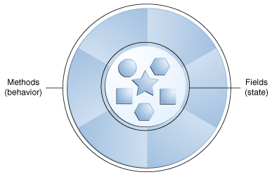

> 本文章以jdk8为基础进行编写，如果想查看后续的版本可以前往jdk版本目录下查看。
>
> 翻译自：https://docs.oracle.com/javase/tutorial/java/concepts/index.html

## 什么是对象（Object）？

对象是理解*面向对象*技术的关键。现在环顾四周，您会发现现实世界中许多物体的例子：您的狗、您的办公桌、您的电视机、您的自行车。

真实世界的对象有两个共同特征：它们都有*状态*和*行为*。狗有状态（名字、颜色、品种、饥饿）和行为（吠叫、抓东西、摇尾巴）。自行车也有状态（当前档位、当前踏板节奏、当前速度）和行为（换档、改变踏板节奏、应用刹车）。识别现实世界对象的状态和行为是开始思考面向对象编程的好方法。

现在花点时间观察您附近区域的真实世界物体。对于你看到的每个物体，问自己两个问题：“这个物体可能处于什么状态？” 和“这个对象可以执行什么可能的行为？”。确保写下您的观察结果。当您这样做时，您会注意到现实世界中的对象在复杂性上各不相同；您的台灯可能只有两种可能的状态（打开和关闭）和两种可能的行为（打开、关闭），但您的桌面收音机可能有其他状态（打开、关闭、当前音量、当前电台）和行为（打开、关闭、增大音量、减小音量、搜索、扫描和调谐）。您可能还会注意到，某些对象反过来也会包含其他对象。这些现实世界的观察都转化为面向对象编程的世界。

 软件对象。


软件对象在概念上类似于现实世界的对象：它们也由状态和相关行为组成。对象将其状态存储在*字段（某些编程语言中的变量）中，并通过**方法*（某些编程语言中的函数）公开其行为。方法对对象的内部状态进行操作，并作为对象到对象通信的主要机制。隐藏内部状态并要求通过对象的方法执行所有交互被称为*数据封装*——面向对象编程的基本原则。

以自行车为例：

 建模为软件对象的自行车。


通过指定状态（当前速度、当前踏板节奏和当前档位）并提供更改该状态的方法，对象仍然可以控制外部世界如何使用它。例如，如果自行车只有 6 个档位，则换档方法可以拒绝任何小于 1 或大于 6 的值。

将代码捆绑到单独的软件对象中有很多好处，包括：

1. 模块化：一个对象的源代码可以独立于其他对象的源代码来编写和维护。一旦创建，一个对象就可以很容易地在系统内部传递。
2. 信息隐藏：通过仅与对象的方法交互，其内部实现的细节对外界保持隐藏。
3. 代码重用：如果一个对象已经存在（可能是由另一个软件开发人员编写的），您可以在您的程序中使用该对象。这允许专家实施/测试/调试复杂的、特定于任务的对象，然后您可以相信这些对象可以在您自己的代码中运行。
4. 可插入性和调试容易：如果某个特定对象被证明是有问题的，您可以简单地将它从您的应用程序中删除并插入一个不同的对象作为它的替代品。这类似于解决现实世界中的机械问题。如果螺栓断裂，您可以更换*它*，而不是整台机器。

## 什么是类（Class）？

在现实世界中，您经常会发现许多同类的单独对象。可能存在成千上万辆其他自行车，它们的品牌和型号都相同。每辆自行车都是根据同一套蓝图制造的，因此包含相同的组件。在面向对象的术语中，我们说你的自行车是自行车*类对象*的一个*实例*。类是创建单个对象的蓝图。

以下 [`Bicycle`](https://docs.oracle.com/javase/tutorial/java/concepts/examples/Bicycle.java)类是自行车的一种可能实现：

```java
class Bicycle {

    int cadence = 0;
    int speed = 0;
    int gear = 1;

    void changeCadence(int newValue) {
         cadence = newValue;
    }

    void changeGear(int newValue) {
         gear = newValue;
    }

    void speedUp(int increment) {
         speed = speed + increment;   
    }

    void applyBrakes(int decrement) {
         speed = speed - decrement;
    }

    void printStates() {
         System.out.println("cadence:" +
             cadence + " speed:" + 
             speed + " gear:" + gear);
    }
}
```

Java 编程语言的语法对您来说看起来很新，但是这个类的设计是基于前面对自行车对象的讨论。字段`cadence`、`speed`和`gear`表示对象的状态，方法（`changeCadence`、`changeGear`等`speedUp`）定义其与外界的交互。

您可能已经注意到`Bicycle`该类不包含`main`方法。那是因为它不是一个完整的应用程序；它只是可能在应用程序中*使用的自行车的蓝图。*创建和使用新`Bicycle`对象的责任属于应用程序中的其他类。

这是一个 [`BicycleDemo`](https://docs.oracle.com/javase/tutorial/java/concepts/examples/BicycleDemo.java)创建两个独立`Bicycle`对象并调用它们的方法的类：

```java
class BicycleDemo {
    public static void main(String[] args) {

        // Create two different 
        // Bicycle objects
        Bicycle bike1 = new Bicycle();
        Bicycle bike2 = new Bicycle();

        // Invoke methods on 
        // those objects
        bike1.changeCadence(50);
        bike1.speedUp(10);
        bike1.changeGear(2);
        bike1.printStates();

        bike2.changeCadence(50);
        bike2.speedUp(10);
        bike2.changeGear(2);
        bike2.changeCadence(40);
        bike2.speedUp(10);
        bike2.changeGear(3);
        bike2.printStates();
    }
}
```

该测试的输出打印了两辆自行车的结束踏板节奏、速度和档位：

```
cadence:50 speed:10 gear:2
cadence:40 speed:20 gear:3
```

## 什么是继承（Inheritance）？

不同种类的对象之间通常有一定数量的共同点。例如，山地自行车、公路自行车和双人自行车都具有自行车的特征（当前速度、当前踏板节奏、当前档位）。然而，每一种都定义了使它们与众不同的附加功能：双人自行车有两个座位和两组车把；公路自行车有下降车把；一些山地自行车有一个额外的链环，使它们的传动比较低。

面向对象编程允许类从其他类*继承*常用的状态和行为。在此示例中，`Bicycle`现在成为`MountainBike` `RoadBike` `TandemBike`的*超*类。在 Java 编程语言中，允许每个类有一个直接的超类，并且每个超类都有无限数量的*子类*的潜力：

 自行车类的层次结构。


创建子类的语法很简单。在类声明的开头，使用`extends`关键字，后跟要继承的类的名称：

```java
class MountainBike extends Bicycle {

    // new fields and methods defining 
    // a mountain bike would go here

}
```

这提供`MountainBike`了与 相同的所有字段和方法`Bicycle`，但允许其代码专门专注于使其独一无二的功能。这使您的子类的代码易于阅读。但是，您必须注意正确记录每个超类定义的状态和行为，因为该代码不会出现在每个子类的源文件中。

## 什么是接口（Interface）？

正如您已经了解到的，对象通过它们公开的方法来定义它们与外部世界的交互。方法形成了对象与外界的*接口；*例如，电视机正面的按钮是您与塑料外壳另一侧电线之间的接口。您按下“电源”按钮可以打开和关闭电视。

在最常见的形式中，接口是一组具有空主体的相关方法。如果指定为接口，自行车的行为可能如下所示：

```java
interface Bicycle {

    // 每分钟车轮转数
    void changeCadence(int newValue);

    void changeGear(int newValue);

    void speedUp(int increment);

    void applyBrakes(int decrement);
}
```

要实现此接口，您的类的名称将更改（例如，更改为特定品牌的自行车，例如`ACMEBicycle`），并且您将`implements`在类声明中使用关键字：

```java
class ACMEBicycle implements Bicycle {

    int cadence = 0;
    int speed = 0;
    int gear = 1;

	 // 编译器现在需要该方法
   // changeCadence、changeGear、speedUp 和 applyBrakes
   // 全部实现。编译将失败，如果那些
   // 此类中缺少方法。

    void changeCadence(int newValue) {
         cadence = newValue;
    }

    void changeGear(int newValue) {
         gear = newValue;
    }

    void speedUp(int increment) {
         speed = speed + increment;   
    }

    void applyBrakes(int decrement) {
         speed = speed - decrement;
    }

    void printStates() {
         System.out.println("cadence:" +
             cadence + " speed:" + 
             speed + " gear:" + gear);
    }
}
```

实现一个接口允许一个类对于它承诺提供的行为变得更加正式。接口在类和外部世界之间形成了一种契约，这种契约在构建时由编译器强制执行。如果您的类声称要实现一个接口，则该接口定义的所有方法都必须在该类成功编译之前出现在其源代码中。

> **注意：** 要实际编译`ACMEBicycle`该类，您需要将`public`关键字添加到已实现的接口方法的开头。[稍后您将在有关类和对象](https://docs.oracle.com/javase/tutorial/java/javaOO/index.html)以及 [接口和继承](https://docs.oracle.com/javase/tutorial/java/IandI/index.html)的课程中了解到这样做的原因 。

## 什么是包（Package）？

包（Package）是组织一组相关类和接口的名称空间。从概念上讲，您可以将包视为类似于计算机上的不同文件夹。您可以将 HTML 页面保存在一个文件夹中，将图像保存在另一个文件夹中，将脚本或应用程序保存在另一个文件夹中。因为用 Java 编程语言编写的软件可以由成百上千*个*单独的类组成，所以通过将相关的类和接口放入包中来组织事物是有意义的。

Java 平台提供了一个庞大的类库（一组包），适合在您自己的应用程序中使用。这个库被称为“应用程序编程接口”，简称“API”。它的包代表了最常与通用编程相关的任务。例如，一个`String`对象包含字符串的状态和行为；`File`对象允许程序员轻松地创建、删除、检查、比较或修改文件系统上的文件；一个`Socket`对象允许创建和使用网络套接字；各种 GUI 对象控制按钮和复选框以及与图形用户界面相关的任何其他内容。有数千种课程可供选择。这使您（程序员）可以专注于特定应用程序的设计，而不是使其工作所需的基础结构。

[Java 平台 API 规范](https://docs.oracle.com/javase/8/docs/api/index.html)包含 Java SE 平台提供的所有包、接口、类、字段和方法的完整列表。 在浏览器中加载该页面并将其添加为书签。作为程序员，它将成为您最重要的参考文档。