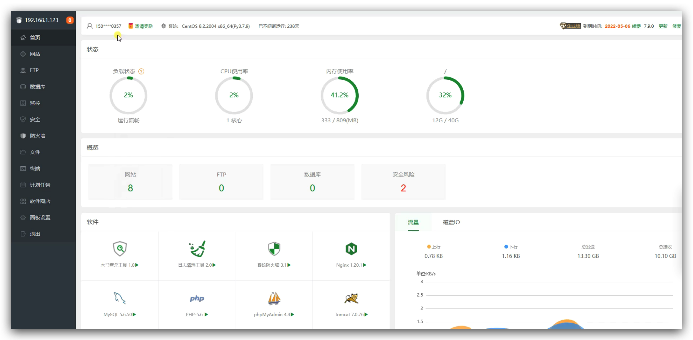

宝塔是一个安全高效的服务器运维面板，可以直接从宝塔平台上部署web项目、监控服务器资源使用情况、快捷操作文件、
一键安装软件及部署源码。详细内容可以移步前往[宝塔官网](https://www.bt.cn/)。

# CentOS安装宝塔

1. 前往[宝塔官网](https://www.bt.cn/)。

2. 点击“立即免费安装”按钮，页面会跳转到宝塔安装界面。
3. 到达宝塔安装界面后，往下滑，找到标题“Linux面板\*.\*.\*安装脚本”。
4. 找到Centos安装脚本。
> 这里备份一下备份一下脚本内容，如果需要请前往官网制定位置进行查看。

Centos安装脚本：`yum install -y wget && wget -O install.sh https://download.bt.cn/install/install_6.0.sh && sh install.sh ed8484bec`

万能安装脚本：`if [ -f /usr/bin/curl ];then curl -sSO https://download.bt.cn/install/install_panel.sh;else wget -O install_panel.sh https://download.bt.cn/install/install_panel.sh;fi;bash install_panel.sh ed8484bec`

5. 下载完成之后，命令行会给提示。前往提示中的url地址，输入用户名和密码，即可到达服务器内的宝塔平台。

