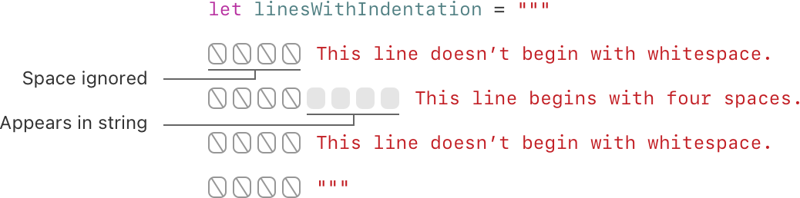
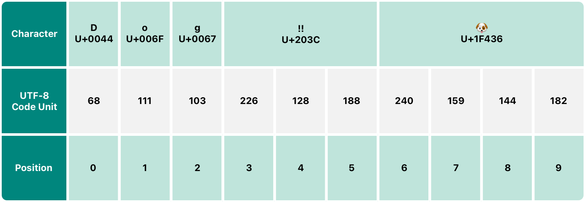
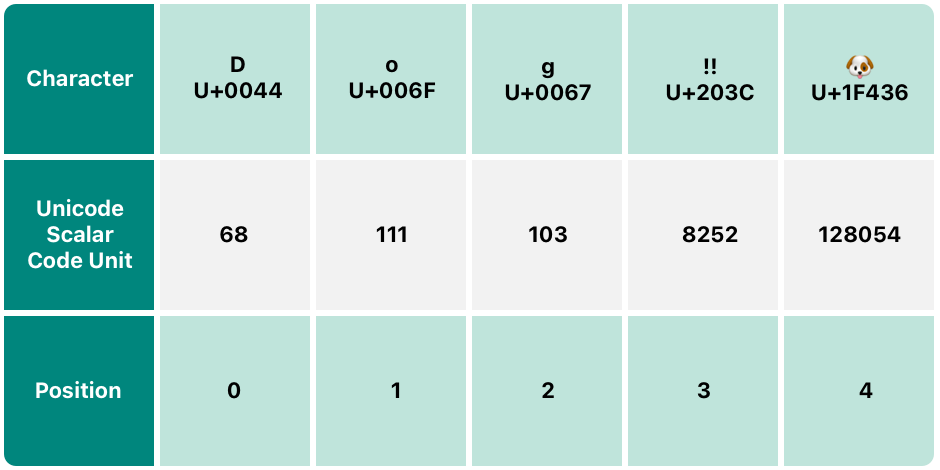

翻译自：https://docs.swift.org/swift-book/LanguageGuide/StringsAndCharacters.html

*字符串*是一系列角色，如`"hello,world"`或`"albatross"`Swift字符串由`String`类型表示。`String`的内容可以通过各种方式访问，包括作为`Character`值的集合。

Swift的`String`和`Character`类型提供了一种快速、符合Unicode的方式来处理代码中的文本。字符串创建和操作的语法轻巧且可读，字符串文字语法与C相似。字符串串联就像将两个字符串与`+`运算符组合在一起一样简单，字符串的可变性通过在常量或变量之间进行选择来管理，就像Swift中的任何其他值一样。您还可以使用字符串将常量、变量、文字和表达式插入较长的字符串中，该过程称为字符串插值。这样可以轻松创建用于显示、存储和打印的自定义字符串值。

尽管语法简单，但Swift的`String`类型是一个快速、现代的字符串实现。每个字符串都由独立于编码的Unicode字符组成，并支持在各种Unicode表示中访问这些字符。

> 注意
>
> Swift的`String`类型与Foundation的`NSString`类桥接。Foundation还扩展了`String`，以公开`NSString`定义的方法。这意味着，如果您导入Foundation，您可以在`String`上访问这些`NSString`方法，而无需铸造。
>
> 有关将`String`与Foundation和Cocoa一起使用的更多信息，请参阅[String和NSString之间的桥接](https://developer.apple.com/documentation/swift/string#2919514)。

## 弦文学

您可以在代码中包含预定义的`String`值作为*字符串文字*。字符串文字是用双引号包围的字符序列（“）。

使用字符串文字作为常量或变量的初始值：

```swift
let someString = "Some string literal value"
```

请注意，Swift推断出`someString`常量的`String`类型，因为它是用字符串字面值初始化的。

### 多行字符串文字

如果您需要一个跨越几行的字符串，请使用多行字符串文字——一个由三个双引号包围的字符序列：

```swift
let quotation = """
The White Rabbit put on his spectacles.  "Where shall I begin,
please your Majesty?" he asked.

"Begin at the beginning," the King said gravely, "and go on
till you come to the end; then stop."
"""
```

多行字符串文字包括其开头和结尾引号之间的所有行。字符串在开头引号（“”）后的第一行开始，在结束引号之前的一行结束，这意味着下面的字符串都没有以换行符开头或结束：

```swift
let singleLineString = "These are the same."
let multilineString = """
These are the same.
"""
```

当您的源代码在多行字符串文字中包含换行符时，该换行符也会出现在字符串的值中。如果您想使用换行符使源代码更容易阅读，但不希望换行符成为字符串值的一部分，请在这些行末尾写一个反斜杠（`\`）：

```swift
let softWrappedQuotation = """
The White Rabbit put on his spectacles.  "Where shall I begin, \
please your Majesty?" he asked.

"Begin at the beginning," the King said gravely, "and go on \
till you come to the end; then stop."
"""
```

要制作以行提要开头或结尾的多行字符串文字，请写一行作为第一行或最后一行。例如：

```swift
let lineBreaks = """

This string starts with a line break.
It also ends with a line break.

"""
```

可以缩进多行字符串以匹配周围的代码。结尾引号（“”）前的空格告诉Swift在所有其他行之前要忽略哪个空格。但是，如果您在行的开头写空格，除了结束引号之前的内容外，则该空格*也*包括在内。



在上面的示例中，即使整个多行字符串文字缩进，字符串中的第一行和最后一行也不会以任何空格开头。中间线的缩进比结束引号更多，所以它从额外的四空格缩进开始。

### 文字中的特殊字符

字符串文字可以包括以下特殊字符：

- 转义的特殊字符`\0`（空字符）、`\\`（反斜杠）、`\t`（水平选项卡）、`\n`（行馈送）、`\r`（回车）、`\"`（双引号）和`\'`（单引号）
- 一个任意的Unicode标量值，写为`\u{`*n*`}`，其中*n*是一个1-8位十六进制数字（Unicode在下面的[Unicode](https://docs.swift.org/swift-book/LanguageGuide/StringsAndCharacters.html#ID293)中讨论）

下面的代码显示了这些特殊字符的四个示例。`wiseWords`常数包含两个转义的双引号。`dollarSign`、`blackHeart`和`sparklingHeart`常量演示了Unicode标量格式：

```swift
let wiseWords = "\"Imagination is more important than knowledge\" - Einstein"
// "Imagination is more important than knowledge" - Einstein
let dollarSign = "\u{24}"        // $,  Unicode scalar U+0024
let blackHeart = "\u{2665}"      // ♥,  Unicode scalar U+2665
let sparklingHeart = "\u{1F496}" // 💖, Unicode scalar U+1F496
```

由于多行字符串文字使用三个双引号，而不仅仅是一个，因此您可以在多行字符串文字中包含一个双引号（”）而不逃避它。要在多行字符串中包含文本`"""`请至少转义一个引号。例如：

```swift
let threeDoubleQuotationMarks = """
Escaping the first quotation mark \"""
Escaping all three quotation marks \"\"\"
"""
```

### 扩展字符串分隔符

你可以在*扩展分隔符*中放置一个字符串字面值，以包含字符串中的特殊字符而不调用它们的效果。将字符串放在引号( `"` )内，然后用数字符号( `#` )包围它。例如，打印字符串字面量 `#"Line 1\nLine 2"#` 将打印换行转义序列( `\n` )，而不是跨两行打印字符串。

如果您需要字符串字面量中的字符的特殊效果，请匹配转义字符(\ ')之后字符串中的数字符号的数量。例如，如果你的字符串是#"Line 1\nLine 2"# '，而你想要换行，你可以使用#"Line 1\#nLine 2"# '代替。类似地，“###”Line1\###nLine2“###”也会断行。

使用扩展分隔符创建的字符串文字也可以是多行字符串文字。您可以使用扩展分隔符将文本`"""`包含在多行字符串中，覆盖结束文字的默认行为。例如：

```swift
let threeMoreDoubleQuotationMarks = #"""
Here are three more double quotes: """
"""#
```

## 初始化空字符串

要创建一个空`String`值作为构建较长字符串的起点，请为变量分配空字符串文字，或使用初始化器语法初始化新的`String`实例：

```swift
var emptyString = ""               // empty string literal
var anotherEmptyString = String()  // initializer syntax
// these two strings are both empty, and are equivalent to each other
```

通过检查isEmpty '属性来确定String '值是否为空:

```swift
if emptyString.isEmpty {
   print("Nothing to see here")
}
// Prints "Nothing to see here"
```

### 字符串可变性

您指示是否可以通过将特定`String`分配给变量（在这种情况下可以修改）或常量（在这种情况下无法修改）来修改（或*突变*）：

```swift
var variableString = "Horse"
variableString += " and carriage"
// variableString is now "Horse and carriage"

let constantString = "Highlander"
constantString += " and another Highlander"
// this reports a compile-time error - a constant string cannot be modified
```

> 注意
>
> 这种方法不同于Objective-C和Cocoa中的字符串突变，在这两个类（`NSString`和`NSMutableString`）之间进行选择，以指示字符串是否可以突变。

## 字符串是值类型

Swift的`String`类型是一种*值类型*。如果您创建新的`String`值，则该`String`值在传递给函数或方法时，或分配给常量或变量时将被*复制*。在每种情况下，都会创建现有`String`值的新副本，并传递或分配新副本，而不是原始版本。值类型在[结构](https://docs.swift.org/swift-book/LanguageGuide/ClassesAndStructures.html#ID88)中描述[，枚举是值类型](https://docs.swift.org/swift-book/LanguageGuide/ClassesAndStructures.html#ID88)。

Swift的默认复制`String`行为确保当函数或方法向您传递`String`值时，很明显，无论它来自哪里，您都拥有该确切的`String`值。您可以放心，除非您自己修改，否则传递的字符串不会被修改。

在幕后，Swift的编译器优化了字符串使用，因此只有在绝对必要的情况下才能进行实际复制。这意味着在将字符串作为值类型使用时，您总是会获得出色的性能。

## 与角色合作

您可以通过使用`for`-`in`循环迭代字符串来访问`String`的单个`Character`值：

```swift
for character in "Dog!🐶" {
   print(character)
}
// D
// o
// g
// !
// 🐶
```

`for`-`in`循环在[For-In循环](https://docs.swift.org/swift-book/LanguageGuide/ControlFlow.html#ID121)中描述。

或者，您可以通过提供`Character`类型注释从单个字符字符串文字中创建独立的`Character`常量或变量：

```swift
let exclamationMark: Character = "!"
```

`String`可以通过将`Character`值数组作为参数传递给其初始化器来构建值：

```swift
let catCharacters: [Character] = ["C", "a", "t", "!", "🐱"]
let catString = String(catCharacters)
print(catString)
// Prints "Cat!🐱"
```

## 串联字符串和字符

`String`值可以与加法运算符（`+`）一起添加（或*串联*），以创建新的`String`值：

```swift
let string1 = "hello"
let string2 = " there"
var welcome = string1 + string2
// welcome now equals "hello there"
```

您还可以使用加法赋值运算符（`+=`) `String`值附加到现有的`String`变量：

```swift
var instruction = "look over"
instruction += string2
// instruction now equals "look over there"
```

您可以使用`String`类型的`append()`方法将`Character`值附加到`String`变量：

```swift
let exclamationMark: Character = "!"
welcome.append(exclamationMark)
// welcome now equals "hello there!"
```

> 注意
>
> 您无法将`String`或`Character`附加到现有`Character`变量，因为`Character`值必须仅包含单个字符。

如果您使用多行字符串文字来构建较长字符串的行，则希望字符串中的每行都以换行符结束，包括最后一行。例如：

```swift
let badStart = """
one
two
"""
let end = """
three
"""
print(badStart + end)
// Prints two lines:
// one
// twothree

let goodStart = """
one
two

"""
print(goodStart + end)
// Prints three lines:
// one
// two
// three
```

在上面的代码中，将`badStart`与`end`连接会产生一个两行字符串，这不是所需的结果。由于`badStart`的最后一行不会以换行符结束，因此该行与第一行`end`相结合。相比之下，两条`goodStart`线都以换行符结束，因此当它与`end`相结合时，结果有三条线，正如预期的那样。

## 字符串插值

*字符串插值*是一种通过将常量、变量、文字和表达式的值包含在字符串文字中来构建新`String`值的方法。您可以在单行和多行字符串文字中使用字符串插值。您插入字符串文字的每个项目都包裹在一对括号中，前缀为反斜杠（`\`）：

```swift
let multiplier = 3
let message = "\(multiplier) times 2.5 is \(Double(multiplier) * 2.5)"
// message is "3 times 2.5 is 7.5"
```

在上面的示例中，`multiplier`的值被插入字符串文字为`\(multiplier)`当计算字符串插值以创建实际字符串时，此占位符将被`multiplier`的实际值取代。

`multiplier` 的值也是字符串后面更大的表达式的一部分。这个表达式计算 `Double(multiplier) * 2.5` 的值，并将结果( `7.5` )插入到字符串中。在本例中，当表达式包含在字符串字面值中时，它被写成`\(Double(multiplier) * 2.5)` 。

您可以使用扩展字符串分隔符创建包含字符的字符串，否则这些字符将被视为字符串插值。例如：

```swift
print(#"Write an interpolated string in Swift using \(multiplier)."#)
// Prints "Write an interpolated string in Swift using \(multiplier)."
```

要在使用扩展分隔符的字符串中使用字符串插值，请将反斜杠后的数字符号数量与字符串开头和结尾的数字符号数量匹配。例如：

```swift
print(#"6 times 7 is \#(6 * 7)."#)
// Prints "6 times 7 is 42."
```

> 注意
>
> 您在插值字符串括号内写的表达式不能包含未转义反斜杠（`\`）、回车或行馈送。然而，它们可以包含其他字符串文字。

## Unicode

*Unicode*是在不同书写系统中编码、表示和处理文本的国际标准。它使您能够以标准化的形式表示来自任何语言的几乎任何字符，并从外部来源（如文本文件或网页）读取和写入这些字符。如本节所述，Swift的`String`和`Character`类型完全符合Unicode。

### Unicode标量值

在幕后，Swift的原生 `String` 类型是由*Unicode标量值*构建的。Unicode标量值是字符或修饰符的唯一21位数字，例如' `U+0061` 表示'拉丁小写字母A  ( " A ")，或 `U+1F425` 表示正面的`BABY CHICK` ( "🐥")。

请注意，并非所有21位Unicode标量值都分配给一个字符——一些标量保留用于未来的分配或用于UTF-16编码。分配给字符的标量值通常也有一个名称，例如上面示例中的`LATINSMALLLETTERA`和`FRONT-FACINGBABY`。

### 扩展的语法集群

Swift`Character`类型的每个实例都代表一个*扩展的字素集群*。扩展字素集群是一个或多个Unicode标量的序列，（当组合时）产生单个人类可读字符。

这是一个例子。字母 `é` 可以表示为单个Unicode标量 `é` ( `拉丁小写字母E WITH ACUTE` ，或' `U+00E9` ')。然而，同样的字母也可以表示为一对标量——一个标准字母 `e` (`拉丁小写字母e` ，或' `U+0065` ')，后面跟着一个`组合急性重音`标量( `U+0301` )。 `combined ACUTE ACCENT` 标量图形化地应用于它前面的标量，当一个支持unicode的文本呈现系统呈现一个 `e` 时，它就会变成一个' `é` '。

在这两种情况下，字母`é`都表示为单个Swift`Character`值，表示扩展的字素集群。在第一种情况下，集群包含单个标量；在第二种情况下，它是一个由两个标量组成的集群：

```swift
let eAcute: Character = "\u{E9}"                         // é
let combinedEAcute: Character = "\u{65}\u{301}"          // e followed by ́
// eAcute is é, combinedEAcute is é
```

扩展字素集群是一种灵活的方式，可以将许多复杂的脚本字符表示为单个`Character`值。例如，韩语字母的韩语音节可以表示为预写或分解序列。这两种表示形式都符合 Swift 中的单个`Character`值：

```swift
let precomposed: Character = "\u{D55C}"                  // 한
let decomposed: Character = "\u{1112}\u{1161}\u{11AB}"   // ᄒ, ᅡ, ᆫ
// precomposed is 한, decomposed is 한
```

扩展的字素集群使用于封闭标记的标量（如`COMBININGENCLOSINGCIRCLE`或`U+20DD`）能够将其他Unicode标量作为单个`Character`值的一部分包围：

```swift
let enclosedEAcute: Character = "\u{E9}\u{20DD}"
// enclosedEAcute is é⃝
```

区域指标符号的Unicode标量可以成对组合，形成单个`Character`值，例如`REGIONALINDICATORSYMBOLLETTERU`（`U+1F1FA`）`REGIONALINDICATORSYMBOLLETTERS`（`U+1F1F8`的组合：

```swift
let regionalIndicatorForUS: Character = "\u{1F1FA}\u{1F1F8}"
// regionalIndicatorForUS is 🇺🇸
```

## 计数字符

要检索字符串中`Character`值的计数，请使用字符串的`count`属性：

```swift
let unusualMenagerie = "Koala 🐨, Snail 🐌, Penguin 🐧, Dromedary 🐪"
print("unusualMenagerie has \(unusualMenagerie.count) characters")
// Prints "unusualMenagerie has 40 characters"
```

请注意，Swift对`Character`值使用扩展字素簇意味着字符串串联和修改可能并不总是影响字符串的字符数。

例如，如果您使用四个字符的单词`cafe`初始化新字符串，然后在字符串末尾附加`COMBININGACUTEACCENT`（`U+0301`），则生成的字符串仍将有4个字符数，第四个字符为é，而不是`e`：

```swift
var word = "cafe"
print("the number of characters in \(word) is \(word.count)")
// Prints "the number of characters in cafe is 4"

word += "\u{301}"    // COMBINING ACUTE ACCENT, U+0301

print("the number of characters in \(word) is \(word.count)")
// Prints "the number of characters in café is 4"
```

> 注意
>
> 扩展的字素集群可以由多个Unicode标量组成。这意味着不同的字符——以及同一字符的不同表示形式——可能需要不同数量的内存来存储。因此，Swift中的字符在字符串表示中不会各自占用相同数量的内存。因此，如果不迭代字符串以确定其扩展的字素集群边界，就无法计算字符串中的字符数。如果您正在处理特别长的字符串值，请注意`count`属性必须迭代整个字符串中的Unicode标量，以确定该字符串的字符。
>
> `count`属性返回的字符计数并不总是与包含相同字符的`NSString`的`length`属性相同。`NSString`的长度基于字符串UTF-16表示中的16位代码单元数量，而不是字符串中Unicode扩展字素集群的数量。

## 访问和修改字符串

您可以通过字符串的方法和属性或使用下标语法访问和修改字符串。

### 字符串索引

每个`String`值都有一个关联的*索引类型*`String.Index`，对应于字符串中每个`Character`的位置。

如上所述，不同的字符可能需要不同数量的内存来存储，因此为了确定哪个`Character`位于特定位置，您必须从该`String`的开头或结尾迭代每个Unicode标量。因此，Swift字符串无法按整数值进行索引。

使用`startIndex`属性访问`String`的第一个`Character`的位置。TheendIndex属性是`String`中最后一个字符后的位置。因此，`endIndex`属性不是字符串下标的有效参数。如果`String`为空，`startIndex`和`endIndex`是相等的。

您可以使用`String`的`index(before:)`和`index(after:)`方法访问给定索引之前和之后的索引。要访问离给定索引更远的索引，您可以使用`index(_:offsetBy:)`方法，而不是多次调用这些方法之一。

您可以使用下标语法访问特定`String`索引的`Character`。

```swift
let greeting = "Guten Tag!"
greeting[greeting.startIndex]
// G
greeting[greeting.index(before: greeting.endIndex)]
// !
greeting[greeting.index(after: greeting.startIndex)]
// u
let index = greeting.index(greeting.startIndex, offsetBy: 7)
greeting[index]
// a
```

尝试访问字符串范围之外的索引或字符串范围之外的索引中的`Character`将触发运行时错误。

```swift
greeting[greeting.endIndex] // Error
greeting.index(after: greeting.endIndex) // Error
```

使用`indices`属性访问字符串中单个字符的所有索引。

```swift
for index in greeting.indices {
   print("\(greeting[index]) ", terminator: "")
}
// Prints "G u t e n   T a g ! "
```

> 注意
>
> 您可以在符合`Collection`协议的任何类型上使用`startIndex`和`endIndex`属性以及`index(before:)` `index(after:)`和`index(_:offsetBy:)`方法。这包括`String`，如图所示，以及集合类型，如数`Array`、`Dictionary`和`Set`。

### 插入和移除

要在指定索引处将单个字符插入字符串，请使用`insert(_:at:)`方法，要在指定索引处插入另一个字符串的内容，请使用`insert(contentsOf:at:)`方法。

```swift
var welcome = "hello"
welcome.insert("!", at: welcome.endIndex)
// welcome now equals "hello!"

welcome.insert(contentsOf: " there", at: welcome.index(before: welcome.endIndex))
// welcome now equals "hello there!"
```

要在指定索引处从字符串中删除单个字符，请使用`remove(at:)`方法，要删除指定范围内的子字符串，请使用`removeSubrange(_:)`方法：

```swift
welcome.remove(at: welcome.index(before: welcome.endIndex))
// welcome now equals "hello there"

let range = welcome.index(welcome.endIndex, offsetBy: -6)..<welcome.endIndex
welcome.removeSubrange(range)
// welcome now equals "hello"
```

> 注意
>
> 你可以使用' insert(:at:) '， ' insert(contentsOf:at:) '， ' remove(at:) '和' removeSubrange(:) '方法来处理任何符合' RangeReplaceableCollection '协议的类型。这包括如下所示的' String '，以及' Array '、' Dictionary '和' Set '等集合类型。

## 子字符串

当您从字符串（例如，使用下标或类似`prefix(_:)`的方法获得子字符串时，结果是[`Substring`](https://developer.apple.com/documentation/swift/substring)的实例，而不是另一个字符串。Swift中的子字符串具有大多数与字符串相同的方法，这意味着您可以像处理字符串一样使用子字符串。然而，与字符串不同，您在对字符串执行操作时仅使用子字符串的时间很短。当您准备将结果存储更长时间时，您将子字符串转换为`String`实例。例如：

```swift
let greeting = "Hello, world!"
let index = greeting.firstIndex(of: ",") ?? greeting.endIndex
let beginning = greeting[..<index]
// beginning is "Hello"

// Convert the result to a String for long-term storage.
let newString = String(beginning)
```

与字符串一样，每个子字符串都有一个内存区域，其中存储了构成子字符串的字符。字符串和子字符串的区别在于，作为性能优化，子字符串可以重用用于存储原始字符串的部分内存，或用于存储另一个子字符串的部分内存。（字符串具有类似的优化，但如果两个字符串共享内存，它们是相等的。）这种性能优化意味着，在您修改字符串或子字符串之前，您不必支付复制内存的性能成本。如上所述，子字符串不适合长期存储——因为它们重用原始字符串的存储，只要使用其任何子字符串，整个原始字符串都必须保存在内存中。

在上面的示例中，`greeting`是一个字符串，这意味着它有一个内存区域，其中存储了构成字符串的字符。因为`beginning`是`greeting`的子字符串，所以它重用`greeting`使用的记忆。相比之下，`newString`是一个字符串——当它从子字符串创建时，它有自己的存储空间。下图显示了这些关系：


> 注意
>
> `String`和`Substring`都符合[`StringProtocol`](https://developer.apple.com/documentation/swift/stringprotocol)协议，这意味着字符串操作函数通常可以方便地接受`StringProtocol`值。您可以使用`String`或`Substring`值调用此类函数。

## 比较字符串

Swift提供了三种比较文本值的方法：字符串和字符平等、前缀平等和后缀平等。

### 弦乐和性格平等

字符串和字符相等性与“等于”运算符（`==`和“不等于”运算符（`!=`），如[比较运算符](https://docs.swift.org/swift-book/LanguageGuide/BasicOperators.html#ID70)中所述：

```swift
let quotation = "We're a lot alike, you and I."
let sameQuotation = "We're a lot alike, you and I."
if quotation == sameQuotation {
   print("These two strings are considered equal")
}
// Prints "These two strings are considered equal"
```

如果扩展的字素簇在*正典上等价，则*两个`String`值（或两个`Character`值）被认为是相等的。如果扩展的字素簇具有相同的语言意义和外观，即使它们是由幕后不同的Unicode标量组成的，它们在规范上也是等价的。

例如，`拉丁小写字母E加急音(U+00E9)` 在规范上等同于`拉丁小写字母E`(`U+0065`)后面跟着`组合急音`(`U+0301`)。这两个扩展的字素集群都是表示字符 `é` 的有效方法，因此它们被认为是规范等价的:

```swift
// "Voulez-vous un café?" using LATIN SMALL LETTER E WITH ACUTE
let eAcuteQuestion = "Voulez-vous un caf\u{E9}?"

// "Voulez-vous un café?" using LATIN SMALL LETTER E and COMBINING ACUTE ACCENT
let combinedEAcuteQuestion = "Voulez-vous un caf\u{65}\u{301}?"

if eAcuteQuestion == combinedEAcuteQuestion {
   print("These two strings are considered equal")
}
// Prints "These two strings are considered equal"
```

相反，英语中使用的`LATINCAPITALLETTERA`（`U+0041`或`"A"`*不*等同于俄语中使用的`CYRILLICLETTERA`（`U+0410`或`"А"`。这些角色在视觉上相似，但没有相同的语言含义：

```swift
let latinCapitalLetterA: Character = "\u{41}"

let cyrillicCapitalLetterA: Character = "\u{0410}"

if latinCapitalLetterA != cyrillicCapitalLetterA {
   print("These two characters aren't equivalent.")
}
// Prints "These two characters aren't equivalent."
```

> 注意
>
> Swift 中的字符串和字符比较不区分区域设置。

### 前缀和后缀平等

要检查字符串是否具有特定的字符串前缀或后缀，请调用string’shasPrefix`hasPrefix(_:)`和`hasSuffix(_:)`方法，这两种方法都采用typeString的单个参数并返回布尔值。

以下示例考虑了代表莎士比亚《*罗密欧与朱丽叶》*前两幕场景位置的一系列弦：

```swift
let romeoAndJuliet = [
   "Act 1 Scene 1: Verona, A public place",
   "Act 1 Scene 2: Capulet's mansion",
   "Act 1 Scene 3: A room in Capulet's mansion",
   "Act 1 Scene 4: A street outside Capulet's mansion",
   "Act 1 Scene 5: The Great Hall in Capulet's mansion",
   "Act 2 Scene 1: Outside Capulet's mansion",
   "Act 2 Scene 2: Capulet's orchard",
   "Act 2 Scene 3: Outside Friar Lawrence's cell",
   "Act 2 Scene 4: A street in Verona",
   "Act 2 Scene 5: Capulet's mansion",
   "Act 2 Scene 6: Friar Lawrence's cell"
]
```

您可以使用`hasPrefix(_:)`方法与`romeoAndJuliet`数组一起计算该剧第1幕中的场景数量：

```swift
var act1SceneCount = 0
for scene in romeoAndJuliet {
   if scene.hasPrefix("Act 1 ") {
       act1SceneCount += 1
   }
}
print("There are \(act1SceneCount) scenes in Act 1")
// Prints "There are 5 scenes in Act 1"
```

同样，使用`hasSuffix(_:)`方法来计算卡普莱特豪宅和劳伦斯修士牢房内或周围发生的场景数量：

```swift
var mansionCount = 0
var cellCount = 0
for scene in romeoAndJuliet {
   if scene.hasSuffix("Capulet's mansion") {
       mansionCount += 1
   } else if scene.hasSuffix("Friar Lawrence's cell") {
       cellCount += 1
   }
}
print("\(mansionCount) mansion scenes; \(cellCount) cell scenes")
// Prints "6 mansion scenes; 2 cell scenes"
```

> 注意
>
> `hasPrefix(_:)`和`hasSuffix(_:)`方法在每个字符串中的扩展字素簇之间执行逐个字符规范等价比较，如[String和字符平等](https://docs.swift.org/swift-book/LanguageGuide/StringsAndCharacters.html#ID299)中所述。

## 字符串的Unicode表示

当将Unicode字符串写入文本文件或其他存储时，该字符串中的Unicode标量将以几种Unicode定义的*编码形式*之一编码。每个表单都以称为*代码单元*的小块对字符串进行编码。这些包括UTF-8编码形式（将字符串编码为8位代码单元）、UTF-16编码形式（将字符串编码为16位代码单元）和UTF-32编码形式（将字符串编码为32位代码单元）。

Swift提供了几种不同的方式来访问字符串的Unicode表示形式。您可以使用`in`语句迭代字符串，以Unicode扩展字素集群的形式访问其单个`Character`值。这个过程在《[处理角色》](https://docs.swift.org/swift-book/LanguageGuide/StringsAndCharacters.html#ID290)中进行了描述。

或者，在其他三种符合Unicode的表示形式之一中访问`String`值：

- UTF-8代码单元的集合（使用字符串的`utf8`属性访问）
- UTF-16代码单元的集合（使用字符串的`utf16`属性访问）
- 21位Unicode标量值的集合，相当于字符串的UTF-32编码形式（使用字符串的`unicodeScalars`属性访问）

下面的每个例子显示了以下字符串的不同表示形式，该字符串由字符`D`, `o`, `g`, `‼` (`DOUBLE EXCLAMATION MARK`, 或Unicode标量`U+203C`)，和🐶字符(' DOG FACE '，或Unicode标量' U+1F436 ')组成:

```swift
let dogString = "Dog‼🐶"
```

### UTF-8代表

您可以通过迭代其`utf8`属性来访问`String`的UTF-8表示形式。此属性类型为`String.UTF8View`，这是无符号8位（`UInt8`）值的集合，字符串UTF-8表示中的每个字节一个：



```swift
for codeUnit in dogString.utf8 {
   print("\(codeUnit) ", terminator: "")
}
print("")
// Prints "68 111 103 226 128 188 240 159 144 182 "
```

在上面的例子中，前三个十进制' codeUnit '值(' 68 '，' 111 '，' 103 ')表示字符' D '， ' o '和' g '，它们的UTF-8表示与它们的ASCII表示相同。接下来的三个十进制' codeUnit '值(' 226 '，' 128 '，' 188 ')是' DOUBLE感叹号'字符的三字节UTF-8表示。最后四个' codeUnit '值(' 240 '，' 159 '，' 144 '，' 182 ')是' DOG FACE '字符的四字节UTF-8表示。

### UTF-16代表

您可以通过迭代其`utf16`属性来访问`String`的UTF-16表示形式。此属性类型为`String.UTF16View`，这是无符号16位（`UInt16`）值的集合，字符串UTF-16表示中的每个16位代码单元一个：


```swift
for codeUnit in dogString.utf16 {
   print("\(codeUnit) ", terminator: "")
}
print("")
// Prints "68 111 103 8252 55357 56374 "
```

同样，前三个`codeUnit`值（`68`、`111`、`103`）代表字符`D`、`o`和`g`，其UTF-16代码单元的值与字符串的UTF-8表示相同（因为这些Unicode标量代表ASCII字符）。

第四个`codeUnit`值（8252）是十六进制值`203C`的十进制，它表示`DOUBLEEXCLAMATIONMARK`字符的Unicode标量`U+203C`。此字符可以在UTF-16中表示为单个代码单元。

第5和第6个' codeUnit '值(' 55357 '和' 56374 ')是' DOG FACE '字符的UTF-16代理对表示。这些值是高替代值‘U+D83D’(十进制值‘55357’)和低替代值‘U+DC36’(十进制值‘56374’)。

### Unicode标量表示

您可以通过迭代其`unicodeScalars`属性来访问`String`值的Unicode标量表示形式。此属性类型为`UnicodeScalarView`，这是`UnicodeScalar`类型的值集合。

每个`UnicodeScalar`都有一个`value`属性，返回标量的21位值，在`UInt32`值中表示：



```swift
for scalar in dogString.unicodeScalars {
   print("\(scalar.value) ", terminator: "")
}
print("")
// Prints "68 111 103 8252 128054 "
```

前三个`UnicodeScalar`值（`68`、`111`、`103`）的`value`属性再次表示字符`D`、`o`和`g`。

第四个`codeUnit`值（8252）再次等价于十六进制值`203C`，该值表示`DOUBLEEXCLAMATION`字符的Unicode标量`U+203C`。

The `value` property of the fifth and final `UnicodeScalar`, `128054`, is a decimal equivalent of the hexadecimal value `1F436`, which represents the Unicode scalar `U+1F436` for the `DOG FACE`character.

作为查询其`value`属性的替代方案，每个`UnicodeScalar`值也可以用于构建新的`String`值，例如字符串插值：

```swift
for scalar in dogString.unicodeScalars {
   print("\(scalar) ")
}
// D
// o
// g
// ‼
// 🐶
```

