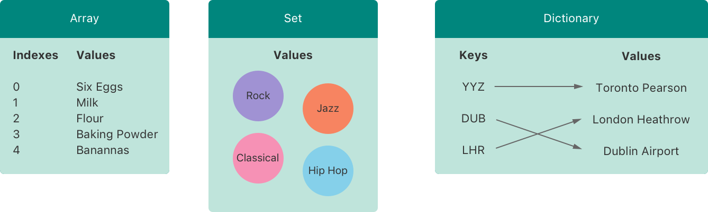

翻译自：https://docs.swift.org/swift-book/LanguageGuide/CollectionTypes.html

Swift提供了三种主要*集合类型*，称为数组、集合和字典，用于存储值集合。数组是有序的值集合。集合是唯一值的无序集合。字典是键值关联的无序集合。



Swift 中的数组、集合和字典始终清楚可以存储的值和键的类型。这意味着您不能错误地将错误类型的值插入集合中。这也意味着您可以对从集合中检索的值类型有信心。

> 注意
>
> Swift的数组、集合和字典类型作为*通用集合*实现。有关泛型类型和集合的更多信息，请参阅[泛型](https://docs.swift.org/swift-book/LanguageGuide/Generics.html)。

## 收藏品的可变性

如果您创建一个数组、集合或字典，并将其分配给变量，则创建的集合将是*可变的*。这意味着您可以在集合创建后通过添加、删除或更改集合中的项目来更改（或*突变*）。如果您将数组、集合或字典分配给常量，则该集合是*不可变的*，其大小和内容无法更改。

> 注意
>
> 在集合不需要更改的所有情况下，创建不可变集合是良好做法。这样做使您更容易对代码进行推理，并使Swift编译器能够优化您创建的集合的性能。

## 数组(Arrays)

*数组*将相同类型的值存储在有序列表中。相同的值可以在不同位置多次出现在数组中。

> 注意
>
> Swift的`Array`类型与Foundation的`NSArray`类桥接。
>
> 有关将`Array`与Foundation和Cocoa一起使用的更多信息，请参阅[Array和NSArray之间的桥接](https://developer.apple.com/documentation/swift/array#2846730)。

### 数组类型速记语法

Swift数组的类型被完整写成`Array<Element>`，其中`Element`是允许数组存储的值类型。您还可以将数组的类型以速记形式写为`[Element]`虽然这两种形式在功能上相同，但速记形式是首选，并在参考数组类型时在整个指南中使用。

### 创建空数组

您可以使用初始化器语法创建特定类型的空数组：

```swift
var someInts: [Int] = []
print("someInts is of type [Int] with \(someInts.count) items.")
// Prints "someInts is of type [Int] with 0 items."
```

请注意，从初始化器的类型推断出`someInts`变量的类型为`[Int]`。

或者，如果上下文已经提供了类型信息，例如函数参数或已经键入的变量或常量，您可以创建一个带有空数组文字的空数组，该数组写为`[]`（一对空的方括号）：

```swift
someInts.append(3)
// someInts now contains 1 value of type Int
someInts = []
// someInts is now an empty array, but is still of type [Int]
```

### 创建具有默认值的数组

Swift的`Array`类型还提供了一个初始化器，用于创建特定大小的数组，其所有值都设置为相同的默认值。您向此初始化器传递适当类型的默认值（称为`repeating`）：以及该值在新数组中重复的次数（称为`count`）：

```swift
var threeDoubles = Array(repeating: 0.0, count: 3)
// threeDoubles is of type [Double], and equals [0.0, 0.0, 0.0]
```

### 通过将两个数组一起创建数组

您可以通过添加两个具有兼容类型的现有数组与加法运算符（`+`）来创建新数组。新数组的类型从您添加的两个数组的类型推断出来：

```swift
var anotherThreeDoubles = Array(repeating: 2.5, count: 3)
// anotherThreeDoubles is of type [Double], and equals [2.5, 2.5, 2.5]

var sixDoubles = threeDoubles + anotherThreeDoubles
// sixDoubles is inferred as [Double], and equals [0.0, 0.0, 0.0, 2.5, 2.5, 2.5]
```

### 使用数组字面创建数组

您还可以使用*数*组*文字*初始化数组，这是将一个或多个值写入数组集合的简写方式。数组文字写为值列表，用逗号分隔，周围是一对方括号：

[`value 1`,` value 2`, `value 3`]

下面的示例创建一个名为`shoppingList`的数组来存储`String`值：

```swift
var shoppingList: [String] = ["Eggs", "Milk"]
// shoppingList has been initialized with two initial items
```

`shoppingList`变量被声明为“字符串值数组”，写为`[String]`由于此特定数组指定了`String`的值类型，因此仅允许存储`String`值。在这里，`shoppingList`数组用两个`String`值（“`"Eggs"`和`"Milk"`初始化，写在数组文字中。

> 注意
>
> `shoppingList`数组被声明为变量（使用`var`介绍器），而不是常量（使用`let`介绍器），因为在下面的示例中，购物列表中添加了更多项目。

在这种情况下，数组字面包含两个`String`值，没有其他值。这与`shoppingList`变量声明的类型（只能包含`String`值的数组）匹配，因此允许分配数组文字作为使用两个初始项初始化`shoppingList`的一种方式。

由于Swift的类型推断，如果您使用包含相同类型值的数组文字初始化数组，则不必编写数组的类型。`shoppingList`的初始化可以以较短的形式编写：

```swift
var shoppingList = ["Eggs", "Milk"]
```

由于数组文字中的所有值都是相同的类型，Swift可以推断`[String]`是用于`shoppingList`变量的正确类型。

### 访问和修改数组

您可以通过数组的方法和属性或使用下标语法访问和修改数组。

要查找数组中的项目数量，请检查其只读`count`属性：

```swift
print("The shopping list contains \(shoppingList.count) items.")
// Prints "The shopping list contains 2 items."
```

使用布尔为`isEmpty`属性作为快捷方式，以检查`count`属性是否等于`0`：

```swift
if shoppingList.isEmpty {
   print("The shopping list is empty.")
} else {
   print("The shopping list isn't empty.")
}
// Prints "The shopping list isn't empty."
```

您可以通过调用数组的`append(_:)`方法将新项添加到数组的末尾：

```swift
shoppingList.append("Flour")
// shoppingList now contains 3 items, and someone is making pancakes
```

或者，将一个或多个兼容项的数组附加到加法赋值运算符（`+=`：

```swift
shoppingList += ["Baking Powder"]
// shoppingList now contains 4 items
shoppingList += ["Chocolate Spread", "Cheese", "Butter"]
// shoppingList now contains 7 item
```

使用*下标语法*从数组中检索值，在数组名称后立即传递要在方括号内检索的值的索引：

```swift
var firstItem = shoppingList[0]
// firstItem is equal to "Eggs"
```

> 注意
>
> 数组中的第一个项目的索引为`0`，而不是1。Swift中的数组总是零索引。

您可以使用下标语法更改给定索引的现有值：

```swift
shoppingList[0] = "Six eggs"
// the first item in the list is now equal to "Six eggs" rather than "Eggs"
```

使用下标语法时，指定的索引必须是有效的。例如，写 `shoppingList[shoppingList.count] = "Salt"` 将一个项添加到数组的末尾会导致运行时错误。

您还可以使用下标语法一次更改值范围，即使替换值集的长度与您要替换的范围不同。以下示例将`"ChocolateSpread"` `"Cheese"`和`"Butter"`替换为`"Bananas"`和`"Apples"`：

```swift
shoppingList[4...6] = ["Bananas", "Apples"]
// shoppingList now contains 6 items
```

要在指定的索引处将项目插入数组，请调用数组的`insert(_:at:)`方法：

```swift
shoppingList.insert("Maple Syrup", at: 0)
// shoppingList now contains 7 items
// "Maple Syrup" is now the first item in the list
```

对`insert(_:at:)`方法的调用在购物清单开头插入一个值为`"MapleSyrup"`的新项目，索引为`0`。

同样，您使用`remove(at:)`方法从数组中删除项目。此方法在指定索引处删除项目并返回已删除的项目（尽管如果您不需要，您可以忽略返回的值）：

```swift
let mapleSyrup = shoppingList.remove(at: 0)
// the item that was at index 0 has just been removed
// shoppingList now contains 6 items, and no Maple Syrup
// the mapleSyrup constant is now equal to the removed "Maple Syrup" string
```

> 注意
>
> 如果您尝试访问或修改超出数组现有边界的索引的值，您将触发运行时错误。您可以通过将索引与数组的`count`属性进行比较，在使用索引之前检查索引是否有效。数组中最大的有效索引是`count1`，因为数组从零开始索引——然而，当`count`为`0`（这意味着数组为空），没有有效的索引。

当删除项目时，数组中的任何间隙都会关闭，因此索引`0`的值再次等于`"Sixeggs"`：

```swift
firstItem = shoppingList[0]
// firstItem is now equal to "Six eggs"
```

如果你想从数组中删除最后一项，使用' removeLast() '方法，而不是' remove(at:) '方法，以避免需要查询数组的' count '属性。像' remove(at:) '方法一样，' removeLast() '返回被删除的项:

```swift
let apples = shoppingList.removeLast()
// the last item in the array has just been removed
// shoppingList now contains 5 items, and no apples
// the apples constant is now equal to the removed "Apples" string
```

### 在数组上迭代

您可以使用`for`-`in`循环迭代数组中的整组值：

```swift
for item in shoppingList {
   print(item)
}
// Six eggs
// Milk
// Flour
// Baking Powder
// Bananas
```

如果您需要每个项目的整数索引及其值，请使用`enumerated()`方法迭代数组。对于数组中的每个项目，`enumerated()`方法返回由整数和项组成的元组。整数从零开始，每个项目数一个；如果您在整个数组中枚举，这些整数与项目的索引匹配。您可以将元组分解为临时常量或变量，作为迭代的一部分：

```swift
for (index, value) in shoppingList.enumerated() {
   print("Item \(index + 1): \(value)")
}
// Item 1: Six eggs
// Item 2: Milk
// Item 3: Flour
// Item 4: Baking Powder
// Item 5: Bananas
```

有关`for`-`in`循环的更多信息，请参阅[for-in循环](https://docs.swift.org/swift-book/LanguageGuide/ControlFlow.html#ID121)。

## Sets

*集合*在集合中存储相同类型的不同值，没有定义的顺序。当项目顺序不重要时，或者当您需要确保项目只出现一次时，您可以使用集合而不是数组。

> 注意
>
> Swift的`Set`类型与Foundation的`NSSet`类桥接。
>
> For more information about using `Set` with Foundation and Cocoa, see [Bridging Between Set and NSSet](https://developer.apple.com/documentation/swift/set#2845530).

### 集合类型的哈希值

为了存储在集合中，类型必须是“哈希”的——也就是说，类型必须为自己提供一种计算“哈希值”的方法。哈希值是一个' Int '值，它对所有相等比较的对象都是相同的，例如，如果' A == b '， ' A '的哈希值等于' b '的哈希值。

Swift的所有基本类型（如`String`、`Int`、`Double`和`Bool`）默认都是可散列的，并且可以用作设置值类型或字典键类型。默认情况下，没有关联值的枚举案例值（如[枚举](https://docs.swift.org/swift-book/LanguageGuide/Enumerations.html)中所述）也是可散列的。

> 注意
>
> 您可以使用自己的自定义类型作为设置值类型或字典键类型，使其符合Swift标准库中的`Hashable`协议。有关实现所需`hash(into:)`方法的信息，请参阅[`Hashable`](https://developer.apple.com/documentation/swift/hashable)。有关遵守协议的信息，请参阅[协议](https://docs.swift.org/swift-book/LanguageGuide/Protocols.html)。

### 设置类型语法

Swift集的类型写为`Set<Element>`，其中`Element`是允许该集存储的类型。与数组不同，集合没有等效的速记形式。

### 创建和初始化空集

您可以使用初始化器语法创建特定类型的空集：

```swift
var letters = Set<Character>()
print("letters is of type Set<Character> with \(letters.count) items.")
// Prints "letters is of type Set<Character> with 0 items."
```

> 注意
>
> 从初始化器的类型推断`letters`变量的类型为`Set<Character>`。

或者，如果上下文已经提供了类型信息，例如函数参数或已经键入的变量或常量，您可以创建一个带有空数组文字的空集：

```swift
letters.insert("a")
// letters now contains 1 value of type Character
letters = []
// letters is now an empty set, but is still of type Set<Character>
```

### 使用数组字面创建集合

您还可以使用数组文字初始化集合，作为将一个或多个值写入集合的速记方式。

下面的示例创建一个名为 `favoriteGenres`集合来存储`String`值：

```swift
var favoriteGenres: Set<String> = ["Rock", "Classical", "Hip hop"]
// favoriteGenres has been initialized with three initial items
```

 `favoritegenre` 变量被声明为"一组 `String` 值"，写成 `set <String>` 。因为这个特定的集合指定了一个值类型 `String` ，它只允许存储 String 值。在这里， `favoritegenre` 集合被初始化为三个 String 值( `Rock` ，  `Classical` 和 `Hip hop` )，写入一个数组文字。

> 注意
>
> `favoriteGenres`集被声明为变量（使用`var`引入器），而不是常量（使用`let`介绍器），因为在下面的示例中添加了和删除了项目。

仅凭数组字面值无法推断集合类型，因此必须显式声明类型`Set`。但是，由于Swift的类型推断，如果您使用仅包含一种类型的值的数组文字初始化集元素的类型，则不必编写该集合元素的类型。`favoriteGenres`的初始化可以以较短的形式编写：

```swift
var favoriteGenres: Set = ["Rock", "Classical", "Hip hop"]
```

由于数组文字中的所有值都是相同的类型，Swift可以推断`Set<String>`是用于`favoriteGenres`变量的正确类型。

### 访问和修改一组

您通过其方法和属性访问和修改集合。

要了解集合中的项目数量，请检查其只读`count`属性：

```swift
print("I have \(favoriteGenres.count) favorite music genres.")
// Prints "I have 3 favorite music genres."
```

使用布尔为`isEmpty`属性作为快捷方式，以检查`count`属性是否等于`0`：

```swift
if favoriteGenres.isEmpty {
   print("As far as music goes, I'm not picky.")
} else {
   print("I have particular music preferences.")
}
// Prints "I have particular music preferences."
```

您可以通过调用集合的`insert(_:)`方法将新项目添加到集合中：

```swift
favoriteGenres.insert("Jazz")
// favoriteGenres now contains 4 items
```

您可以通过调用集合的`remove(_:)`方法从集合中删除项目，如果项目是集合的成员，则删除项目，并返回删除的值，如果集合不包含它，则返回`nil`。或者，集合中的所有项目都可以使用其`removeAll()`方法删除。

```swift
if let removedGenre = favoriteGenres.remove("Rock") {
   print("\(removedGenre)? I'm over it.")
} else {
   print("I never much cared for that.")
}
// Prints "Rock? I'm over it."
```

要检查集合是否包含特定项，请使用`contains(_:)`方法。

```swift
if favoriteGenres.contains("Funk") {
   print("I get up on the good foot.")
} else {
   print("It's too funky in here.")
}
// Prints "It's too funky in here."
```

### 在一组上迭代

您可以使用`for`-`in`循环迭代集合中的值。

```swift
for genre in favoriteGenres {
   print("\(genre)")
}
// Classical
// Jazz
// Hip hop
```

有关`for`-`in`循环的更多信息，请参阅[for-in循环](https://docs.swift.org/swift-book/LanguageGuide/ControlFlow.html#ID121)。

Swift的`Set`类型没有定义的顺序。要按特定顺序迭代集合的值，请使用`sorted()`方法，该方法将集合的元素作为使用`<`运算符排序的数组返回。

```swift
for genre in favoriteGenres.sorted() {
   print("\(genre)")
}
// Classical
// Hip hop
// Jazz
```

## 执行集合操作

您可以高效地执行基本集合操作，例如将两个集合组合在一起，确定两个集合具有共同值，或确定两个集合是否包含所有、部分或不包含相同的值。

### 基本集操作

下面的插图描绘了两个集合——`a`和`b`——以及由阴影区域表示的各种集合操作的结果。

- 使用`intersection(_:)`方法创建一个新集合，其中只有两个集合共有的值。
- 使用`symmetricDifference(_:)`方法创建一个新集合，其中两个集合都有值，但不是两者。
- 使用`union(_:)`方法创建一个包含两个集合中所有值的新集合。
- 使用`subtracting(_:)`方法创建一个值不在指定集合中的新集合。

```swift
let oddDigits: Set = [1, 3, 5, 7, 9]
let evenDigits: Set = [0, 2, 4, 6, 8]
let singleDigitPrimeNumbers: Set = [2, 3, 5, 7]

oddDigits.union(evenDigits).sorted()
// [0, 1, 2, 3, 4, 5, 6, 7, 8, 9]
oddDigits.intersection(evenDigits).sorted()
// []
oddDigits.subtracting(singleDigitPrimeNumbers).sorted()
// [1, 9]
oddDigits.symmetricDifference(singleDigitPrimeNumbers).sorted()
// [1, 2, 9]
```

### 设定成员资格和平等

下图描述了三个集合——a、b和c，其中重叠的区域表示集合之间共享的元素。设置一个是集的超集b,因为包含了所有元素b。相反地,b是集的一个子集,因为所有元素b也包含一组。b, c是不相交的,因为他们没有共同之处。


- 使用“相等”运算符(`==`)确定两个集合是否包含所有相同的值。
- Use the `isSubset(of:)` 方法确定一个集合的所有值是否包含在指定的集合中。
- Use the `isSuperset(of:)` 方法确定一个集合是否包含指定集合中的所有值。
- Use the `isStrictSubset(of:)` or `isStrictSuperset(of:)` 方法确定一个集合是子集还是超集，但不等于指定的集合。
- 使用`isDisjoint(with:)`方法确定两个集合是否没有共同值。

```swift
let houseAnimals: Set = ["🐶", "🐱"]
let farmAnimals: Set = ["🐮", "🐔", "🐑", "🐶", "🐱"]
let cityAnimals: Set = ["🐦", "🐭"]

houseAnimals.isSubset(of: farmAnimals)
// true
farmAnimals.isSuperset(of: houseAnimals)
// true
farmAnimals.isDisjoint(with: cityAnimals)
// true
```

## 字典(Dictionaries)

*字典在*集合中存储相同类型的键和相同类型的值之间的关联，没有定义的顺序。每个值都与一个唯一的*键*相关联，该键充当字典中该值的标识符。与数组中的项目不同，字典中的项目没有指定的顺序。当您需要根据它们的标识符查找值时，您可以使用字典，就像使用现实世界的字典来查找特定单词的定义一样。

> 注意
>
> Swift的`Dictionary`类型与Foundation的`NSDictionary`类相连。
>
> 有关使用`Dictionary`与基金会和可可的更多信息，请参阅[词典和NS词典之间的衔接](https://developer.apple.com/documentation/swift/dictionary#2846239)。

### 字典类型速记语法

Swift字典的类型完整地写成‘dictionary <Key, Value>’，其中‘Key’是可以用作字典键的值的类型，而‘Value’是字典为这些键存储的值的类型。

> 注意
>
> 字典`Key`类型必须符合`Hashable`协议，就像集合的值类型一样。
>
> 您还可以以速记形式将字典类型写为`[Key:Value]`虽然这两种形式在功能上相同，但简写形式是首选，并在参考词典类型时在整个指南中使用。

### 创建空字典

与数组一样，您可以使用初始化器语法创建特定类型的空`Dictionary`：

```swift
var namesOfIntegers: [Int: String] = [:]
// namesOfIntegers is an empty [Int: String] dictionary
```

这个例子创建了一个“[Int: String]”类型的空字典来存储人类可读的整数值名称。它的键的类型是' Int '，它的值的类型是' String '。

如果上下文已经提供了类型信息，您可以创建一个带有空字典文字的空字典，该字典写为`[:]`（一对方括号内的冒号）：

```swift
namesOfIntegers[16] = "sixteen"
// namesOfIntegers now contains 1 key-value pair
namesOfIntegers = [:]
// namesOfIntegers is once again an empty dictionary of type [Int: String]
```

### 使用字典创建词典

您还可以使用*字典文字*初始化字典，该字典的语法与前面看到的数组文字相似。字典文字是将一个或多个键值对写成`Dictionary`集合的简写方式。

*键值对*是键和值的组合。在字典文字中，每个键值对中的键和值由冒号分隔。键值对写成列表，用逗号分隔，周围是一对方括号：

[`key 1`: `value 1`, `key 2`: `value 2`, `key 3`: `value 3`]

下面的示例创建了一本词典来存储国际机场的名称。在本词典中，键是三个字母的国际航空运输协会代码，值是机场名称：

```swift
var airports: [String: String] = ["YYZ": "Toronto Pearson", "DUB": "Dublin"]
```

`airports`词典被声明为具有`[String:String]`的类型，意思是“键为`String`类型，其值也为`String`类型的`Dictionary`”。

> 注意
>
> `airports`词典被声明为变量（使用`var`介绍器），而不是常量（使用`let`介绍器），因为在下面的示例中，词典中添加了更多的机场。

`airports`词典以包含两个键值对的字典字面进行初始化。第一对有`"YYZ"`的键和`"TorontoPearson"`的值。第二对有`"DUB"`的键和`"Dublin"`的值。

这本词典的文字包含两个`String:String`对。此键值类型与`airports`变量声明的类型匹配（仅具有`String`键和仅`String`值的字典），因此允许分配字典文字，作为用两个初始项初始化`airports`字典的一种方式。

与数组一样，如果您使用键和值具有一致类型的字典字典初始化，则不必编写字典类型。`airports`的初始化可以以较短的形式书写：

```swift
var airports = ["YYZ": "Toronto Pearson", "DUB": "Dublin"]
```

因为字面值中的所有键都是彼此相同的类型，同样的，所有值也都是彼此相同的类型，Swift可以推断' [String: String] '是' airports '字典的正确类型。

### 访问和修改词典

您通过字典的方法和属性或使用下标语法访问和修改字典。

与数组一样，您可以通过检查字典的只读`count`属性来查找`Dictionary`中的项目数量：

```swift
print("The airports dictionary contains \(airports.count) items.")
// Prints "The airports dictionary contains 2 items."
```

使用布尔为`isEmpty`属性作为快捷方式，以检查`count`属性是否等于`0`：

```swift
if airports.isEmpty {
   print("The airports dictionary is empty.")
} else {
   print("The airports dictionary isn't empty.")
}
// Prints "The airports dictionary isn't empty."
```

您可以将新项目添加到带有下标语法的字典中。使用适当类型的新键作为下标索引，并分配适当类型的新值：

```swift
airports["LHR"] = "London"
// the airports dictionary now contains 3 items
```

您还可以使用下标语法来更改与特定键关联的值：

```swift
airports["LHR"] = "London Heathrow"
// the value for "LHR" has been changed to "London Heathrow"
```

作为下标的替代方案，使用字典的`updateValue(_:forKey:)`方法来设置或更新特定键的值。与上面的下标示例一样，`updateValue(_:forKey:)`方法为键设置值（如果没有，则为该键设置值，如果该键已经存在，则更新该值。然而，与下标不同，`updateValue(_:forKey:)`方法在执行更新后返回*旧*值。这使您能够检查是否进行了更新。

`updateValue(_:forKey:)`方法返回字典值类型的可选值。例如，对于存储`String`值的字典，该方法返回`String?`或“可选`String`”类型的值。如果更新前存在该键，则此可选值包含该键的旧值，如果没有值，则`nil`：

```swift
if let oldValue = airports.updateValue("Dublin Airport", forKey: "DUB") {
   print("The old value for DUB was \(oldValue).")
}
// Prints "The old value for DUB was Dublin."
```

您还可以使用下标语法从字典中检索特定键的值。由于可以请求一个不存在值的键，字典的下标返回字典值类型的可选值。如果字典包含请求键的值，则下标返回一个可选值，其中包含该键的现有值。否则，下标返回`nil`：

```swift
if let airportName = airports["DUB"] {
   print("The name of the airport is \(airportName).")
} else {
   print("That airport isn't in the airports dictionary.")
}
// Prints "The name of the airport is Dublin Airport."
```

您可以使用下标语法通过为该键分配`nil`的值从字典中删除键值对：

```swift
airports["APL"] = "Apple International"
// "Apple International" isn't the real airport for APL, so delete it
airports["APL"] = nil
// APL has now been removed from the dictionary
```

或者，使用`removeValue(forKey:)`方法从字典中删除键值对。如果存在键值对，此方法将删除并返回删除的值，如果没有值，则返回`nil`：

```swift
if let removedValue = airports.removeValue(forKey: "DUB") {
   print("The removed airport's name is \(removedValue).")
} else {
   print("The airports dictionary doesn't contain a value for DUB.")
}
// Prints "The removed airport's name is Dublin Airport."
```

### 在字典上迭代

您可以使用`for`-`in`循环迭代字典中的键值对。字典中的每个项目都作为`(key,value)`元组返回，您可以将元组的成员分解为临时常量或变量，作为迭代的一部分：

```swift
for (airportCode, airportName) in airports {
   print("\(airportCode): \(airportName)")
}
// LHR: London Heathrow
// YYZ: Toronto Pearson
```

有关`for`-`in`循环的更多信息，请参阅[for-in循环](https://docs.swift.org/swift-book/LanguageGuide/ControlFlow.html#ID121)。

您还可以通过访问字典的键和`values`属性来检索字典键或值`keys`迭代集合：

```swift
for airportCode in airports.keys {
   print("Airport code: \(airportCode)")
}
// Airport code: LHR
// Airport code: YYZ

for airportName in airports.values {
   print("Airport name: \(airportName)")
}
// Airport name: London Heathrow
// Airport name: Toronto Pearson
```

如果您需要将字典的键或值与采用`Array`实例的API一起使用，请使用`keys`或`values`属性初始化新数组：

```swift
let airportCodes = [String](airports.keys)
// airportCodes is ["LHR", "YYZ"]

let airportNames = [String](airports.values)
// airportNames is ["London Heathrow", "Toronto Pearson"]
```

Swift的`Dictionary`类型没有定义的顺序。要按特定顺序迭代字典的键或值，请在其`keys`或`values`属性上使用`sorted()`方法。